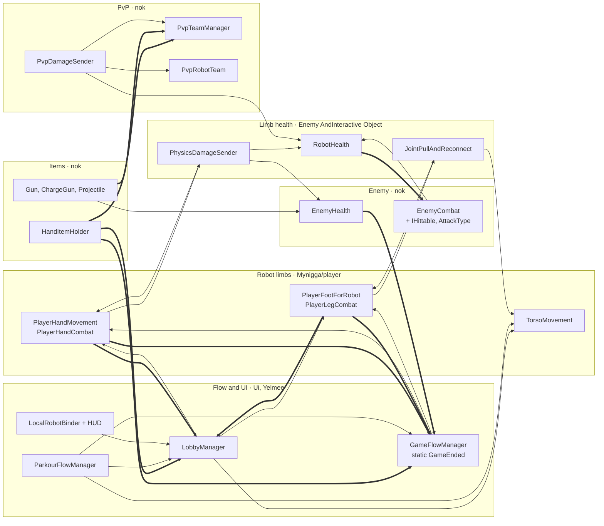
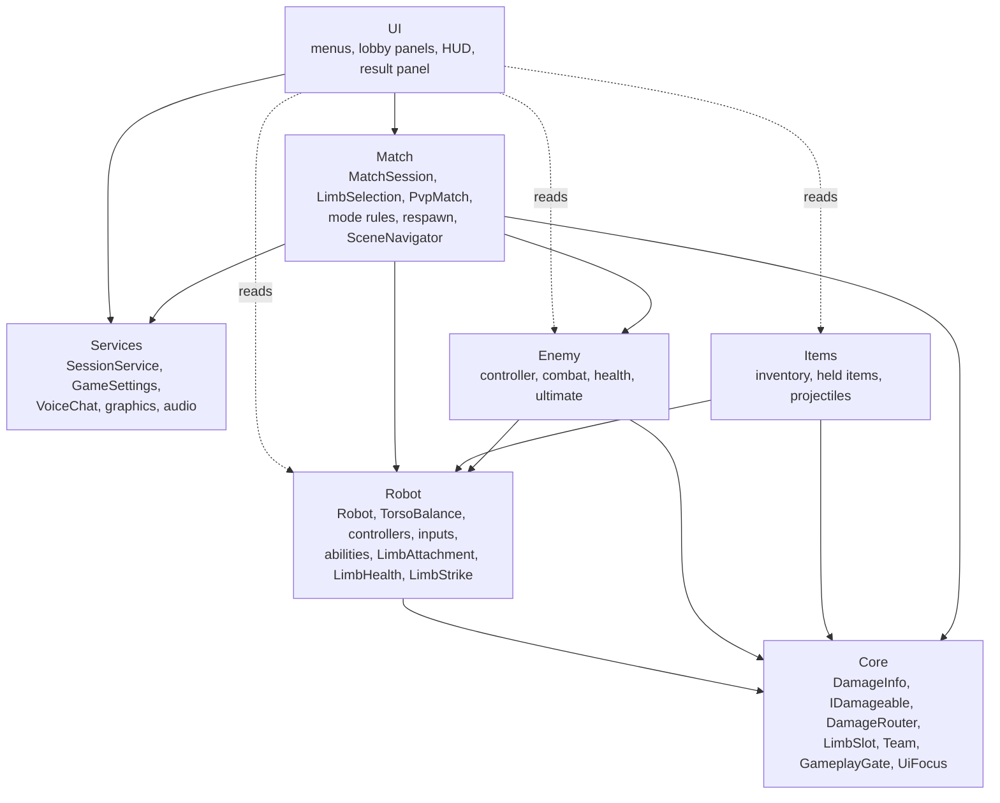
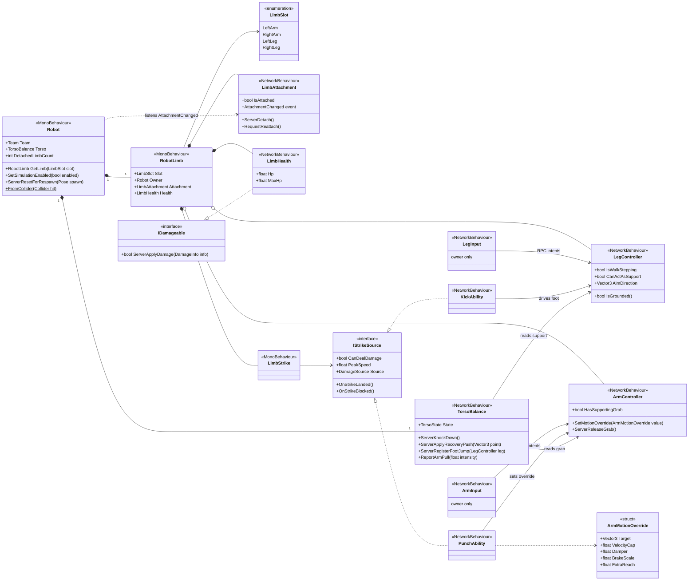
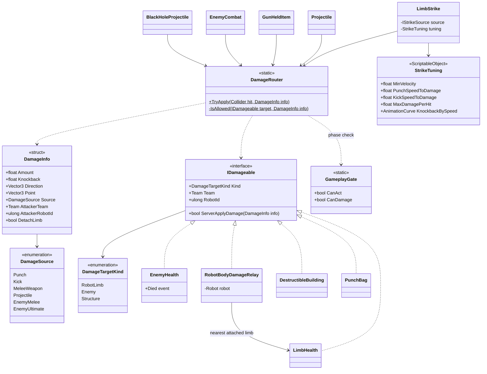
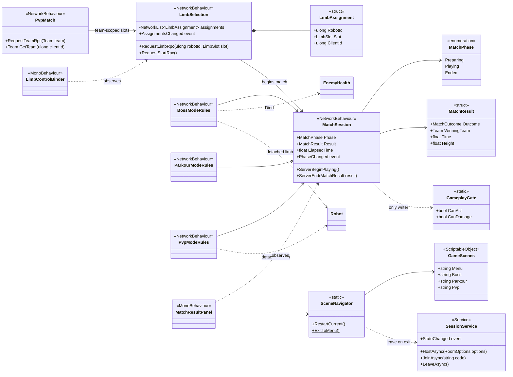
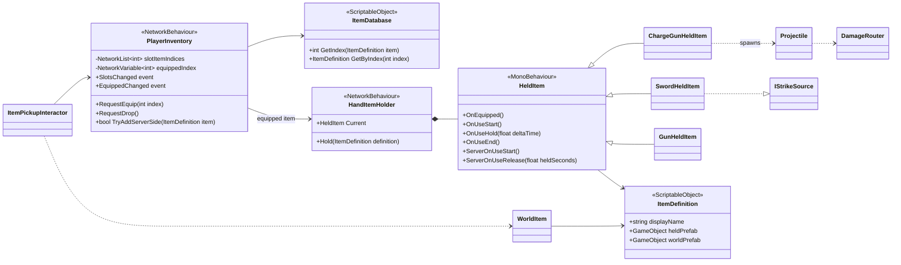
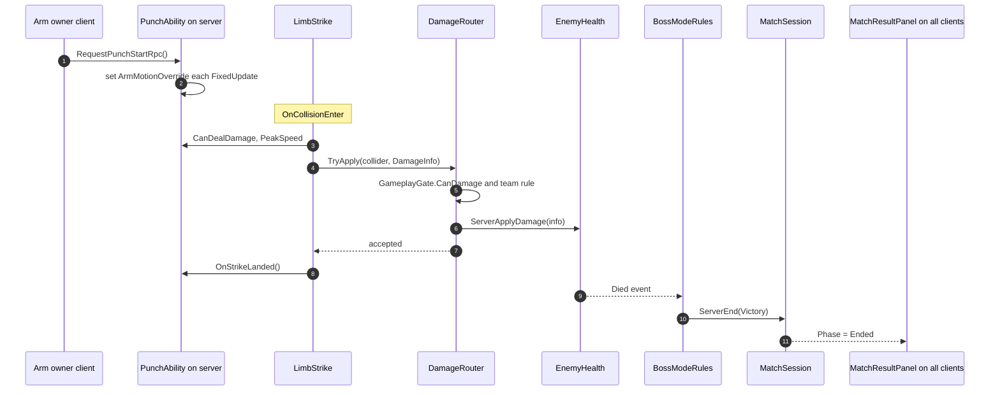
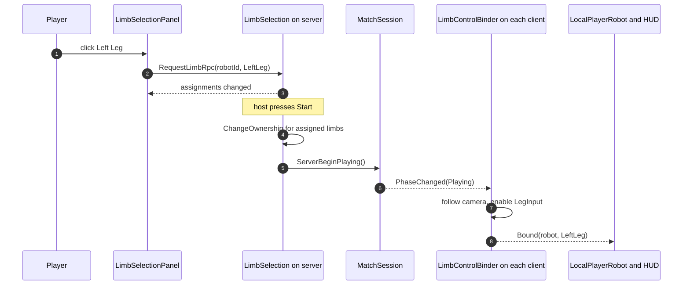
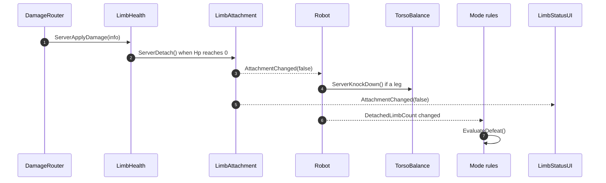
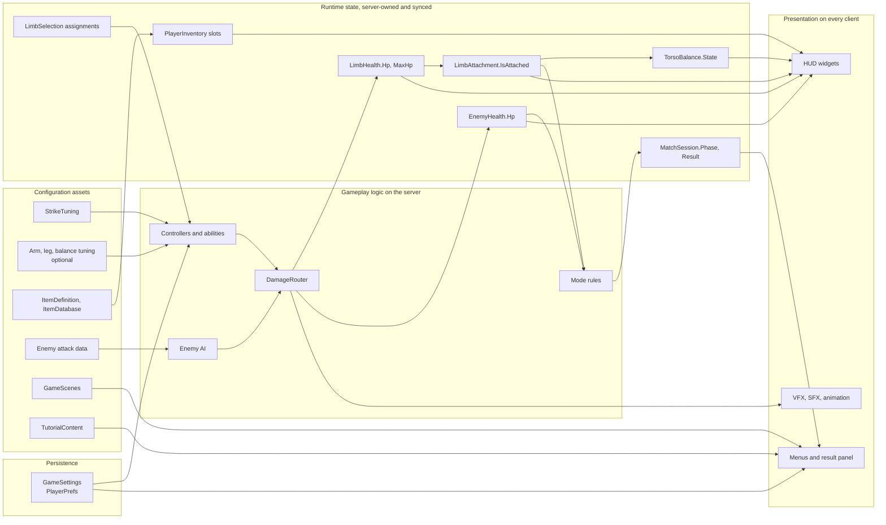

# Nsc-Unity Architecture Review

Branch `yelmee`, working tree of 2026-09-27 (includes the uncommitted edits to the item scripts and `ParkourFlowManager`).

**Scope.** Every runtime project script was read: about 24,000 lines in ~110 files under `Assets/Scenes/TheBestFolder/Mynigga`, `Assets/nok`, `Assets/Yelmee`, `Assets/petong` and `Assets/Scenes/Enemy AndInteractive Object`. The 19 editor scripts in `Assets/Editor` (~5,000 lines), `OutDated/`, `Learn/` and `_ArmFeelTest/` were skimmed. Third-party code (DOTween, JMO, Hierarchy Designer, Toon Shaders, UnityMCP, city packs) was excluded. Scene and prefab usage was checked by script GUID against the 8 enabled build scenes and every prefab, so "unused" below means "not attached anywhere", not a guess.

**Severity** (risk of bugs or change cost): Critical, High, Medium, Low.
**Priority** (what to do first): Critical, Important, Improvement, Optional.
Where the code does not settle a question, the text says **Cannot determine from provided code**.

---

## A. Codebase Overview

### What the code builds

A physics robot brawler. One robot is a torso plus four limbs (left/right arm, left/right leg). Every limb is its own `NetworkObject`, and a different player can control each one. All physics runs on the server: the owning client reads the mouse and sends aim targets and button states by RPC, and the server moves spring-driven rigidbodies. Modes: Boss (PvE, `MAPBOSS`), Parkour (`MAPPAKUAR`), PvP (two robots, red vs blue, up to 8 players), plus Timeline-intro variants of Boss and Parkour.

### Systems as they exist today

| System | Main classes (lines) | How it works |
|---|---|---|
| Robot balance and locomotion | `TorsoMovement` (517), `PlayerFootForRobot` (1128), `PlayerHandMovement` (995), `PlayerCam` (142) | Torso registers its feet and hands, reads their state every `FixedUpdate` and decides `Standing / Falling / Ragdoll`. Limbs are server-side springs toward targets sent by the owner. |
| Limb combat | `PlayerHandCombat : PlayerHandMovement` (521), `PlayerLegCombat` (658), `PhysicsDamageSender` (258), `PvpDamageSender` (283) | Punch = acceleration while LMB is held; kick = Shift charge. A collision on the limb turns peak speed into damage. |
| Limb health and detachment | `RobotHealth` (228), `JointPullAndReconnect` (445) | HP per limb; at 0 the joint is destroyed and max HP drops. Hold R to pull the limb back and rebuild the joint. |
| Boss enemy (`NscGame.Enemy`) | `EnemyController` (653), `EnemyCombat` (650), `EnemyHealth` (376), `EnemyUltimate` (641), `BlackHoleProjectile`, `EnemyRagdoll`, `EnemyBodySway`, `EnemyHealthUI`, `EnemyStateData` | Server coroutine decision loop, NetworkVariables drive the Animator on clients. `IHittable` and `AttackType` are declared here. |
| Items (`NscUnity.Items`) | `ItemDefinition`/`ItemDatabase` (ScriptableObjects), `PlayerInventory`, `HandItemHolder`, `HeldItem` + `ChargeGunHeldItem`/`GunHeldItem`/`SwordHeldItem`, `Projectile`, `WorldItem`, `ItemPickupInteractor`, `LocalItemOwner`, `InputCompat`, `ItemWheelUI`, `PickupPromptUI` | Server-owned inventory synced as indices into the item database. |
| Session and match flow | `OnlineNetworkUI` (1430), `ReturnToMenuOnHostLost` (328), `LobbyManager` (1533), `PvpTeamManager` (608), `PvpRobotTeam` (321), `GameFlowManager` (319), `ParkourFlowManager` (208), `RespawnManager`, `CheckpointZone`, `FallDeathZone`, `TutorialManager`, `TimelineSkipController` | Menu creates or joins a Unity Gaming Services session, host loads a map, an in-scene lobby assigns limbs, a mode manager decides win or loss. |
| HUD and menus | `LocalRobotBinder` + `HullRingUI`, `LimbStatusUI`, `PunchForceUI`, `KickChargeUI`, `StatusPromptUI`; `HudVisibilityGate`, `PvpPlayerHudGate`, `PvpHudRobotBinder`, `PvpTeamSelectUI` (760), `PvpResultUI`, `InMatchMenu` (767), `SettingsManager` (1113) | HUD widgets bind to "my robot" through `LocalRobotBinder`. |
| App services | `VoiceChat`, `GraphicsQualityManager` (both self-created, `DontDestroyOnLoad`), `GameAudio`/`AudioCategory`, `MouseSettings`, `MouseWheelFocus`, `UiFocus` | Static or singleton helpers that live across scenes. |
| Editor tooling | `PlayerHudBuilder`, `SettingsUIBuilder`, `PvpUIBuilder`, `InMatchMenuBuilder`, `GameFlowPanelBuilder`, validators, `ItemAuthorityTests` | Most UI hierarchies are generated from code in the editor. |

### What already works and should be kept

- **Server authority is consistent.** Clients send intents; the server clamps and validates them (`ValidateAndSetFootTarget`, `ValidateAndSetHandTarget`, the radius clamp in `TorsoMovement.ApplyRecoveryForceRpc`, `Vector3Extensions.IsValid`).
- **`PlayerInventory` is the model to copy.** One source of truth (`NetworkList` + `NetworkVariable`), server-only mutation, a `Request*` API for clients, events for UI, and `RpcInvokePermission.Owner` on its RPCs.
- **ScriptableObjects are used where they belong.** `ItemDefinition` and `ItemDatabase` hold configuration and give items a stable network index.
- **HUD widgets observe instead of polling each other**: `LocalRobotBinder.OnBound`, `NetworkVariable.OnValueChanged`, `JointPullAndReconnect.OnConnectionStateChanged`.
- **`UiFocus`** is a small, clear answer to "does a UI own the mouse right now".
- **The enemy module** has its own namespace, one-way ownership inside the prefab and cached Animator hashes.
- Comments explain *why* each fix exists, which made this review possible.

### The problem in one sentence

The code is carefully written locally, but the project has no shared backbone objects (no `Robot` that owns its limbs, no single way to deal damage, no single owner of the match phase), so each new feature re-derives those ideas by searching the scene, matching GameObject names and reading UI singletons.

---

## B. Architecture Problems

| # | File / Class | Problem | Severity | Evidence / Reason |
|---|---|---|---|---|
| 1 | Damage call sites (7) | No single damage pipeline. Target lookup, team rules and damage formulas are reimplemented in every attacker. | Critical | `PhysicsDamageSender.OnCollisionEnter` (EnemyHealth, then RobotHealth), `PvpDamageSender.OnCollisionEnter` (PvpRobotTeam, then RobotHealth or body), `explobuilding.OnCollisionEnter` (re-reads `PhysicsDamageSender` tuning and `PlayerHandCombat`), `GunHeldItem.ApplyDamage` (EnemyHealth, PvP checks, IHittable, body), `Projectile.ApplyDamage` (PvP, EnemyHealth, IHittable), `BlackHoleProjectile.DamageAlong` (`hittable is explobuilding`, `hittable is RobotHealth`), `EnemyCombat.ProcessHitDetection` (`p is RobotHealth rh`). `EnemyHealth` does not implement `IHittable`; it has its own `ServerTakeHit`. The punch formula `min(peak * speedToDamage, maxDamagePerHit)` is written in three files. |
| 2 | Robot limbs in `PVP.unity` | Two damage components on the same rigidbody, with different rules. Which one applies damage depends on component order. | Critical (verify in Play Mode) | The base prefab `Yelmee/Robotc DDD/RobotContainer.prefab` puts `PhysicsDamageSender` on the four limbs. `PVP.unity` adds `PvpDamageSender` to both robot instances and removes nothing. `PhysicsDamageSender` has no match-phase check, and its team check `RobotTeam.AreEnemies` always returns true because `RobotTeam` is attached to no prefab or scene. Whichever sender runs first calls `NotifyPunchImpact()`, which makes `CanDealDamage` false for the other. The PvP rules (`IsFighting`, `friendlyFire`, `limbDamageMultiplier`) can therefore be skipped. |
| 3 | `LobbyManager` | God class, and gameplay code depends on it. | Critical | 1533 lines and about ten responsibilities (see C). Gameplay reads it: `PlayerHandCombat` and `PlayerLegCombat` (`CanReadCombatInputForThisLimb` via `Instance` or `FindFirstObjectByType`), `HandItemHolder.CanUseWeapon`, `GameFlowManager` and `ParkourFlowManager` (timer start), `EnemyHealthUI`, `HudVisibilityGate`, `LocalRobotBinder`. |
| 4 | Robot structure (≥ 9 places) | No `Robot` aggregate. Limbs are found by GameObject name and hierarchy searches. Limb indices are defined four ways. | Critical | Name matching: `LobbyManager.ResolveActiveRobot` (`"_R"` goes to the **left** arm slot, mirrored for the UI), `PvpTeamManager.AssignByName` (`"_L"` goes to the left arm slot, not mirrored), `LocalRobotBinder.IsLeftName/IsRightName`. Hierarchy searches: `PvpRobotTeam.ResolveRobotRoot`, `RobotTeam.Find`, `LocalRobotBinder.ResolveRobotRoot`, `RobotBodyCheck`, `EnemyController.FindRobotTarget`, `GameFlowManager.CheckDefeatCondition` (all feet and hands in the scene), `RespawnManager.limbRigidbodies`. Limb index: `PvpLimb` constants, `LobbyManager.GetLimbByIndex`, `LimbStatusUI.LimbSlot`, `TutorialManager.LimbRole`. |
| 5 | Match phase | "Can players act or deal damage?" is answered by four unrelated flags. | High | Static `GameFlowManager.GameEnded` is written by `GameFlowManager`, `ParkourFlowManager` and `PvpResultUI` and read by the hand, foot, leg combat and `HandItemHolder`. Also `LobbyManager.GameStarted`, `PvpTeamManager.IsFighting`, `ParkourFlowManager.netEnded`. `HandItemHolder.CanUseWeapon` checks three singletons. `PvpPlayerHudGate` disables `HudVisibilityGate` so the two stop fighting over one `CanvasGroup`. |
| 6 | Limb attachment | Two sources of truth for "is this limb detached". | High | `JointPullAndReconnect.netIsConnected` and `PlayerFootForRobot.currentState` / `PlayerHandMovement.currentState` (`Attached/Detached`); the joint writes both. `GameFlowManager` counts defeat from the hand/foot state, `PvpRobotTeam` from `joint.IsConnected`. |
| 7 | `PlayerFootForRobot`, `PlayerHandMovement` | Owner input, cursor lock, aim model, IMGUI crosshair, RPC protocol, server physics and respawn reset live in one class. Aim is static shared state. | High | 1128 and 995 lines. `HandleCursorLock` and `HandleFootCursorLock` are near copies. `protected static sharedVirtualCursor` / `sharedAimOffsetWorld` are read by `GunHeldItem` and the foot through `PlayerHandMovement.AimNormalized`. |
| 8 | Cursor and ESC | Ten classes write `Cursor.lockState`; four handle ESC. | High | Writers: `PlayerHandMovement`, `PlayerFootForRobot`, `PlayerCam`, `GameFlowManager` and `ParkourFlowManager` (every frame after the end), `PvpResultUI`, `InMatchMenu`, `ItemWheelUI`, `SettingsManager`, `ReturnToMenuOnHostLost.LeaveMatchAsync`. ESC: hand, foot, `InMatchMenu`, `ItemWheelUI`. |
| 9 | `LobbyManager` vs `PvpTeamManager` | Two implementations of "players reserve limbs, host starts, bind camera to the limb". | High | `LobbyPlayer` vs `PvpPlayerEntry`, `SubmitPlayerNameServerRpc` vs `SubmitNameRpc`, `TryAssignAllLimbs` vs `TryAssignLocalLimb`, two `GetPlayerObject` copies, two ownership-transfer loops. `PvpTeamManager`'s header says the PvP scene must not contain `LobbyManager`, because the lobby disables extra robots. |
| 10 | Debug tools in shipping assets | Any client can detach limbs. | High | `DebugLimbBreaker` is on `PlayerHUD.prefab` with `enableDebugKeys: 1`; keys 1-4 call `JointPullAndReconnect.DebugRequestBreakRpc`, a server RPC with the NGO default `InvokePermission = Everyone`. `AutoStartHost` is in five build scenes. |
| 11 | Folders and namespaces | Organized by person rather than feature; one folder name is a racial slur. | High | Scripts live in `Assets/Scenes/TheBestFolder/Mynigga`, `Assets/nok`, `Assets/petong`, `Assets/Yelmee`, `Assets/Scenes/Enemy AndInteractive Object`. `Mynigga` is a slur and appears in every script path, log and stack trace. Three `RobotContainer` prefabs (`Yelmee/`, `Yelmee/Robotc DDD/`, `เก็บไว้กัน/`). Namespaces: `NscGame.Enemy`, `NscGame.Pvp`, `NscUnity.Items`, global, and `Unity.Multiplayer.Samples.Utilities.ClientAuthority` for a copied sample. CLAUDE.md's folder map is out of date (`player/` and `Ui/`, not `Player/` and `UI/`; `PhysicsDamageSender.cs` and `PlayerCam.cs` are not in `Combat/`). |
| 12 | `PlayerHandCombat : PlayerHandMovement` | Inheritance used to temporarily rewrite the parent's fields. | Medium | `PerformArmMovement` sets `handDamper`, `brakeDamping`, `smoothedHandTarget`, `velocityCapOverride`, `extraReach`, calls `base`, then restores them. Legs use composition instead (`PlayerLegCombat` is a separate component), so one concept follows two patterns. |
| 13 | `GameFlowManager`, `ParkourFlowManager`, `PvpResultUI` | Mode rules, result UI and scene navigation mixed together and copied. The menu scene name is defined four ways. | Medium | `FormatTime`, `RestartLevel`, `ExitToMenu`, `HidePanelInstant`, timer start and the cursor-unlock loop are copies. Menu scene: `"-Menu"` (GameFlowManager default), `"Assets/nok/scene/Game/-MenuNOk.unity"` (ParkourFlowManager), `"-MenuNOk"` (`ReturnToMenuOnHostLost` constant, `InMatchMenu`). Which value ships depends on serialized scene data: **Cannot determine from provided code**. |
| 14 | `OnlineNetworkUI` + `ReturnToMenuOnHostLost` | Session lifecycle lives inside the menu UI; reconnect state is shared through public mutable statics. | Medium | `OnlineNetworkUI` owns `CreateSessionAsync`, `JoinSessionByCodeAsync`, leave and reset, plus four panels and their animations. `LastRoomCode`, `LastSessionId`, `LeavingIntentionally` are static and written by both classes. |
| 15 | `EnemyHealth` | The enemy knows the game mode. | Medium | `ServerDie` calls `GameFlowManager.Instance.TriggerVictory()`. |
| 16 | `IHittable`, `AttackType` | The shared damage contract lives in the enemy module and is downcast by callers. | Medium | `IHittable` is declared at the bottom of `EnemyCombat.cs`. `AttackType` lists boss moves but is reused as the damage source for player punches, kicks, PvP and guns (`GunHeldItem` and `Projectile` report `AttackType.LightPunch`). Two overloads force every implementer to write near-identical methods. |
| 17 | `HandItemHolder` | A generic "hand" that knows one weapon type and three mode singletons. | Medium | `Current as ChargeGunHeldItem` in `Update` and `FireRpc`, `serverChargingGun` field, charge RPCs; `CanUseWeapon()` reads `GameFlowManager`, `PvpTeamManager`, `LobbyManager`. |
| 18 | Settings persistence | PlayerPrefs keys scattered; master volume written by two UIs. | Medium | Literal keys in `SettingsManager`, `InMatchMenu`, `LobbyManager`, `PvpTeamManager`, `VoiceChat`, `GameAudio`, `MouseSettings`, `GraphicsQualityManager`. `"PlayerName"` is read in three files; `"MasterVolume"` is written by `SettingsManager.OnMasterVolumeChanged` and `InMatchMenu.OnMasterChanged`. |
| 19 | UI animation helpers | The same DOTween helpers are copied into four classes. | Medium | `SetVisibleAnimated`, `SetVisibleInstant`, `KillUiTween`, `GetOriginalScale`, `PlayButtonClickFeedback`, `UpdateMenuFeel` in `OnlineNetworkUI`, `LobbyManager` ("ported from OnlineNetworkUI"), `PvpTeamSelectUI`, `InMatchMenu`. CLAUDE.md tells developers to copy this pattern. |
| 20 | Input | Two input APIs; key bindings hard-coded in about twelve classes; tutorial text disagrees with the code. | Medium | `InputCompat` (items, `InMatchMenu`) vs `Input.*` (limbs, camera, `JointPullAndReconnect`, `TutorialManager`, `DebugLimbBreaker`). `TutorialManager` says "Hold Left Shift to punch", "W/S height", "press F again to release"; the code punches on LMB, kicks on Shift, and grabs while F is held. |
| 21 | Public mutable state | Other classes write fields the owner should control. | Medium | `torso.currentState.Value` is written by `JointPullAndReconnect.HandleDisconnection` and `BlackHoleProjectile.KnockDownRobot`; `torso.armPullIntensity` by `PlayerHandMovement`; `PlayerFootForRobot.isStepping/isJumping/isPushingRecovery/plantedPosition` are public; `RobotHealth.MaxHp` and `currentHp` are public; `LobbyManager.Instance` and `leftArm`… are public fields; `PlayerCam.followTarget` is set by `LobbyManager` and `PvpTeamManager`. |
| 22 | Singletons and scene searches | 9 `Instance` singletons, about 10 mutable statics, 20 `FindObject*ByType` calls in runtime code. | Medium | See section F. |
| 23 | Dead code | Unused classes and fields still compile and mislead readers. | Low | `RobotTeam` (attached nowhere, still called by `PhysicsDamageSender`), `RobotManager` (references `OutDated.Following`), `TestNetwork`, `ClientNetworkTransform`, `PlayerPartsHitbox` (empty), `OutDated/*`, `ItemWheelUI.IsAnyOpen`, `PlayerHandMovement.detachedMoveSpeed` (and there is no detached-hand physics at all), `PlayerLegCombat.localLiftArmed` / `kickNeedsMouseRelease` (written, never read), `OnlineNetworkUI.nextSceneName`, `PlayerLegCombat.IsFinite` (duplicates `Vector3Extensions.IsValid`). |
| 24 | `TutorialManager` | Content is hard-coded in the class and has drifted from the controls. | Low | Step strings are static arrays; see row 20. |

---

## C. Responsibility Analysis

### God class and manager risk

| Class | Lines | Independent reasons to change | Risk | Is the name a real responsibility? |
|---|---|---|---|---|
| `LobbyManager` | 1533 | ~10 | Critical | No. It is a container: roster, reconnect seats, limb reservation, match start, limb binding, robot discovery, physics freeze, tutorial start, all lobby UI, local identity. |
| `OnlineNetworkUI` | 1430 | ~8 | High | Partly. Menu UI plus the whole UGS session lifecycle. |
| `PlayerFootForRobot` | 1128 | ~7 | High | Yes for physics; input, cursor and IMGUI are extra. |
| `SettingsManager` | 1113 | ~6 | High | Partly. Settings UI plus persistence, display application, voice UI, FPS/ping overlay, and re-parenting itself into a persistent canvas. |
| `PlayerHandMovement` | 995 | ~6 | High | Yes for physics; input, cursor, static aim and IMGUI are extra. |
| `PvpTeamManager` | 608 | ~5 | Medium | Mostly. PvP roster and winner; limb binding and name-based limb lookup belong elsewhere. |
| `PvpRobotTeam` | 321 | 4 | Medium | Partly. Team tag, static registry, defeat watch, body-damage routing. |
| `GameFlowManager` | 319 | 5 | Medium | Partly. It only runs the Boss mode, and it also owns result UI, scene navigation and the cursor. |
| `TorsoMovement` | 517 | 3 | Medium | Yes, but the name says "movement" and the class decides balance and falling. |
| `PlayerHandCombat` | 521 | 2 | Medium | Yes; the problem is the inheritance mechanism (row 12). |
| `HandItemHolder` | 265 | 3 | Medium | Mostly; the ChargeGun protocol leaked in. |
| `EnemyController`, `EnemyCombat`, `EnemyUltimate` | ~650 each | 2-3 | Low | Yes. Large but cohesive for a single boss. |
| `RespawnManager`, `GraphicsQualityManager`, `TutorialManager` | 150-440 | 1-2 | Low | Yes. |
| `RobotManager` | 13 | 0 | Low | No. Empty; delete. |

### Spaghetti hotspots

- **Order-dependent damage.** Two senders on one rigidbody communicate through the side effect `NotifyPunchImpact()` → `hasHitThisPunch` (row 2).
- **Temporal coupling through field mutation.** `PlayerHandCombat.PerformArmMovement` writes five inherited fields, calls `base`, and restores them; a missed restore silently changes arm feel.
- **`TorsoMovement.HandleFakeHoverAndPosture`** (~150 lines) evaluates four fall rules with four timers, then applies centering, hover and upright forces, with early `return`s between them.
- **Cross-scene flags.** `intentionalLeave` (instance) and `ReturnToMenuOnHostLost.LeavingIntentionally` (static) must be set in the right order by two classes to prevent a reconnect loop.
- **Discovery by polling.** `HudVisibilityGate`, `EnemyHealthUI` and `LocalRobotBinder` search for `LobbyManager` on a timer every second.

### Recommended boundaries for the important classes

**`LobbyManager`**
- Current responsibilities: (1) roster of clients with names, `playerId` and connected flag; (2) reconnect seat holding; (3) limb reservation (`limbOwners`, `RequestLimbServerRpc`); (4) match start (`netGameStarted`, ownership transfer); (5) binding the local player to the limb (camera follow, enabling controllers, retry loop); (6) robot discovery and disabling extra robots; (7) physics freeze and unfreeze; (8) tutorial start; (9) all lobby UI including hover, colors, tweens and parallax; (10) static `LocalPlayerId`.
- Problems: a UI redesign, a reconnect policy change and a robot-prefab change all edit the same file; gameplay code must find this UI object to decide whether input is allowed.
- Recommended responsibility: "who reserved which limb, and when did the match start".
- Candidates:
  - `LimbSelection` (NetworkBehaviour): roster, seats, reservations, start request.
  - `LimbControlBinder` (client MonoBehaviour, shared with PvP): camera follow and enabling the input component of the assigned limb.
  - `LimbSelectionPanel` (UI): images, colors, player list, status text.
  - Physics freeze moves to `Robot.SetSimulationEnabled(bool)`, driven by the match phase.
  - `LocalPlayerId` and player name move to `GameSettings`/`PlayerIdentity`.

**`OnlineNetworkUI`**
- Current: UGS init and sign-in, session create/join/leave/reset, player count and room-capacity sync, map selection and scene load, connect-panel state machine, reconnect panel, tweens, button feedback, parallax.
- Recommended: `SessionService` (app-lifetime, absorbs `ReturnToMenuOnHostLost`): `HostAsync`, `JoinAsync`, `LeaveAsync`, reconnect, `StateChanged` event. `MainMenuUI`: the panels. `RoomPanel`: waiting room, player count, map choice.

**`PlayerFootForRobot` and `PlayerHandMovement`**
- Current: owner input (mouse aim, wheel, buttons, Q, Space, F), cursor lock and ESC, aim model, IMGUI marker, RPC protocol and validation, server physics, joint-chain setup, respawn reset.
- Recommended: keep the server side together as `LegController` / `ArmController` (physics, RPC validation, joint setup, respawn reset). These are cohesive and share tuning; splitting them further would scatter the tuning fields. Move owner-only code (input, aim, cursor, crosshair) into `LegInput` / `ArmInput`. Replace the static aim fields with one `LocalAim` component per local player.

**`PlayerHandCombat`**
- Recommended: `PunchAbility` as a separate component, like `PlayerLegCombat`. `ArmController` accepts an `ArmMotionOverride` struct (target, velocity cap, damper, brake scale, extra reach) for the current physics tick, so no field is mutated and restored.

**`TorsoMovement`**
- Mostly cohesive: "keep the robot upright and decide when it falls". Keep one class, rename it `TorsoBalance`, and replace outside writes with methods: `ServerKnockDown()`, `ReportArmPull(float)`. Optionally move the four fall rules into a plain C# `FallRules` class so they can be unit tested.

**`JointPullAndReconnect`**
- Current: joint break and rebuild, joint settings snapshot, R-key input, pull physics, attachment sync, writing the controllers' state, knocking the torso down, debug break.
- Recommended: `LimbAttachment` keeps state, reconnect physics and an `AttachmentChanged` event. The R key moves to the limb input. The torso knock-down is done by `Robot`, which listens to its limbs. Controllers read `attachment.IsAttached` instead of keeping their own copy.

**`PhysicsDamageSender` + `PvpDamageSender`**
- Same job ("turn a limb collision into a damage request") with different target rules. Merge into `LimbStrike`, which builds a `DamageInfo` and calls `DamageRouter` (section H).

**`PvpRobotTeam`**
- Team moves to `Robot.Team`; registry to `Robot.All` / `Robot.FromCollider`; body damage to `RobotBodyDamageRelay` (an `IDamageable` on the torso); defeat watch to `PvpModeRules`.

**`GameFlowManager`, `ParkourFlowManager`, `PvpResultUI`**
- Recommended: server rules (`BossModeRules`, `ParkourModeRules`, `PvpModeRules`), one `MatchResultPanel`, and a shared `SceneNavigator` with one place for scene names.

**`SettingsManager` and `InMatchMenu`**
- Recommended: `GameSettings` owns keys, load, save and apply; `SettingsPanel` and `InMatchMenu` only display and forward changes. Move the FPS/ping overlay into its own `NetStatsOverlay`.

**`HandItemHolder`**
- Recommended: give `HeldItem` server hooks (`ServerOnUseStart`, `ServerOnUseRelease(float heldSeconds)`) so the charge protocol lives in `ChargeGunHeldItem`. Read `GameplayGate` instead of three singletons.

**`LocalRobotBinder`**
- After `LimbSelection` exists this becomes a thin `LocalPlayerRobot` that exposes the assigned `(Robot, LimbSlot)`. The HUD widgets stay as they are.

**No change needed:** `PlayerInventory`, `WorldItem`, `ItemDatabase`, `ItemDefinition`, `ItemPickupInteractor`, `UiFocus`, `MouseWheelFocus`, `MouseSettings`, `GameAudio`/`AudioCategory`, `EnemyRagdoll`, `EnemyBodySway`, `CheckpointZone`, `FallDeathZone`, the HUD widgets, `VoiceLevelMeter`, `Vector3Extensions`.

---

## D. Naming Analysis

### Vocabulary

The project uses `Manager`, `Movement`, `Combat`, `ForRobot`, `Binder`, `Gate`, `Check` and `UI` for overlapping roles. Proposed vocabulary:

| Term | Meaning | Examples |
|---|---|---|
| `Robot` | The whole robot aggregate | `Robot`, `RobotLimb` |
| `Limb`, `LimbSlot` | One arm or leg, and which of the four | `LimbSlot.LeftLeg` |
| `*Controller` | Server-side physics driver of a body part | `ArmController`, `LegController` |
| `*Input` | Owner-side input reader that sends RPCs | `ArmInput`, `LegInput` |
| `*Ability` | An action that temporarily drives a controller | `PunchAbility`, `KickAbility` |
| `*Health` | Owns HP | `LimbHealth`, `EnemyHealth` |
| `*Rules` | Server-side game-mode rules | `BossModeRules` |
| `*Service` | App-lifetime system (`DontDestroyOnLoad`) | `SessionService` |
| `*UI` / `*Panel` | Presentation only | `SettingsPanel`, `HullRingUI` |
| `Server*` method | Runs only on the server | `ServerApplyDamage` |
| `Request*` method | Client asks the server | `RequestEquip` (already used) |
| Event name | Past tense, no `On` prefix | `Died`, `PhaseChanged` |
| Handler name | `On` + event | `OnPhaseChanged` |

### Folders and namespaces

```text
Assets/Scenes/TheBestFolder/Mynigga/ → Assets/_Game/Scripts/{Core, Robot, Enemy, Items, Match, Services, UI}/
Reason: the current name is a racial slur, and scripts should not live under Scenes/.

Assets/nok/, Assets/petong/, Assets/Yelmee/ (script parts) → the feature folders above
Reason: folders named after people do not tell a reader where "items" or "PvP" live. Keep personal folders for sandbox scenes only.

Assets/nok/Timeline'/ → Assets/_Game/Scripts/Match/Timeline/
Reason: the apostrophe breaks shell commands and some tools.

Assets/เก็บไว้กัน/, Assets/_Recovery/ → remove from Assets (git already keeps history)
Reason: backup prefabs share names and GUID-referenced scripts with the live ones.

Namespaces NscGame.Enemy, NscGame.Pvp, NscUnity.Items, global → Nsc.Core, Nsc.Robot, Nsc.Enemy, Nsc.Items, Nsc.Match, Nsc.Services, Nsc.UI
Reason: one root; add namespaces when files move, not as a separate churn pass.
```

Moves and renames must be done inside the Unity Editor so `.meta` GUIDs, and therefore scene and prefab references, are preserved.

### Classes

```text
TorsoMovement → TorsoBalance
Reason: it decides standing vs falling; it does not move the robot.

PlayerHandMovement → ArmController
PlayerFootForRobot → LegController
Reason: consistent pair; "ForRobot" is noise and "Player" is misleading (the limb belongs to the robot; a player only controls it).

PlayerHandCombat → PunchAbility
PlayerLegCombat → KickAbility
Reason: says what the component does; matches the composition model.

JointPullAndReconnect → LimbAttachment
Reason: names the concept (is the limb attached), not the mechanism.

RobotHealth → LimbHealth
Reason: HP is per limb; the robot has no health of its own.

PhysicsDamageSender + PvpDamageSender → LimbStrike
Reason: one component for "this limb hit something".

IHittable → IDamageable
Reason: the contract is about taking damage, and it should live in Core, not in EnemyCombat.cs.

explobuilding (file "explo building.cs") → DestructibleBuilding (DestructibleBuilding.cs)
Reason: lowercase abbreviation, and the file name must match the class name.

LobbyManager → LimbSelection + LimbSelectionPanel + LimbControlBinder
Reason: it is the in-scene limb selection, not a UGS lobby, and it holds three responsibilities.

OnlineNetworkUI → MainMenuUI + SessionService
ReturnToMenuOnHostLost → merged into SessionService
Reason: the current name describes one fallback; the class actually reconnects and leaves matches.

GameFlowManager → BossModeRules + MatchResultPanel
ParkourFlowManager → ParkourModeRules
PvpTeamManager → PvpMatch
PvpRobotTeam → Robot.Team + PvpModeRules + RobotBodyDamageRelay
RobotTeam → delete
Reason: "Manager" hides that each class serves one mode; rules and presentation separate.

LocalRobotBinder → LocalPlayerRobot
HudVisibilityGate + PvpPlayerHudGate → HudVisibility
SettingsManager → SettingsPanel (+ GameSettings for data)
TutorialManager → TutorialPanel (+ TutorialContent asset)

NetworkCheck.IsServerOrHost() → NetworkAuthority.IsServerOrOffline()
Reason: it returns true when there is no network at all; the current name hides that.

RobotBodyCheck.IsRobotBodyPart(c) → Robot.FromCollider(c) != null
UiTest, PlayerPartsHitbox, RobotManager, TestNetwork, ClientNetworkTransform → delete
```

### Methods

```text
HandleFakeHoverAndPosture → EvaluateFallRules + ApplyStandingSupport
Reason: one method currently does both; the split matches the two jobs.

ApplyContinuousRecoveryForce → ServerApplyRecoveryPush
NotifyFootJump → ServerRegisterFootJump
Reason: server-only methods use the Server prefix like the rest of the codebase.

SetPunchingRpc(bool) → RequestPunchStartRpc() / RequestPunchReleaseRpc()
Reason: a bool parameter hides two different commands.

HandleInput (PlayerHandMovement, PlayerFootForRobot) and the input reading inside HandItemHolder.Update() → ReadOwnerInput
Reason: "Handle" says nothing; this reads local input on the owner.

ProcessHitDetection → ApplyHitToNearestPart
Reason: describes the actual rule.

ServerTakeHit (EnemyHealth) and three ServerTakeDamage overloads (RobotHealth, explobuilding) → ServerApplyDamage(in DamageInfo)
Reason: one signature for every damageable object.

TriggerVictory / TriggerDefeat / TriggerRunEnd → MatchSession.ServerEnd(MatchResult)
ForceBreakJoint → ServerDetach
StartPullingExternal / StopPullingExternal → BeginReattach / CancelReattach
CheckDefeat / CheckDefeatCondition → EvaluateDefeat
UiTest.OnHelthchanged → delete (misspelled, unused)
```

### Fields and properties

```text
public NetworkVariable currentState (torso, hand, foot) → private NetworkVariable + public State { get; } + Server* methods
Reason: other classes currently write .Value directly.

RobotHealth.MaxHp (public field), currentHp → [SerializeField] maxHp + MaxHp property; private hp NetworkVariable + Hp property
Jpar → attachment
Joinobject → jointHost
RobotManager.limps → (deleted; typo of "limbs")
PlayerCam.playercam / playeral → playerCamera / audioListener
RobotHealth.regening → isRegenerating
TorsoMovement.testSingleFootRecovery (default true) → allowSingleFootRecovery
Reason: it is a shipped behavior, not a test.

debugLog / debugPunchLog / debugKickLog (default true) → default false
ulong.MaxValue as "no owner" (LobbyManager) and PvpTeamManager.NoOwner → one ClientIds.None constant
```

Private field style is mixed in the same file (`_tiltTimer` next to `currentStress` in `TorsoMovement`). Pick one convention; this is Low priority and should be applied only when a file is touched anyway.

### Interfaces

`IHittable` is the only interface. It is a reasonable idea in the wrong place: it sits in the enemy module, uses the enemy's `AttackType`, has two overloads, and callers downcast it (`is RobotHealth`, `is explobuilding`). Replace it with `IDamageable` in Core with one method that takes a `DamageInfo`. Add `IStrikeSource` for the hand, leg and sword. No other interfaces are needed.

### Events

All events use an `On` prefix (`OnConnectionStateChanged`, `OnBound`, `OnFocusChanged`, `OnRosterChanged`, `OnMatchStateChanged`, `OnWinnerDecided`, `OnRegistryChanged`, `OnSlotsChanged`, `OnEquippedChanged`, `OnReconnectStateChanged`, `OnVoiceStateChanged`), and so do the handlers, which makes `joint.OnConnectionStateChanged += OnPartConnectionChanged` hard to read. Rename to `AttachmentChanged`, `Bound`, `FocusChanged`, `RosterChanged`, `PhaseChanged`, `WinnerDecided`, `SlotsChanged`, `EquippedChanged`, `ReconnectStateChanged` when each class is touched. Replace `Action<bool, int, int, string>` with `Action<ReconnectStatus>` so the four values have names.

### Enums

- `EnemyState`, `UltimatePhase`, `CombatState`, `LegActionState`: clear state enums; keep.
- `AttackType` mixes boss moves with a general damage source. Split into `EnemyAttack` (the boss's melee moves only: LightPunch, BarragePunch, Kick) and `DamageSource` (Core). `BlackHole` is not an `EnemyAttack`: only `EnemyUltimate` fires the black hole, and today the value is just the damage-source tag in `BlackHoleProjectile` (`BlackHoleProjectile.cs:166`, `BlackHoleProjectile.cs:171`), which becomes `DamageSource.EnemyUltimate`.
- `TorsoState.Falling` lives for one `FixedUpdate`; outsiders set it to mean "fall now". Replace outside writes with `ServerKnockDown()` and keep `Falling` private or remove it.
- `HandState` / `FootState` (`Attached/Detached`) duplicate `LimbAttachment`; remove.
- `GameState {Playing, Victory, Defeat}`, `PvpMatchState {TeamSelect, Fighting, Finished}`, `bool netGameStarted`, `bool netEnded` all describe the same thing: use `MatchPhase {Preparing, Playing, Ended}` plus a `MatchResult`.
- `PvpLimb` ints, `LimbStatusUI.LimbSlot`, `TutorialManager.LimbRole`, and the `index >= 2` checks in `LobbyManager`: one `LimbSlot` enum with `IsArm()`, `IsLeg()` and `DisplayName()` extensions.

### Comments

Comments are in Thai and English, and `PlayerFootMovementAudio` is in Japanese. Identifiers are already English. Choosing one comment language is a team decision (Optional), but mixing three in one feature makes review harder for anyone outside the original author.

---

## E. OOP Analysis

### Encapsulation

The dominant pattern is "public field that other classes write". Examples: `TorsoMovement.currentState`, `torsoRb`, `armPullIntensity`, `currentStress`; `PlayerFootForRobot.isStepping`, `isJumping`, `isPushingRecovery`, `plantedPosition`; `RobotHealth.MaxHp`, `currentHp`; `LobbyManager.Instance` (a public field, not a property), `leftArm`, `rightArm`, `leftLeg`, `rightLeg`; `PlayerCam.followTarget`. Public tuning fields for the Inspector are fine; public runtime state is not.

Rule: private `NetworkVariable` + read-only property + `Server*` methods for changes. `PlayerInventory` and `EnemyController` already do this.

### Abstraction

- Good: `UiFocus`, `InputCompat` (an adapter over two input systems), `ItemDatabase`, `LocalRobotBinder` from the widgets' point of view.
- Missing: a `Robot` aggregate, a damage contract (`DamageInfo` + `IDamageable`), one match-phase owner.
- Leaky: `IHittable` callers downcast to concrete types; `HandItemHolder` casts to `ChargeGunHeldItem`; `AttackType` exposes boss moves to player code.

### Inheritance

| Hierarchy | Real IS-A? | Verdict |
|---|---|---|
| `PlayerHandCombat : PlayerHandMovement` | Loosely (a punching arm is an arm), but implemented by rewriting parent fields | Replace with composition (`ArmController` + `PunchAbility`), matching legs |
| `HeldItem` → `ChargeGunHeldItem`, `GunHeldItem`, `SwordHeldItem` | Yes; virtual hooks are a good fit | Keep; add server hooks so the holder stops casting |
| `ClientNetworkTransform : NetworkTransform` | Yes | Unused; delete |
| Every `NetworkBehaviour` | Framework requirement | Fine; no deep trees exist |

### Polymorphism

Conditionals worth replacing:
- `if (combat != null) … else if (legCombat != null) … else …` in `PhysicsDamageSender`, `PvpDamageSender` and `explobuilding`: replace with `IStrikeSource` (hand, leg, sword each implement it).
- `hittable is explobuilding` / `is RobotHealth` in `BlackHoleProjectile` and `EnemyCombat`: replace with `IDamageable.Kind` (Structure, RobotLimb, Enemy) and a `DetachLimb` flag on `DamageInfo`.
- Four parallel `switch (AttackType)` blocks in `EnemyCombat` (origin, rotation offset, VFX prefab, execute): this is data, not behavior. A serializable `EnemyAttackDefinition[]` (origin, radius, damage, hit delay, VFX, SFX, trigger) removes 12 fields and 4 switches. Improvement priority, and only worth doing if more attacks or a second enemy is planned.

Conditionals to keep: `switch` over `TorsoState`, `EnemyState`, `CombatState`, `LegActionState`. They are small, and the enums must stay serializable in `NetworkVariable`s.

### Composition

Legs already compose well (`PlayerFootForRobot` + `PlayerLegCombat` on the same object, the foot yielding control through `IsKickControllingFoot`). The HUD composes widgets around `LocalRobotBinder`. The proposal extends the same idea: `Robot` composes a torso and four `RobotLimb`s; each limb composes attachment, health, strike, a controller, an input and an ability.

---

## F. Dependency Analysis

### Current dependencies (verified code references)

Gameplay pointing at UI and mode classes (wrong direction):

```text
PlayerHandCombat   → LobbyManager                      (CanReadCombatInputForThisLimb)
PlayerLegCombat    → LobbyManager, GameFlowManager
PlayerHandMovement → GameFlowManager.GameEnded, UiFocus
PlayerFootForRobot → GameFlowManager.GameEnded, UiFocus
HandItemHolder     → GameFlowManager, PvpTeamManager, LobbyManager, UiFocus
EnemyHealth        → GameFlowManager                   (TriggerVictory)
GunHeldItem, Projectile, ChargeGunHeldItem → PvpTeamManager, PvpRobotTeam
RobotHealth        → IHittable, AttackType             (declared in the enemy module)
```

Flow and UI pointing at gameplay (expected direction, but through searches and names):

```text
LobbyManager     → TorsoMovement, PlayerHandMovement, PlayerFootForRobot, PlayerCam, TutorialManager, SettingsManager
PvpTeamManager   → PlayerHandMovement, PlayerFootForRobot, PlayerCam, PvpRobotTeam
GameFlowManager  → PlayerFootForRobot, PlayerHandMovement, LobbyManager
ParkourFlowManager → TorsoMovement, LobbyManager, GameFlowManager
LocalRobotBinder → LobbyManager, TorsoMovement, JointPullAndReconnect, PlayerHandCombat, PlayerLegCombat, RobotHealth
```

Combat:

```text
PhysicsDamageSender → PlayerHandCombat, PlayerLegCombat, EnemyHealth, RobotHealth, RobotTeam, AttackType
PvpDamageSender     → PlayerHandCombat, PlayerLegCombat, PvpRobotTeam, PvpTeamManager, RobotHealth
explobuilding       → PhysicsDamageSender, PlayerHandCombat, NetworkCheck, IHittable
EnemyCombat         → EnemyController, IHittable, RobotHealth
BlackHoleProjectile → IHittable, explobuilding, RobotHealth, TorsoMovement
```

### Circular dependencies

1. `PlayerHandCombat ⇄ PhysicsDamageSender` and `PlayerLegCombat ⇄ PhysicsDamageSender`: the sender reads `PeakPunchSpeed`/`CanDealDamage` and calls `Notify*`; the combat classes read the sender's tuning for their debug log.
2. `PlayerFootForRobot ⇄ PlayerLegCombat`.
3. `TorsoMovement ⇄ PlayerFootForRobot / PlayerHandMovement`: registration, plus limbs writing torso fields.
4. `JointPullAndReconnect ⇄ PlayerFootForRobot / PlayerHandMovement`: the joint writes controller state; the foot reads `JointPull.IsBeingPulled`.
5. `OnlineNetworkUI ⇄ ReturnToMenuOnHostLost` through static fields and a static event.
6. Module level: limbs → `LobbyManager` → limbs; `RobotHealth` → enemy module (`IHittable`) → `RobotHealth`; enemy → `GameFlowManager` → limbs.

Cycles 2 and 3 are inside one robot and are acceptable if they go through narrow read-only members. Cycles 1, 5 and 6 cross module boundaries and should be removed.

### Fan-in and fan-out

| Class | Fan-in (files that use it in code) | Comment |
|---|---|---|
| `TorsoMovement` | 14 | Natural hub of the robot; needs a smaller public surface |
| `PlayerHandMovement`, `PlayerFootForRobot` | ~12 each | Hubs because nothing else represents "the robot" |
| `RobotHealth`, `JointPullAndReconnect` | 11 each | |
| `PvpTeamManager` | 10 | Items and projectiles depend on the PvP mode |
| `LocalRobotBinder`, `UiFocus` | 10 each | Fine: UI-side hubs |
| `LobbyManager` | 8 | Problem: gameplay depends on a UI class |
| `GameFlowManager` | 7 | Problem: static flag used as a global gate |

Highest fan-out: `LobbyManager` (9+ project types plus NGO, UGS, DOTween), `OnlineNetworkUI`, `PvpTeamManager`, `PhysicsDamageSender` (6), `GunHeldItem` (6).

### Hidden dependencies

- **20 `FindObject*ByType` calls** in runtime code: `LocalRobotBinder` (4), `LobbyManager` (2), `GameFlowManager` (2), `EnemyHealthUI` (2), `LocalItemOwner` (2), and one each in `PlayerHandCombat`, `PlayerLegCombat`, `HudVisibilityGate`, `ParkourFlowManager`, `EnemyController`, `GunHeldItem`, `PlayerCam`, `GraphicsQualityManager`.
- **9 singletons**: `LobbyManager`, `SettingsManager`, `VoiceChat`, `GraphicsQualityManager`, `TutorialManager`, `PvpTeamManager`, `GameFlowManager`, `ParkourFlowManager`, `RespawnManager`.
- **Mutable statics**: `GameFlowManager.GameEnded`; `ReturnToMenuOnHostLost.LastRoomCode`, `LastSessionId`, `LeavingIntentionally`, `IsReconnecting`; `PlayerHandMovement` shared aim; `PvpRobotTeam` registry; `WorldItem.Active`; `ItemWheelUI.openCount`; `UiFocus`, `MouseWheelFocus`, `MouseSettings`, `GameAudio` caches. Most of them correctly reset on domain reload.
- **GameObject names** as identity (row 4).

### Who should know whom

| Dependency | Mechanism | Why |
|---|---|---|
| Limb ⇄ torso, limb ⇄ its ability | Direct serialized reference | Same robot, same lifetime |
| Anything → robot parts | `Robot` / `RobotLimb` / `LimbSlot` | Replaces names and scene searches |
| Attacker → damaged object | `DamageRouter` + `IDamageable` | Five unrelated receiver types |
| Collision → strike data | `IStrikeSource` | Hand, leg and sword differ |
| Enemy death, limb detached, match phase | C# events / `NetworkVariable` callbacks | Sender must not know receivers |
| Gameplay → "is the match running" | `GameplayGate` (read-only, single writer) | Removes the dependency on UI and mode classes |
| Scene objects → scene objects | Inspector references | Explicit, no search at runtime |
| UI → gameplay | Read models, send `Request*` calls | Nothing depends on UI |

---

## G. Communication Design

| Sender | Mechanism | Receiver | Why this mechanism |
|---|---|---|---|
| Owner client input | RPC (`InvokePermission.Owner`) | `ArmController` / `LegController` | A command that needs an authority check. Owner-only permission matches `PlayerInventory`. |
| `LimbStrike`, projectiles, enemy attacks | Static call `DamageRouter.TryApply(collider, info)` | `IDamageable` | One place for team and phase rules; receivers vary. |
| `LimbHealth.Hp`, `EnemyHealth.Hp` | `NetworkVariable.OnValueChanged` (existing) | HUD widgets, boss bar | Already correct. |
| `LimbAttachment` | `AttachmentChanged` event | `Robot` → `TorsoBalance.ServerKnockDown()` | The robot owns its limbs; the attachment should not know the torso. |
| `EnemyHealth` | `Died` event | `BossModeRules` → `MatchSession.ServerEnd(Victory)` | The enemy should not know which mode it is in. |
| `Robot` detached count | Query + `AttachmentChanged` | `BossModeRules`, `PvpModeRules` | Defeat is a mode rule. |
| `MatchSession.Phase` | `NetworkVariable` + `PhaseChanged`; writes `GameplayGate` | Inputs, weapons, HUD, result panel | One owner for the phase; readers depend only on Core. |
| `LimbSelection` assignments | `NetworkList` change | `LimbControlBinder` → `LocalPlayerRobot.Bound` → HUD | Shared by co-op and PvP. |
| UI panels | `UiFocus.Push/Pop` | Limb inputs (via cursor policy) | `UiFocus` already works; give it cursor ownership too. |
| `SessionService` | `StateChanged` event | `MainMenuUI`, `InMatchMenu` | Survives scene loads; replaces static fields. |
| Settings UI | Direct call to `GameSettings` setters | `AudioListener`, `GameAudio`, `MouseSettings`, graphics | Simple and synchronous; no event bus needed. |
| `FallDeathZone` | `RespawnManager.Instance.RespawnBody()` → `Robot.ServerResetForRespawn()` | Limbs, torso | One scene service; the robot fans out to its own parts. |

An event bus is not needed: there are fewer than ten cross-module events and each has an obvious owner.

---

## H. Recommended Architecture

Seven modules, sized to the project. Arrows point from the user of a module to the module it uses.

| Module | Responsibility | Belongs here | Does not belong here | Depends on | Talks through |
|---|---|---|---|---|---|
| **Core** | Shared vocabulary | `DamageInfo`, `DamageSource`, `IDamageable`, `DamageRouter`, `Team`, `LimbSlot`, `GameplayGate`, `UiFocus`, `MouseWheelFocus`, `InputCompat`, `Vector3Extensions`, `NetworkAuthority` | Any scene logic, any MonoBehaviour with state | Unity, NGO | Static helpers, structs |
| **Robot** | The robot and its limbs | `Robot`, `RobotLimb`, `TorsoBalance`, `ArmController`, `LegController`, `ArmInput`, `LegInput`, `PunchAbility`, `KickAbility`, `LimbAttachment`, `LimbHealth`, `LimbStrike`, `OrbitCamera` | Lobby, modes, UI, PvP teams (only the `Team` value) | Core | RPCs, events, `DamageRouter` |
| **Enemy** | The boss | Current enemy classes + `Died` event | Victory logic | Core, Robot (targets via `Robot.All`) | `DamageRouter`, events |
| **Items** | Inventory and held items | Current item classes | Mode checks (use `GameplayGate`) | Core, Robot | `DamageRouter`, RPCs |
| **Match** | One match in one scene | `MatchSession`, `LimbSelection`, `PvpMatch`, `LimbControlBinder`, `BossModeRules`, `ParkourModeRules`, `PvpModeRules`, `RespawnManager`, checkpoints, `SceneNavigator`, `GameScenes` | UI layout | Core, Robot, Enemy, Services | NetworkVariables, events |
| **Services** | App-lifetime systems | `SessionService`, `GameSettings`, `VoiceChat`, `GraphicsQualityService`, `GameAudio` | Gameplay | NGO, UGS | Events, direct calls |
| **UI** | Everything the player sees | Menus, lobby panels, PvP team select, HUD, result panel, in-match menu, settings panel, tutorial panel, item wheel, `UiPanelAnimator`, `ButtonFeedback` | Rules, persistence, session logic | All of the above (read + requests) | Observes models, calls `Request*` |

Optional once folders are moved: one Assembly Definition per module. Then a Robot script that references a UI class fails to compile, which enforces the direction for free and speeds up iteration.

### Unity-specific placement

| Concern | Today | Recommended |
|---|---|---|
| Input | `Update()` inside limb NetworkBehaviours, `Input.*` and `InputCompat` mixed | Owner-only `*Input` components; one binding source (Input System actions asset, package already installed, or a `KeyBindings` asset read through `InputCompat`) |
| Gameplay rules | Limb physics in server `FixedUpdate` (good); mode rules inside UI managers | `*Rules` components in the Match module |
| Runtime state | `NetworkVariable`s (good) but public | Private `NetworkVariable` + property |
| Presentation | HUD widgets (good); IMGUI crosshair inside limb classes | Crosshair as a HUD widget reading `LocalAim` (Optional) |
| Physics | Server-only simulation (good); client kinematic switching inside `LobbyManager` | `Robot.SetSimulationEnabled`, driven by the match phase |
| Data | Items as ScriptableObjects (good); strike tuning duplicated on components; tutorial text in code | `StrikeTuning`, `GameScenes`, `TutorialContent` assets |
| Persistence | PlayerPrefs keys in 8 files | `GameSettings` |
| Networking | Session code in menu UI | `SessionService` |
| Lifecycle | `RuntimeInitializeOnLoadMethod` bootstraps with static reset (good) | Keep for app services |

Type choices: `MonoBehaviour` for things with a transform, physics or Inspector wiring; `NetworkBehaviour` only where state is synced or RPCs are needed; plain C# or static classes for pure logic (`DamageRouter`, `DamageInfo`, `GameSettings`, `SceneNavigator`, `FallRules`); ScriptableObjects for shared configuration and content. Coroutines stay for timed server sequences (enemy attacks, ultimate). `async`/`await` stays for UGS calls; keep `async void` only in UI event handlers and wrap them in `try/catch`.

---

## I. UML Class Diagrams

### Diagram 1a — Current high-level dependencies

Thick arrows point from gameplay to UI or mode classes, the direction that should not exist.



### Diagram 1b — Proposed modules



### Diagram 2 — Core gameplay: the Robot aggregate



### Diagram 5a — Detailed: damage pipeline



### Diagram 5b — Detailed: match, lobby and session



### Diagram 5c — Detailed: items (mostly unchanged)



---

## J. Communication Diagram

### Punch lands on the boss, boss dies, match ends



### Limb selection, match start, local binding



### Limb breaks and the robot falls



---

## K. Data Flow



### Where data, state and logic are mixed today

| Kind | Examples today | Recommendation |
|---|---|---|
| Configuration duplicated | `minVelocityThreshold`, `speedToDamage`, `kickSpeedToDamage`, `maxDamagePerHit` on both `PhysicsDamageSender` and `PvpDamageSender`; `SwordHeldItem` overwrites those fields at runtime | One `StrikeTuning` asset; the sword passes a multiplier |
| Configuration on components, fine as is | Enemy ranges and attack weights, limb spring constants | Keep serialized fields. Move limb tuning to assets only if several robot variants need the same numbers |
| Content in code | Tutorial strings, scene names in four places | `TutorialContent` and `GameScenes` assets |
| Magic numbers in logic | `RobotHealth` regen `2f` per second and `7.5f` s delay | Serialized fields |
| Runtime state held twice | Attachment (joint and controller), "game started" (lobby, PvP, flow managers) | One owner each |
| Runtime state as static | Shared aim, `GameEnded`, reconnect statics | Instance state on the owner |
| Persistence spread over UI | PlayerPrefs in 8 files | `GameSettings` |

---

## L. Before vs After

| Current problem | Root cause | Refactoring | Result |
|---|---|---|---|
| Damage logic in 7 places; PvP has two competing senders | No damage contract | `DamageInfo` + `IDamageable` + `DamageRouter` + `LimbStrike` | One place for damage, team and phase rules; the PvP double-sender bug class disappears |
| `LobbyManager` God class, read by gameplay | Lobby holds network state, UI and robot setup | `LimbSelection`, `LimbSelectionPanel`, `LimbControlBinder`, `Robot.SetSimulationEnabled` | Limb input no longer depends on a UI object |
| Robot parts found by name in 9+ places | No `Robot` aggregate | `Robot`, `RobotLimb`, `LimbSlot` | Explicit references; renaming a GameObject cannot break PvP |
| Four "match started/ended" flags | No owner for the match phase | `MatchSession` + `GameplayGate` | One answer to "can players act or deal damage" |
| Attachment stored twice | The joint writes controller state | Controllers read `LimbAttachment` | No desync between HUD, defeat check and physics |
| Co-op and PvP limb assignment written twice | Built separately for each mode | Shared `LimbSelection` + `LimbControlBinder` | Camera and control binding fixed once for both |
| Copied flow managers, 4 menu scene names | Rules, UI and navigation in one class | `*ModeRules`, `MatchResultPanel`, `SceneNavigator`, `GameScenes` | A new mode is one rules component |
| Ten classes set the cursor | No owner | `UiFocus` owns the cursor policy | Predictable cursor in menus, wheel and result panels |
| Arm uses inheritance with field mutation, leg uses composition | Two patterns for one concept | `PunchAbility` + `ArmMotionOverride` | Arm and leg read the same way |
| Copied DOTween helpers | No shared UI component | `UiPanelAnimator`, `ButtonFeedback`, `MenuParallax` | Roughly 400 fewer lines; CLAUDE.md stops prescribing copies |
| PlayerPrefs keys in 8 files | UI owns persistence | `GameSettings` | One list of keys |
| Tutorial text wrong | Content in code, bindings in 12 classes | `TutorialContent` + one binding source | Text generated from the real bindings |
| Debug break keys ship to players | No development-only guard | `#if UNITY_EDITOR \|\| DEVELOPMENT_BUILD`, owner-only RPC | No cheat path in release builds |
| Folders by person, offensive folder name | Organic growth | Feature folders, one namespace root | Discoverability; clean paths in logs |
| Dead classes and fields | No cleanup pass | Delete | Less to read and less to misread |

---

## M. Refactoring Plan

Each step leaves the game playable. Do one step per branch and play-test before merging.

| Step | What changes | Why | Depends on | Risk | Test afterwards |
|---|---|---|---|---|---|
| **0. Baseline** | Write a play-test checklist per mode (walk, co-op jump, punch, kick, grab and climb, limb break and R-pull, fall respawn, pick up and fire, win and lose panels, reconnect). Add EditMode tests for pure functions you will touch, following `Assets/Editor/ItemAuthorityTests.cs`. Confirm problem 2 by logging both damage senders and punching the other robot during team select. | Know current behavior before changing it | None | None | The checklist itself |
| **1. Clean up** | Rename the offensive folder (in the Editor). Delete dead code listed in row 23, and remove the `RobotTeam` call in `PhysicsDamageSender` (it always returns true). Guard `DebugLimbBreaker` and `DebugRequestBreakRpc` with `#if UNITY_EDITOR \|\| DEVELOPMENT_BUILD`; default debug flags to false. Put scene names in one `GameScenes` class. Update CLAUDE.md. | Removes noise and a cheat path; fixes the menu scene name mismatch | Step 0 | Low | Compiles; every build scene loads; no missing scripts on prefabs |
| **2. Robot aggregate** | Add `Robot` and `RobotLimb` with serialized references; an editor "Auto-fill" button can use the current name rules once, at edit time. Replace lookups in `LocalRobotBinder`, `LobbyManager`, `PvpTeamManager`, `PvpRobotTeam`, `RobotBodyCheck`, `GameFlowManager`, `EnemyController`, `RespawnManager`. Introduce `LimbSlot` and document the lobby's mirrored labels in one place. Move "leg detached → torso falls" into `Robot`; add `TorsoBalance.ServerKnockDown()`. Remove `HandState`/`FootState`. | Every later step needs a reliable way to reach limbs | Step 1 | Medium | Co-op: each of 4 slots controls the right limb. PvP: both teams, all slots. HUD shows own limb. Defeat at 4 detached. Black hole knocks down. |
| **3. Damage pipeline** | Add `DamageInfo`, `DamageSource`, `Team`, `IDamageable`, `DamageRouter`, `GameplayGate` (default open). Implement `IDamageable` on `RobotHealth`, `EnemyHealth` (adapter over `ServerTakeHit`), `explobuilding`, `PunchBag`, `RobotBodyDamageRelay`. Add `IStrikeSource` to hand, leg and sword. Merge the two senders into `LimbStrike` with a `StrikeTuning` asset that copies today's numbers. Remove `PvpDamageSender` from `PVP.unity` and `Sword.prefab`. Point projectiles, gun, enemy combat and black hole at `DamageRouter`. Delete `IHittable`. | Fixes problem 2 and makes damage rules changeable in one place | Step 2 | Medium-High (combat feel) | Same damage per hit before and after (compare logs for the same punch); no friendly fire; no damage during team select; black hole flattens buildings; sword multiplier |
| **4. Match phase** | Add `MatchSession` per gameplay scene; it is the only writer of `GameplayGate`. Lobby start and PvP start call `ServerBeginPlaying()`; win and lose call `ServerEnd(result)`. Replace reads of `GameEnded`, `GameStarted`, `IsFighting` in limbs, items and HUD. Merge the two HUD gates. `EnemyHealth` raises `Died`. | One owner for "is the match running" | Step 3 | Medium | Timer starts on Start; HUD hidden until Start; weapons blocked before Start; result panels in all modes; cursor released at the end; restart and exit |
| **5. Split `LobbyManager`, share with PvP** | Extract `LimbSelection` (keep the NetworkList layouts), then `LimbSelectionPanel` and `LimbControlBinder`. Physics freeze moves to `Robot.SetSimulationEnabled`. `PvpTeamManager` keeps teams and uses `LimbSelection` for slots. Remove `CanReadCombatInputForThisLimb`: the binder enables only the assigned limb's input. | Removes the God class and the co-op/PvP duplication | Step 4 | High (networking) | 2-4 clients with Multiplayer Play Mode (package installed); reconnect inside the seat-hold window returns the same limb; late join; host leaves |
| **6. Mode rules and result UI** | `GameFlowManager` → `BossModeRules` + `MatchResultPanel`; `ParkourFlowManager` → `ParkourModeRules` (height tracking); `PvpResultUI` reads `MatchResult`. One `SceneNavigator`. | A new mode becomes one component | Step 4 | Low-Medium | Each mode's panel text, time and height; restart for all clients |
| **7. Input and cursor** | Move owner-only code from the hand and foot into `ArmInput`/`LegInput` without changing it; RPCs stay on the controllers. One `LocalAim` instance replaces the static aim. `UiFocus` becomes the only code that sets `Cursor.lockState`. Key bindings in one source; generate tutorial text from it. Optionally convert `PlayerHandCombat` to `PunchAbility` + `ArmMotionOverride`. | Clear owner/server boundary; ends cursor fights | Step 2 | Medium (feel) | Aim feel unchanged (use the `_ArmFeelTest` harness); ESC, menu, wheel and result panel cursor states; both hands share aim |
| **8. Settings, UI helpers, session** | `GameSettings` for all PlayerPrefs; `UiPanelAnimator`, `ButtonFeedback`, `MenuParallax` replace copied helpers (update CLAUDE.md). Move UGS calls from `OnlineNetworkUI` into `SessionService`, merge `ReturnToMenuOnHostLost`, replace the static fields with instance state and events. | Less duplication; the session survives scene loads cleanly | Step 1 | Low-Medium | Settings persist across restarts; menus animate the same; host, join, leave, reconnect |
| **9. Folders, namespaces, asmdefs** | Move scripts into feature folders in the Editor, add namespaces while moving, optionally add one asmdef per module. | Makes the dependency direction a compile error | Steps 2-8 | Low (if done in the Editor) | Compiles; no missing scripts; all scenes load |

Steps 7 and 8 can run in parallel with 5 and 6. If time is short, steps 1-4 deliver most of the value: they remove the confirmed duplication, the likely PvP damage bug and the gameplay-to-UI dependency.

---

## N. Design Pattern Usage

| Pattern | Location | Reason | Trade-off |
|---|---|---|---|
| Aggregate root (composition) | `Robot` + `RobotLimb` | Replaces 9+ name and hierarchy lookups | One more component to wire; an editor auto-fill button helps |
| Single entry point (facade) | `DamageRouter` | Seven damage call sites share one policy | A static class; keep it small and free of mode knowledge |
| Interface for unrelated receivers | `IDamageable` | Five receiver types; removes downcasts | Each receiver adapts to one signature |
| Strategy | `IStrikeSource` (punch, kick, sword) | Removes `if/else` chains in three files | One small interface |
| Observer | `EnemyHealth.Died`, `LimbAttachment.AttachmentChanged`, `MatchSession.PhaseChanged`, existing `NetworkVariable` callbacks | The sender does not need to know receivers | Every subscriber must unsubscribe in `OnDestroy` or `OnNetworkDespawn` |
| Single-writer state holder | `GameplayGate`, written only by `MatchSession` | Replaces four scattered flags without making gameplay depend on the Match module | Global read access; keep the setter internal to the Match code and review writers |
| Data-driven configuration | `StrikeTuning`, `GameScenes`, `TutorialContent`; optional limb tuning and `EnemyAttackDefinition[]` | Removes duplicated tuning and stale text | More assets to maintain |
| Parameter object | `ArmMotionOverride` | Replaces temporary field mutation in the arm | None worth noting |
| Adapter | `InputCompat` (exists) | Hides the old and new input systems | Keep until input moves to actions |
| Registry | `Robot.All`, `WorldItem.Active` (exists) | Lookup without scene searches | Clear on domain reload (already done for `WorldItem`) |
| State pattern | `TorsoState`, `EnemyState`, `CombatState`, `LegActionState` | **No Pattern Needed.** Enums with `switch` are small and must be serializable in `NetworkVariable`s | — |
| Command | Player actions | **No Pattern Needed.** RPCs already are commands | — |
| Factory | Item and VFX creation | **No Pattern Needed.** `Instantiate` plus `ItemDefinition` is enough | — |
| DI container / service locator | Wiring | **No Pattern Needed.** Inspector references and a few justified singletons fit this size | — |
| Event bus | Cross-module messages | **No Pattern Needed.** Fewer than ten events, each with a clear owner | — |
| Repository | Settings | **No Pattern Needed.** `GameSettings` over PlayerPrefs is enough | — |
| Interfaces between torso and limbs | Balance reads | **No Pattern Needed.** Same robot, same lifetime; use direct read-only members | — |

---

## O. Final Architecture Rules

1. Robot, Enemy and Items code never references UI, lobby or mode classes. To ask whether the match is running, read `GameplayGate`.
2. Damage has one path: build a `DamageInfo` and call `DamageRouter.TryApply`. Attackers never look up a health component themselves.
3. Robot parts have one path: `Robot`, `RobotLimb`, `LimbSlot`. Never match GameObject names or search the scene at runtime.
4. Server-owned state is private: a private `NetworkVariable`, a read-only property, and `Server*` methods. Other classes call methods; they never write `.Value`.
5. Each piece of shared state has one owner: cursor (`UiFocus`), match phase (`MatchSession`), settings (`GameSettings`), limb assignment (`LimbSelection`), attachment (`LimbAttachment`).
6. Owner input and server simulation live in different components (`*Input` and `*Controller`). RPCs are the only bridge, and owner-input RPCs declare `InvokePermission.Owner`.
7. Prefer composition: an `*Ability` drives a controller through a parameter struct. Do not subclass a controller to change its tuning for a moment.
8. Add an interface only when two or more unrelated classes must be treated the same way by a caller. No single-implementation interfaces.
9. Use C# events for "something happened" across modules. Name them in past tense without `On`; unsubscribe in `OnDestroy` or `OnNetworkDespawn`.
10. Shared tuning and player-facing text go in ScriptableObjects; per-instance values stay serialized on the component.
11. Do not add new `*Manager` classes. Name classes by responsibility using the vocabulary in section D.
12. A new singleton needs a one-line reason: an app-lifetime service (session, voice, graphics) or a one-per-scene coordinator (`MatchSession`, `RespawnManager`). Gameplay components are never singletons.
13. Debug tools compile only in the Editor and development builds, and never expose unrestricted server RPCs.
14. Scripts live in feature folders under one root and one namespace root. Personal folders are for sandbox scenes only.
15. Before adding a layer, name the concrete duplication or bug it removes. Keep the architecture as small as the game.

---

## Open questions (cannot determine from provided code)

- Whether problem 2 actually double-applies or skips PvP rules depends on the order `OnCollisionEnter` runs across the two components on the same GameObject. Verify in Play Mode (Step 0).
- Which menu and map scene names ship depends on values serialized in the scenes, which may override the defaults in code.
- Whether `PvpTeamSelectUI` labels compensate for the lobby's mirrored left/right mapping.
- Whether `GunHeldItem` (on `Pistol.prefab`) is listed in the item database used by the build.
