# ส่วนที่ 1: รีวิวสถาปัตยกรรม Nsc-Unity

ฉบับข้อความของ `ARCHITECTURE_REVIEW.th.md` แผนภาพ 15 ชุดเขียนเป็นโค้ด Mermaid แทนรูป

---

# รีวิวสถาปัตยกรรม Nsc-Unity

Branch `yelmee` ตามไฟล์ในเครื่อง ณ วันที่ 27 ก.ย. 2026 (รวมการแก้ที่ยังไม่ commit ในสคริปต์ไอเทมและ `ParkourFlowManager`)

**ขอบเขต** อ่านสคริปต์ runtime ของโปรเจกต์ครบทุกไฟล์ ประมาณ 24,000 บรรทัดใน ~110 ไฟล์ ภายใต้ `Assets/Scenes/TheBestFolder/Mynigga`, `Assets/nok`, `Assets/Yelmee`, `Assets/petong` และ `Assets/Scenes/Enemy AndInteractive Object` ส่วนสคริปต์ editor 19 ไฟล์ใน `Assets/Editor` (~5,000 บรรทัด), `OutDated/`, `Learn/` และ `_ArmFeelTest/` อ่านแบบไล่ดูโครง ไม่รวมโค้ด third-party (DOTween, JMO, Hierarchy Designer, Toon Shaders, UnityMCP, แพ็กฉากเมือง) และตรวจการใช้งานสคริปต์ด้วย GUID เทียบกับ 8 ซีนที่เปิดใน Build Settings และ prefab ทุกตัว คำว่า "ไม่ได้ใช้" ในเอกสารนี้จึงหมายถึง "ไม่ได้ติดอยู่ที่ไหนเลย" ไม่ใช่การเดา

**Severity** (ความเสี่ยงต่อบั๊กหรือต้นทุนการแก้): Critical, High, Medium, Low
**Priority** (ควรทำอะไรก่อน): Critical, Important, Improvement, Optional
จุดที่โค้ดตอบไม่ได้ จะเขียนว่า **ไม่สามารถสรุปได้จากโค้ดที่มี**

---

## A. ภาพรวมของโค้ดเบส

### เกมนี้คืออะไร (ดูจากโค้ด)

เกมหุ่นยนต์ต่อสู้ที่ขับด้วยฟิสิกส์ หุ่นหนึ่งตัวคือลำตัวกับแขนขาอีก 4 ชิ้น (แขนซ้าย/ขวา ขาซ้าย/ขวา) แขนขาแต่ละชิ้นเป็น `NetworkObject` ของตัวเอง และผู้เล่นคนละคนคุมคนละชิ้นได้ ฟิสิกส์ทั้งหมดรันบน server: client ที่เป็นเจ้าของชิ้นนั้นอ่านเมาส์แล้วส่งจุดเล็งกับสถานะปุ่มผ่าน RPC ส่วน server ขยับ rigidbody ที่ขับด้วยสปริง มีโหมด Boss (PvE, `MAPBOSS`), Parkour (`MAPPAKUAR`), PvP (หุ่นสองตัว แดง vs น้ำเงิน สูงสุด 8 คน) และเวอร์ชันที่มี Timeline intro ของ Boss กับ Parkour

### ระบบที่มีอยู่ตอนนี้

| ระบบ | คลาสหลัก (จำนวนบรรทัด) | ทำงานอย่างไร |
|---|---|---|
| การทรงตัวและการเคลื่อนที่ของหุ่น | `TorsoMovement` (517), `PlayerFootForRobot` (1128), `PlayerHandMovement` (995), `PlayerCam` (142) | ลำตัวลงทะเบียนเท้าและมือ อ่านสถานะของพวกมันทุก `FixedUpdate` แล้วตัดสินว่า `Standing / Falling / Ragdoll` แขนขาเป็นสปริงฝั่ง server ที่วิ่งเข้าหาเป้าที่เจ้าของส่งมา |
| การต่อสู้ของแขนขา | `PlayerHandCombat : PlayerHandMovement` (521), `PlayerLegCombat` (658), `PhysicsDamageSender` (258), `PvpDamageSender` (283) | ต่อย = อัดความเร่งขณะกดคลิกซ้ายค้าง เตะ = ชาร์จด้วย Shift เมื่อแขนขาชนอะไร จะแปลงความเร็วพีคเป็นดาเมจ |
| เลือดและการหลุดของแขนขา | `RobotHealth` (228), `JointPullAndReconnect` (445) | เลือดแยกต่อชิ้น เลือดหมด joint ถูกทำลายและเพดานเลือดลด กด R ค้างเพื่อดึงชิ้นกลับแล้วสร้าง joint ใหม่ |
| บอส (`NscGame.Enemy`) | `EnemyController` (653), `EnemyCombat` (650), `EnemyHealth` (376), `EnemyUltimate` (641), `BlackHoleProjectile`, `EnemyRagdoll`, `EnemyBodySway`, `EnemyHealthUI`, `EnemyStateData` | ลูปตัดสินใจเป็น coroutine บน server ใช้ NetworkVariable ขับ Animator ฝั่ง client `IHittable` กับ `AttackType` ถูกประกาศไว้ในโมดูลนี้ |
| ไอเทม (`NscUnity.Items`) | `ItemDefinition`/`ItemDatabase` (ScriptableObject), `PlayerInventory`, `HandItemHolder`, `HeldItem` + `ChargeGunHeldItem`/`GunHeldItem`/`SwordHeldItem`, `Projectile`, `WorldItem`, `ItemPickupInteractor`, `LocalItemOwner`, `InputCompat`, `ItemWheelUI`, `PickupPromptUI` | กระเป๋าที่ server เป็นเจ้าของ sync เป็นเลข index ในฐานข้อมูลไอเทม |
| session และลำดับของแมตช์ | `OnlineNetworkUI` (1430), `ReturnToMenuOnHostLost` (328), `LobbyManager` (1533), `PvpTeamManager` (608), `PvpRobotTeam` (321), `GameFlowManager` (319), `ParkourFlowManager` (208), `RespawnManager`, `CheckpointZone`, `FallDeathZone`, `TutorialManager`, `TimelineSkipController` | เมนูสร้างหรือเข้าห้องผ่าน Unity Gaming Services, host โหลดแมพ, ลอบบี้ในฉากแจกแขนขา, ตัวจัดการโหมดตัดสินแพ้ชนะ |
| HUD และเมนู | `LocalRobotBinder` + `HullRingUI`, `LimbStatusUI`, `PunchForceUI`, `KickChargeUI`, `StatusPromptUI`; `HudVisibilityGate`, `PvpPlayerHudGate`, `PvpHudRobotBinder`, `PvpTeamSelectUI` (760), `PvpResultUI`, `InMatchMenu` (767), `SettingsManager` (1113) | widget ของ HUD ผูกกับ "หุ่นของเรา" ผ่าน `LocalRobotBinder` |
| service ระดับแอป | `VoiceChat`, `GraphicsQualityManager` (สร้างตัวเองและ `DontDestroyOnLoad` ทั้งคู่), `GameAudio`/`AudioCategory`, `MouseSettings`, `MouseWheelFocus`, `UiFocus` | helper แบบ static หรือ singleton ที่อยู่ข้ามฉาก |
| เครื่องมือใน Editor | `PlayerHudBuilder`, `SettingsUIBuilder`, `PvpUIBuilder`, `InMatchMenuBuilder`, `GameFlowPanelBuilder`, ตัว validate ต่างๆ, `ItemAuthorityTests` | UI ส่วนใหญ่ถูกสร้างจากโค้ดใน editor |

### สิ่งที่ทำได้ดีแล้วและควรเก็บไว้

- **ยึด server authority อย่างสม่ำเสมอ** client ส่งแค่เจตนา server เป็นคน clamp และตรวจค่า (`ValidateAndSetFootTarget`, `ValidateAndSetHandTarget`, การจำกัดรัศมีใน `TorsoMovement.ApplyRecoveryForceRpc`, `Vector3Extensions.IsValid`)
- **`PlayerInventory` คือแบบที่ควรลอกไปใช้ทั้งโปรเจกต์** มีแหล่งความจริงเดียว (`NetworkList` + `NetworkVariable`) แก้ได้เฉพาะ server มี API `Request*` ให้ client มีอีเวนต์ให้ UI และใส่ `RpcInvokePermission.Owner` บน RPC
- **ใช้ ScriptableObject ถูกที่** `ItemDefinition` กับ `ItemDatabase` เก็บค่าตั้งและให้ไอเทมมี index สำหรับเครือข่ายที่คงที่
- **widget ของ HUD ใช้การฟังอีเวนต์ ไม่ poll กันเอง** เช่น `LocalRobotBinder.OnBound`, `NetworkVariable.OnValueChanged`, `JointPullAndReconnect.OnConnectionStateChanged`
- **`UiFocus`** เป็นคำตอบที่เล็กและชัดสำหรับคำถาม "ตอนนี้มี UI ครองเมาส์อยู่ไหม"
- **โมดูลบอส** มี namespace ของตัวเอง ความเป็นเจ้าของในตัว prefab ไหลทางเดียว และแคช hash ของ Animator
- คอมเมนต์อธิบาย *เหตุผล* ของการแก้แต่ละจุดไว้ ซึ่งทำให้รีวิวนี้ทำได้

### ปัญหาในประโยคเดียว

โค้ดแต่ละจุดเขียนอย่างตั้งใจ แต่โปรเจกต์ไม่มี "แกนกลาง" ที่ทุกระบบใช้ร่วมกัน (ไม่มี `Robot` ที่เป็นเจ้าของแขนขา ไม่มีทางเดียวในการทำดาเมจ ไม่มีเจ้าของเฟสของแมตช์เพียงคนเดียว) ทุกฟีเจอร์ใหม่จึงต้องหาความหมายเหล่านี้ใหม่เอง ด้วยการค้นทั้งฉาก เทียบชื่อ GameObject และอ่านค่าจาก singleton ของ UI

---

## B. ปัญหาเชิงสถาปัตยกรรม

| # | ไฟล์ / คลาส | ปัญหา | Severity | หลักฐาน / เหตุผล |
|---|---|---|---|---|
| 1 | จุดที่ทำดาเมจ (7 ที่) | ไม่มีเส้นทางดาเมจเส้นเดียว ผู้โจมตีทุกตัวเขียนการหาเป้า กติกาทีม และสูตรดาเมจเอง | Critical | `PhysicsDamageSender.OnCollisionEnter` (EnemyHealth แล้วค่อย RobotHealth), `PvpDamageSender.OnCollisionEnter` (PvpRobotTeam แล้วค่อย RobotHealth หรือลำตัว), `explobuilding.OnCollisionEnter` (อ่านค่าจูนของ `PhysicsDamageSender` และ `PlayerHandCombat` เอง), `GunHeldItem.ApplyDamage` (EnemyHealth, เช็ค PvP, IHittable, ลำตัว), `Projectile.ApplyDamage` (PvP, EnemyHealth, IHittable), `BlackHoleProjectile.DamageAlong` (`hittable is explobuilding`, `hittable is RobotHealth`), `EnemyCombat.ProcessHitDetection` (`p is RobotHealth rh`) โดย `EnemyHealth` ไม่ได้ implement `IHittable` แต่มี `ServerTakeHit` ของตัวเอง สูตรหมัด `min(peak * speedToDamage, maxDamagePerHit)` ถูกเขียนซ้ำ 3 ไฟล์ |
| 2 | แขนขาของหุ่นใน `PVP.unity` | มีคอมโพเนนต์ดาเมจสองตัวบน rigidbody เดียวกันที่กติกาต่างกัน ตัวไหนได้ทำดาเมจขึ้นกับลำดับคอมโพเนนต์ | Critical (ต้องยืนยันใน Play Mode) | prefab ฐาน `Yelmee/Robotc DDD/RobotContainer.prefab` ติด `PhysicsDamageSender` บนแขนขาทั้ง 4 ส่วน `PVP.unity` เพิ่ม `PvpDamageSender` ให้หุ่นทั้งสองตัวโดยไม่ลบของเดิม `PhysicsDamageSender` ไม่เช็คเฟสของแมตช์ และการเช็คทีม `RobotTeam.AreEnemies` คืนค่า true เสมอเพราะ `RobotTeam` ไม่ได้ติดอยู่ที่ prefab หรือซีนไหนเลย ตัวส่งที่ทำงานก่อนจะเรียก `NotifyPunchImpact()` ซึ่งทำให้ `CanDealDamage` ของอีกตัวเป็น false กติกา PvP (`IsFighting`, `friendlyFire`, `limbDamageMultiplier`) จึงอาจถูกข้าม |
| 3 | `LobbyManager` | God class และโค้ดเกมเพลย์ต้องพึ่งมัน | Critical | 1533 บรรทัด ราวสิบหน้าที่ (ดูข้อ C) โค้ดเกมเพลย์อ่านค่าจากมัน: `PlayerHandCombat` และ `PlayerLegCombat` (`CanReadCombatInputForThisLimb` ผ่าน `Instance` หรือ `FindFirstObjectByType`), `HandItemHolder.CanUseWeapon`, `GameFlowManager` และ `ParkourFlowManager` (เริ่มจับเวลา), `EnemyHealthUI`, `HudVisibilityGate`, `LocalRobotBinder` |
| 4 | โครงสร้างหุ่น (≥ 9 ที่) | ไม่มี aggregate `Robot` หาแขนขาด้วยชื่อ GameObject และการค้น hierarchy และ index ของแขนขาถูกนิยาม 4 แบบ | Critical | เทียบชื่อ: `LobbyManager.ResolveActiveRobot` (`"_R"` ไปลงช่องแขน**ซ้าย** กลับด้านเพื่อ UI), `PvpTeamManager.AssignByName` (`"_L"` ไปลงช่องแขนซ้าย ไม่กลับด้าน), `LocalRobotBinder.IsLeftName/IsRightName` ค้น hierarchy: `PvpRobotTeam.ResolveRobotRoot`, `RobotTeam.Find`, `LocalRobotBinder.ResolveRobotRoot`, `RobotBodyCheck`, `EnemyController.FindRobotTarget`, `GameFlowManager.CheckDefeatCondition` (เท้าและมือทุกตัวในฉาก), `RespawnManager.limbRigidbodies` index ของแขนขา: ค่าคงที่ใน `PvpLimb`, `LobbyManager.GetLimbByIndex`, `LimbStatusUI.LimbSlot`, `TutorialManager.LimbRole` |
| 5 | เฟสของแมตช์ | คำถาม "ผู้เล่นทำอะไรได้หรือทำดาเมจได้หรือยัง" ถูกตอบด้วยแฟล็ก 4 ตัวที่ไม่เกี่ยวกัน | High | `GameFlowManager.GameEnded` แบบ static ถูกเขียนโดย `GameFlowManager`, `ParkourFlowManager` และ `PvpResultUI` และถูกอ่านโดยมือ เท้า การเตะ และ `HandItemHolder` นอกจากนี้ยังมี `LobbyManager.GameStarted`, `PvpTeamManager.IsFighting`, `ParkourFlowManager.netEnded` โดย `HandItemHolder.CanUseWeapon` เช็ค singleton สามตัว และ `PvpPlayerHudGate` ต้องปิด `HudVisibilityGate` ทิ้งเพื่อไม่ให้สองตัวแย่งคุม `CanvasGroup` อันเดียวกัน |
| 6 | การหลุดของแขนขา | มีแหล่งความจริงสองแห่งสำหรับ "ชิ้นนี้หลุดอยู่ไหม" | High | `JointPullAndReconnect.netIsConnected` กับ `PlayerFootForRobot.currentState` / `PlayerHandMovement.currentState` (`Attached/Detached`) โดย joint เขียนทั้งสองที่ `GameFlowManager` นับการแพ้จากสถานะมือ/เท้า ส่วน `PvpRobotTeam` นับจาก `joint.IsConnected` |
| 7 | `PlayerFootForRobot`, `PlayerHandMovement` | input ของเจ้าของ การล็อกเคอร์เซอร์ โมเดลการเล็ง crosshair แบบ IMGUI โปรโตคอล RPC ฟิสิกส์ฝั่ง server และการรีเซ็ตตอน respawn อยู่ในคลาสเดียว และการเล็งเป็น state แบบ static ที่ใช้ร่วมกัน | High | 1128 และ 995 บรรทัด `HandleCursorLock` กับ `HandleFootCursorLock` แทบเหมือนกัน `protected static sharedVirtualCursor` / `sharedAimOffsetWorld` ถูกอ่านโดย `GunHeldItem` และเท้าผ่าน `PlayerHandMovement.AimNormalized` |
| 8 | เคอร์เซอร์และปุ่ม ESC | มี 10 คลาสที่เขียน `Cursor.lockState` และ 4 คลาสที่จัดการ ESC | High | ผู้เขียน: `PlayerHandMovement`, `PlayerFootForRobot`, `PlayerCam`, `GameFlowManager` และ `ParkourFlowManager` (ทุกเฟรมหลังจบเกม), `PvpResultUI`, `InMatchMenu`, `ItemWheelUI`, `SettingsManager`, `ReturnToMenuOnHostLost.LeaveMatchAsync` ส่วน ESC: มือ, เท้า, `InMatchMenu`, `ItemWheelUI` |
| 9 | `LobbyManager` กับ `PvpTeamManager` | มีโค้ดสองชุดสำหรับเรื่องเดียวกัน คือ "ผู้เล่นจองแขนขา host กดเริ่ม ผูกกล้องเข้ากับชิ้นที่จอง" | High | `LobbyPlayer` กับ `PvpPlayerEntry`, `SubmitPlayerNameServerRpc` กับ `SubmitNameRpc`, `TryAssignAllLimbs` กับ `TryAssignLocalLimb`, `GetPlayerObject` สองชุด, ลูปโอน ownership สองชุด หัวไฟล์ของ `PvpTeamManager` บอกว่าฉาก PvP ห้ามมี `LobbyManager` เพราะลอบบี้จะปิดหุ่นตัวเกินทิ้ง |
| 10 | เครื่องมือดีบักในของที่ปล่อยจริง | client ไหนก็ทำให้แขนขาหลุดได้ | High | `DebugLimbBreaker` อยู่บน `PlayerHUD.prefab` โดย `enableDebugKeys: 1` ปุ่ม 1-4 เรียก `JointPullAndReconnect.DebugRequestBreakRpc` ซึ่งเป็น server RPC ที่ใช้ค่า default ของ NGO คือ `InvokePermission = Everyone` และ `AutoStartHost` อยู่ใน 5 ซีนที่อยู่ใน build |
| 11 | โฟลเดอร์และ namespace | จัดตามชื่อคน ไม่ใช่ตามฟีเจอร์ และมีชื่อโฟลเดอร์หนึ่งที่เป็นคำเหยียดเชื้อชาติ | High | สคริปต์อยู่ใน `Assets/Scenes/TheBestFolder/Mynigga`, `Assets/nok`, `Assets/petong`, `Assets/Yelmee`, `Assets/Scenes/Enemy AndInteractive Object` ชื่อ `Mynigga` เป็นคำเหยียดเชื้อชาติ และโผล่ในทุก path ของสคริปต์ ทุก log และทุก stack trace มี prefab `RobotContainer` สามตัว (`Yelmee/`, `Yelmee/Robotc DDD/`, `เก็บไว้กัน/`) namespace มี `NscGame.Enemy`, `NscGame.Pvp`, `NscUnity.Items`, global และ `Unity.Multiplayer.Samples.Utilities.ClientAuthority` ของคลาสที่ก๊อปมาจากตัวอย่าง แผนผังโฟลเดอร์ใน CLAUDE.md ไม่ตรงของจริง (`player/` และ `Ui/` ไม่ใช่ `Player/` และ `UI/`; `PhysicsDamageSender.cs` กับ `PlayerCam.cs` ไม่ได้อยู่ใน `Combat/`) |
| 12 | `PlayerHandCombat : PlayerHandMovement` | ใช้ inheritance เพื่อเขียนทับฟิลด์ของคลาสแม่ชั่วคราว | Medium | `PerformArmMovement` ตั้งค่า `handDamper`, `brakeDamping`, `smoothedHandTarget`, `velocityCapOverride`, `extraReach` เรียก `base` แล้วคืนค่าเดิม ขณะที่ขาใช้ composition (`PlayerLegCombat` เป็นคอมโพเนนต์แยก) แนวคิดเดียวกันจึงมีสองแพทเทิร์น |
| 13 | `GameFlowManager`, `ParkourFlowManager`, `PvpResultUI` | กติกาของโหมด UI ผลลัพธ์ และการเปลี่ยนฉากปนกันและถูกก๊อปซ้ำ ชื่อฉากเมนูถูกนิยาม 4 แบบ | Medium | `FormatTime`, `RestartLevel`, `ExitToMenu`, `HidePanelInstant` การเริ่มจับเวลา และลูปปลดล็อกเคอร์เซอร์ เป็นโค้ดก๊อปกัน ชื่อฉากเมนู: `"-Menu"` (ค่า default ของ GameFlowManager), `"Assets/nok/scene/Game/-MenuNOk.unity"` (ParkourFlowManager), `"-MenuNOk"` (ค่าคงที่ใน `ReturnToMenuOnHostLost` และ `InMatchMenu`) ค่าไหนถูกใช้จริงขึ้นกับข้อมูลที่ serialize ในซีน: **ไม่สามารถสรุปได้จากโค้ดที่มี** |
| 14 | `OnlineNetworkUI` + `ReturnToMenuOnHostLost` | วงจรชีวิตของ session อยู่ในเมนู UI และสถานะ reconnect ถูกแชร์ผ่าน static ที่ใครก็แก้ได้ | Medium | `OnlineNetworkUI` คุม `CreateSessionAsync`, `JoinSessionByCodeAsync`, การออกและรีเซ็ต พร้อมแผง UI สี่แผงและแอนิเมชัน `LastRoomCode`, `LastSessionId`, `LeavingIntentionally` เป็น static และถูกเขียนโดยทั้งสองคลาส |
| 15 | `EnemyHealth` | บอสรู้จักโหมดของเกม | Medium | `ServerDie` เรียก `GameFlowManager.Instance.TriggerVictory()` |
| 16 | `IHittable`, `AttackType` | สัญญาเรื่องดาเมจที่ใช้ร่วมกันอยู่ในโมดูลบอส และผู้เรียกต้อง downcast | Medium | `IHittable` ประกาศไว้ท้ายไฟล์ `EnemyCombat.cs` ส่วน `AttackType` เป็นรายชื่อท่าของบอส แต่ถูกใช้เป็นแหล่งดาเมจของหมัด เตะ PvP และปืน (`GunHeldItem` กับ `Projectile` รายงานเป็น `AttackType.LightPunch`) และ overload สองตัวบังคับให้ทุกคลาสที่ implement ต้องเขียนเมธอดเกือบเหมือนกันสองตัว |
| 17 | `HandItemHolder` | "มือ" แบบทั่วไปที่รู้จักอาวุธชนิดเดียวและ singleton ของโหมดสามตัว | Medium | `Current as ChargeGunHeldItem` ใน `Update` และ `FireRpc`, ฟิลด์ `serverChargingGun`, RPC สำหรับชาร์จ และ `CanUseWeapon()` อ่าน `GameFlowManager`, `PvpTeamManager`, `LobbyManager` |
| 18 | การบันทึกค่าตั้ง | คีย์ PlayerPrefs กระจายอยู่หลายไฟล์ และเสียงหลักถูกเขียนโดย UI สองตัว | Medium | คีย์แบบตัวอักษรตรงๆ อยู่ใน `SettingsManager`, `InMatchMenu`, `LobbyManager`, `PvpTeamManager`, `VoiceChat`, `GameAudio`, `MouseSettings`, `GraphicsQualityManager` คีย์ `"PlayerName"` ถูกอ่าน 3 ไฟล์ และ `"MasterVolume"` ถูกเขียนโดย `SettingsManager.OnMasterVolumeChanged` และ `InMatchMenu.OnMasterChanged` |
| 19 | helper แอนิเมชัน UI | helper ของ DOTween ชุดเดียวกันถูกก๊อปไป 4 คลาส | Medium | `SetVisibleAnimated`, `SetVisibleInstant`, `KillUiTween`, `GetOriginalScale`, `PlayButtonClickFeedback`, `UpdateMenuFeel` อยู่ใน `OnlineNetworkUI`, `LobbyManager` ("ported from OnlineNetworkUI"), `PvpTeamSelectUI`, `InMatchMenu` และ CLAUDE.md ยังแนะนำให้ก๊อปแพทเทิร์นนี้ |
| 20 | Input | มี input API สองแบบ ปุ่มถูก hard-code ในราว 12 คลาส และข้อความสอนเล่นไม่ตรงกับโค้ด | Medium | `InputCompat` (ไอเทม, `InMatchMenu`) กับ `Input.*` (แขนขา, กล้อง, `JointPullAndReconnect`, `TutorialManager`, `DebugLimbBreaker`) `TutorialManager` บอกว่า "กด Left Shift เพื่อต่อย", "W/S ปรับความสูง", "กด F อีกครั้งเพื่อปล่อย" แต่โค้ดต่อยด้วยคลิกซ้าย เตะด้วย Shift และจับของเฉพาะตอนกด F ค้าง |
| 21 | state ที่ public และแก้ได้ | คลาสอื่นเขียนฟิลด์ที่เจ้าของควรคุมเอง | Medium | `torso.currentState.Value` ถูกเขียนโดย `JointPullAndReconnect.HandleDisconnection` และ `BlackHoleProjectile.KnockDownRobot`, `torso.armPullIntensity` ถูกเขียนโดย `PlayerHandMovement`, ฟิลด์ `PlayerFootForRobot.isStepping/isJumping/isPushingRecovery/plantedPosition` เป็น public, `RobotHealth.MaxHp` และ `currentHp` เป็น public, `LobbyManager.Instance` และ `leftArm`… เป็นฟิลด์ public, `PlayerCam.followTarget` ถูกตั้งโดย `LobbyManager` และ `PvpTeamManager` |
| 22 | singleton และการค้นฉาก | singleton แบบ `Instance` 9 ตัว static ที่แก้ได้ราว 10 ตัว และการเรียก `FindObject*ByType` 20 จุดในโค้ด runtime | Medium | ดูข้อ F |
| 23 | โค้ดที่ไม่ได้ใช้ | คลาสและฟิลด์ที่ไม่ได้ใช้ยังคอมไพล์อยู่และทำให้คนอ่านเข้าใจผิด | Low | `RobotTeam` (ไม่ได้ติดที่ไหน แต่ `PhysicsDamageSender` ยังเรียกอยู่), `RobotManager` (อ้าง `OutDated.Following`), `TestNetwork`, `ClientNetworkTransform`, `PlayerPartsHitbox` (ว่างเปล่า), `OutDated/*`, `ItemWheelUI.IsAnyOpen`, `PlayerHandMovement.detachedMoveSpeed` (และไม่มีฟิสิกส์ของมือตอนหลุดเลย), `PlayerLegCombat.localLiftArmed` / `kickNeedsMouseRelease` (เขียนแต่ไม่เคยอ่าน), `OnlineNetworkUI.nextSceneName`, `PlayerLegCombat.IsFinite` (ซ้ำกับ `Vector3Extensions.IsValid`) |
| 24 | `TutorialManager` | เนื้อหาถูก hard-code ในคลาส และไม่ตรงกับปุ่มจริงแล้ว | Low | ข้อความแต่ละขั้นเป็น static array ดูแถวที่ 20 |
| 25 | ลำตัวกับขาที่หลุด | ลำตัวยังนับขาที่หลุดเป็นเท้าในกฎการล้มและในแรงดึงเข้ากลาง | High (ต้องยืนยันใน Play Mode) | เท้าลงทะเบียนตอน spawn (`PlayerFootForRobot.cs:219`) และถอนตอน despawn เท่านั้น (`PlayerFootForRobot.cs:340`) ลูปใน `TorsoMovement.HandleFakeHoverAndPosture` นับทุกเท้าที่ลงทะเบียน (`TorsoMovement.cs:196-213`) และ `IsGrounded()` ไม่เช็คว่าต่ออยู่ (`PlayerFootForRobot.cs:1074-1080`) ขาที่หลุดนอนบนพื้นจึงนับว่าแตะพื้น ลำตัวถูกดึงไปทางมัน และกฎ "ลอยนานเกิน" ไม่ทำงาน ถ้าหลุดตอนผู้เล่นกดคลิกซ้ายค้าง `isStepping` ของขานั้นค้างเป็น true บน server เพราะถูกล้างเฉพาะในสาขาที่ต่ออยู่ของ `HandleInput` (`PlayerFootForRobot.cs:710-715`, `PlayerFootForRobot.cs:800-805`) หลังลุกขึ้น ขาที่เหลือก้าวเมื่อไหร่ กฎสองขาก้าวพร้อมกัน (`TorsoMovement.cs:249-258`) จะนับครบสองขาแล้วสั่งล้ม |
| 26 | `PlayerHandMovement` → `TorsoMovement.armPullIntensity` | มือทุกข้างเขียนทับค่าเดียวกันทุก tick | Medium | `PlayerHandMovement.cs:805` (มือที่ปีน) และ `PlayerHandMovement.cs:809` (มือที่ไม่ได้จับ เขียน 0) รันทุก `FixedUpdate` ของแขนที่ต่ออยู่ทั้งสองข้าง ค่าที่ลำตัวใช้ลดแรงดึงเข้ากลางตอนปีน (`TorsoMovement.cs:308`) จึงเป็นของแขนที่รันทีหลัง ไม่ใช่ของแขนที่ปีน |
| 27 | `RespawnManager` | แคช joint ทั้งตัวไว้ตอน `Awake` แต่ joint ของแขนขาถูกสร้างใหม่ทุกครั้งที่ต่อกลับ และต้องรู้จักคลาสของหุ่นทุกตัว | Medium | `RespawnManager.cs:109-125` เก็บ `GetComponentsInChildren<Joint>` ครั้งเดียว ส่วน `JointPullAndReconnect.ReconnectSystem` สร้าง `ConfigurableJoint` ตัวใหม่ (`JointPullAndReconnect.cs:258`) ที่ไม่อยู่ในแคช จึงไม่ถูกปลดระหว่าง teleport และ `RespawnManager` อ้าง `TorsoMovement`, `PlayerFootForRobot`, `PlayerHandMovement` ตรงๆ (`RespawnManager.cs:53-55`, `RespawnManager.cs:217-225`) |
| 28 | RPC ของแขนขาและลำตัว | ไม่ได้จำกัดให้เฉพาะเจ้าของเรียก | Medium | `[Rpc(SendTo.Server)]` ใน `PlayerHandMovement.cs:585-586, 607, 663`, `PlayerFootForRobot.cs:1008-1015` และ `TorsoMovement.cs:465` ใช้ค่าเริ่มต้น `InvokePermission = Everyone` (NGO 2.12, `RpcAttributes.cs:91-93`) client ไหนก็ส่งเป้าหมายให้แขนขาของคนอื่นได้ ใน PvP คือขับแขนขาของฝ่ายตรงข้ามได้ถ้า client ถูกแก้ (`PlayerInventory` ทำถูกแล้วด้วย `RpcInvokePermission.Owner`) ส่วน `TorsoMovement.ApplyRecoveryForceRpc` ไม่มีโค้ดไหนเรียกเลย ลบได้ |

---

## C. การวิเคราะห์หน้าที่ของคลาส

### ความเสี่ยงของ God class และ Manager

| คลาส | บรรทัด | เหตุผลอิสระที่ทำให้ต้องแก้ | Risk | ชื่อสะท้อนหน้าที่จริงไหม |
|---|---|---|---|---|
| `LobbyManager` | 1533 | ~10 | Critical | ไม่ เป็นแค่ที่เก็บของ: รายชื่อผู้เล่น ที่นั่งรอ reconnect การจองแขนขา การเริ่มแมตช์ การผูกผู้เล่นกับแขนขา การหาหุ่น การแช่แข็งฟิสิกส์ การเริ่มสอนเล่น UI ลอบบี้ทั้งหมด และตัวตนของเครื่อง |
| `OnlineNetworkUI` | 1430 | ~8 | High | บางส่วน เป็นเมนู UI บวกวงจรชีวิตของ session UGS ทั้งหมด |
| `PlayerFootForRobot` | 1128 | ~7 | High | ใช่ในส่วนฟิสิกส์ แต่ input เคอร์เซอร์ และ IMGUI เกินหน้าที่ |
| `SettingsManager` | 1113 | ~6 | High | บางส่วน เป็น UI ตั้งค่า บวกการบันทึก การใช้ค่าจอ UI เสียงพูด ตัวโชว์ FPS/ping และการย้ายตัวเองไปอยู่ใน canvas ข้ามฉาก |
| `PlayerHandMovement` | 995 | ~6 | High | ใช่ในส่วนฟิสิกส์ แต่ input เคอร์เซอร์ การเล็งแบบ static และ IMGUI เกินหน้าที่ |
| `PvpTeamManager` | 608 | ~5 | Medium | ส่วนใหญ่ใช่ คือรายชื่อและผู้ชนะของ PvP แต่การผูกแขนขาและการหาแขนขาด้วยชื่อควรอยู่ที่อื่น |
| `PvpRobotTeam` | 321 | 4 | Medium | บางส่วน ป้ายทีม registry แบบ static การเฝ้าดูการแพ้ และการกระจายดาเมจที่ลำตัว |
| `GameFlowManager` | 319 | 5 | Medium | บางส่วน ใช้กับโหมด Boss เท่านั้น และยังดูแล UI ผลลัพธ์ การเปลี่ยนฉาก และเคอร์เซอร์ |
| `TorsoMovement` | 517 | 3 | Medium | ใช่ แต่ชื่อบอกว่า "เคลื่อนที่" ขณะที่คลาสตัดสินการทรงตัวและการล้ม |
| `PlayerHandCombat` | 521 | 2 | Medium | ใช่ ปัญหาอยู่ที่กลไก inheritance (แถว 12) |
| `HandItemHolder` | 265 | 3 | Medium | ส่วนใหญ่ใช่ แต่โปรโตคอลของปืนชาร์จรั่วเข้ามา |
| `EnemyController`, `EnemyCombat`, `EnemyUltimate` | ~650 ต่อไฟล์ | 2-3 | Low | ใช่ ใหญ่แต่เกาะกลุ่มกันดีสำหรับบอสตัวเดียว |
| `RespawnManager`, `GraphicsQualityManager`, `TutorialManager` | 150-440 | 1-2 | Low | ใช่ |
| `RobotManager` | 13 | 0 | Low | ไม่ ว่างเปล่า ลบได้ |

### จุดที่เป็น spaghetti

- **ดาเมจที่ขึ้นกับลำดับ** ตัวส่งดาเมจสองตัวบน rigidbody เดียวกันสื่อสารกันผ่านผลข้างเคียง `NotifyPunchImpact()` → `hasHitThisPunch` (แถว 2)
- **ผูกกันด้วยลำดับเวลาผ่านการแก้ฟิลด์** `PlayerHandCombat.PerformArmMovement` เขียนฟิลด์ที่สืบทอดมา 5 ตัว เรียก `base` แล้วคืนค่า ถ้าลืมคืนค่าตัวไหน ฟีลของแขนจะเปลี่ยนแบบเงียบๆ
- **`TorsoMovement.HandleFakeHoverAndPosture`** (~150 บรรทัด) ประเมินกฎการล้ม 4 ข้อด้วยตัวจับเวลา 4 ตัว แล้วค่อยใส่แรงดึงเข้ากลาง แรงลอย และแรงตั้งตรง โดยมี `return` กลางทาง
- **แฟล็กข้ามฉาก** `intentionalLeave` (ของอินสแตนซ์) กับ `ReturnToMenuOnHostLost.LeavingIntentionally` (static) ต้องถูกตั้งตามลำดับที่ถูกโดยสองคลาส ไม่งั้นจะวนพยายามต่อกลับ
- **หาของด้วยการ poll** `HudVisibilityGate`, `EnemyHealthUI` และ `LocalRobotBinder` ค้นหา `LobbyManager` ทุกวินาที

### ขอบเขตหน้าที่ที่แนะนำสำหรับคลาสสำคัญ

**`LobbyManager`**
- หน้าที่ปัจจุบัน: (1) รายชื่อ client พร้อมชื่อ `playerId` และสถานะการเชื่อมต่อ (2) กันที่นั่งไว้รอ reconnect (3) จองแขนขา (`limbOwners`, `RequestLimbServerRpc`) (4) เริ่มแมตช์ (`netGameStarted`, โอน ownership) (5) ผูกผู้เล่นเครื่องนี้กับแขนขา (กล้องตาม เปิดตัวควบคุม และลูป retry) (6) หาหุ่นและปิดหุ่นตัวเกิน (7) แช่แข็งและปลดฟิสิกส์ (8) เริ่มสอนเล่น (9) UI ลอบบี้ทั้งหมด รวม hover สี tween และ parallax (10) `LocalPlayerId` แบบ static
- ปัญหา: การออกแบบ UI ใหม่ การเปลี่ยนนโยบาย reconnect และการเปลี่ยน prefab หุ่น ล้วนต้องแก้ไฟล์เดียวกัน และโค้ดเกมเพลย์ต้องหาอ็อบเจกต์ UI ตัวนี้เพื่อรู้ว่ากดปุ่มได้หรือยัง
- หน้าที่ที่ควรเป็น: "ใครจองแขนขาชิ้นไหน และแมตช์เริ่มเมื่อไหร่"
- คลาสที่ควรแยกออกมา:
  - `LimbSelection` (NetworkBehaviour): รายชื่อ ที่นั่ง การจอง คำขอเริ่ม
  - `LimbControlBinder` (MonoBehaviour ฝั่ง client ใช้ร่วมกับ PvP): ให้กล้องตามและเปิดคอมโพเนนต์ input ของแขนขาที่ได้รับ
  - `LimbSelectionPanel` (UI): รูปแขนขา สี รายชื่อผู้เล่น ข้อความสถานะ
  - การแช่แข็งฟิสิกส์ย้ายไปเป็น `Robot.SetSimulationEnabled(bool)` โดยให้เฟสของแมตช์เป็นตัวสั่ง
  - `LocalPlayerId` และชื่อผู้เล่นย้ายไป `GameSettings`/`PlayerIdentity`

**`OnlineNetworkUI`**
- ปัจจุบัน: เริ่ม UGS และล็อกอิน สร้าง/เข้า/ออก/รีเซ็ต session sync จำนวนผู้เล่นและความจุห้อง เลือกแมพและโหลดฉาก state machine ของแผงเชื่อมต่อ แผง reconnect tween ฟีดแบ็กปุ่ม parallax
- แนะนำ: `SessionService` (อยู่ตลอดอายุแอป และรวม `ReturnToMenuOnHostLost` เข้ามา) มี `HostAsync`, `JoinAsync`, `LeaveAsync`, การต่อกลับ และอีเวนต์ `StateChanged` / `MainMenuUI` สำหรับแผงต่างๆ / `RoomPanel` สำหรับห้องรอ จำนวนผู้เล่น และการเลือกแมพ

**`PlayerFootForRobot` และ `PlayerHandMovement`**
- ปัจจุบัน: input ของเจ้าของ (เล็งเมาส์ ล้อ ปุ่ม Q Space F) ล็อกเคอร์เซอร์และ ESC โมเดลการเล็ง ตัวชี้แบบ IMGUI โปรโตคอล RPC และการตรวจค่า ฟิสิกส์ฝั่ง server การตั้งค่า joint chain การรีเซ็ตตอน respawn
- แนะนำ: ย้ายโค้ดฝั่งเจ้าของ (input การเล็ง เคอร์เซอร์ crosshair ราว 300 บรรทัดต่อไฟล์) ไปไว้ใน `LegInput` / `ArmInput` และแทนฟิลด์เล็งแบบ static ด้วย `LocalAim` หนึ่งตัวต่อผู้เล่นในเครื่อง ฝั่ง server เป็น `LegController` / `ArmController` ที่สืบทอดจาก `LimbController` ตัวเดียวกัน (rigidbody จุดหมุน สปริง การทำ joint chain ให้ไม่ขาด และ `ServerResetForRespawn`) เพราะสองไฟล์นี้มีโค้ดเดินโซ่ joint และโค้ดรีเซ็ตที่ซ้ำกันอยู่แล้ว แยกการจับของออกมาเป็น `ArmGrip` เพราะมี state และโปรโตคอลขอ ยืนยัน และบังคับปล่อยของตัวเอง และลำตัวต้องอ่านแค่ส่วนนี้ ขาใช้ `LegMode` ค่าเดียวต่อ tick แทนแฟล็ก bool 4 ตัวที่ต้องอ่านรวมกัน แล้วส่ง `FootContact` ที่คำนวณจากโหมดให้ลำตัว ขาที่หลุดจึงไม่ถูกนับเป็นเท้าและไม่มีแฟล็ก stepping ค้าง (แถว 25) ไม่แยกย่อยกว่านี้ เพราะการยืน การก้าว และการกระโดดใช้ rigidbody เป้า และจุดปักเดียวกันทุก tick (แผนภาพ 5)

**`PlayerHandCombat`**
- แนะนำ: เป็นคอมโพเนนต์ `PunchAbility` แยกออกมาเหมือน `PlayerLegCombat` แล้วให้ `ArmController` รับ struct `ArmMotionOverride` (เป้า เพดานความเร็ว damper สเกลเบรก ระยะยืดพิเศษ) สำหรับ physics tick นั้น จะได้ไม่ต้องแก้ฟิลด์แล้วคืนค่า

**`TorsoMovement`**
- ปัจจุบัน: state ของลำตัว กฎการล้ม 5 ข้อพร้อมตัวจับเวลา 4 ตัว แรงพยุงตัว การกระโดดสองคน การลุก การรีเซ็ตตอน respawn และรายชื่อเท้ากับมือที่ลงทะเบียนตอน spawn และถอนตอน despawn เท่านั้น ส่วน state ถูกเขียนจากภายนอกอีก 2 คลาส (`JointPullAndReconnect.cs:183`, `BlackHoleProjectile.cs:202`)
- แนะนำ: เปลี่ยนชื่อเป็น `TorsoBalance` แยกกฎการล้มเป็นคลาส C# ธรรมดา `FallRules` ที่รับ `BalanceInput` แล้วคืน `FallReason` เลิกใช้รายชื่อที่ลงทะเบียนไว้ โดยให้ลำตัวอ่านแขนขาทั้ง 4 ชิ้นจาก `Robot` ทุก tick (ขาที่หลุดยังนับในกฎล้มแบบเดิมเป็นค่าเริ่มต้น `FallLimits.countDetachedLegs = true` จนกว่าทีมจะลองเล่นแล้วตัดสิน เพราะการแก้แถว 25 เปลี่ยนความรู้สึกตอนเหลือขาเดียว) และให้คลาสอื่นสั่งล้มได้ทางเดียวคือ `ServerKnockDown(FallReason)` แขนขาเรียกลำตัวได้แค่ `ServerAddStress`, `ServerApplyJump` และ `ServerApplyRecoveryPush` ส่วนแรงพยุง การกระโดด และการลุก อยู่ใน `TorsoBalance` ต่อ เพราะใช้ rigidbody และ state ตัวเดียวกันทุก tick (แผนภาพ 4)
- เปลี่ยนจากเวอร์ชันก่อน: เดิมรีวิวนี้บอกว่า `FallRules` ไม่บังคับ หลังตรวจโค้ดรอบสองพบว่ารายชื่อที่ลงทะเบียนไว้ทำให้ขาที่หลุดยังถูกนับ (แถว 25) และตอบไม่ได้ว่าหุ่นล้มเพราะกฎข้อไหน จึงเปลี่ยนเป็นแนะนำให้ทำ เพราะนี่คือกติกาหลักของเกมที่ต้องเทสได้

**`JointPullAndReconnect`**
- ปัจจุบัน: ทำลายและสร้าง joint ใหม่ เก็บค่าตั้งของ joint รับปุ่ม R ฟิสิกส์การดึงกลับ sync สถานะการต่อ เขียนสถานะของตัวควบคุม สั่งลำตัวล้ม และปุ่มดีบัก
- แนะนำ: `LimbAttachment` เก็บแค่สถานะ ค่าตั้งของ joint ฟิสิกส์การดึงกลับ และอีเวนต์ `AttachmentChanged` ปุ่ม R ย้ายไปอยู่กับ input ของแขนขา ผลที่ตามมาของการหลุดย้ายออกไปที่อื่น: `RobotLimb` ใช้กติกาของชิ้น (เลือดหมดแล้วหลุด ต่อกลับแล้วเติมเลือด) `Robot` สั่งลำตัวล้มพร้อมเหตุผล และตัวควบคุมอ่าน `limb.IsAttached` แทนการเก็บสำเนาไว้เอง (แผนภาพ 3 และ 11)

**`PhysicsDamageSender` + `PvpDamageSender`**
- หน้าที่เดียวกัน ("แปลงการชนของแขนขาเป็นคำขอทำดาเมจ") แต่กติกาเป้าต่างกัน รวมเป็น `LimbStrike` ที่สร้าง `DamageInfo` แล้วเรียก `DamageRouter` (ดูข้อ H)

**`PvpRobotTeam`**
- ทีมย้ายไป `Robot.Team` / registry ย้ายไป `Robot.All` / `Robot.FromCollider` / ดาเมจที่ลำตัวย้ายไป `RobotBodyDamageRelay` (`IDamageable` บนลำตัว) / การเฝ้าดูการแพ้ย้ายไป `PvpModeRules`

**`GameFlowManager`, `ParkourFlowManager`, `PvpResultUI`**
- แนะนำ: กติกาฝั่ง server (`BossModeRules`, `ParkourModeRules`, `PvpModeRules`) + `MatchResultPanel` ตัวเดียว + `SceneNavigator` ที่ใช้ร่วมกันและมีที่เดียวสำหรับชื่อฉาก

**`SettingsManager` และ `InMatchMenu`**
- แนะนำ: `GameSettings` เป็นเจ้าของคีย์ การโหลด การบันทึก และการนำค่าไปใช้ ส่วน `SettingsPanel` กับ `InMatchMenu` ทำแค่แสดงผลและส่งต่อการเปลี่ยนค่า ย้ายตัวโชว์ FPS/ping ไปเป็น `NetStatsOverlay`

**`HandItemHolder`**
- แนะนำ: เพิ่ม hook ฝั่ง server ให้ `HeldItem` (`ServerOnUseStart`, `ServerOnUseRelease(float heldSeconds)`) เพื่อให้โปรโตคอลการชาร์จอยู่ใน `ChargeGunHeldItem` และอ่าน `GameplayGate` แทน singleton สามตัว

**`LocalRobotBinder`**
- เมื่อมี `LimbSelection` แล้ว คลาสนี้จะเหลือแค่ `LocalPlayerRobot` บางๆ ที่บอกว่าเราได้ `(Robot, LimbSlot)` ไหน widget ของ HUD ไม่ต้องแก้

**ไม่ต้องแก้:** `PlayerInventory`, `WorldItem`, `ItemDatabase`, `ItemDefinition`, `ItemPickupInteractor`, `UiFocus`, `MouseWheelFocus`, `MouseSettings`, `GameAudio`/`AudioCategory`, `EnemyRagdoll`, `EnemyBodySway`, `CheckpointZone`, `FallDeathZone`, widget ของ HUD, `VoiceLevelMeter`, `Vector3Extensions`

---

## D. การวิเคราะห์การตั้งชื่อ

### คำศัพท์กลาง

ตอนนี้โปรเจกต์ใช้ `Manager`, `Movement`, `Combat`, `ForRobot`, `Binder`, `Gate`, `Check` และ `UI` กับบทบาทที่ทับซ้อนกัน เสนอให้ใช้คำศัพท์ชุดนี้:

| คำ | ความหมาย | ตัวอย่าง |
|---|---|---|
| `Robot` | หุ่นทั้งตัว (aggregate) | `Robot`, `RobotLimb` |
| `Limb`, `LimbSlot` | แขนหรือขาหนึ่งชิ้น และเป็นชิ้นไหนในสี่ชิ้น | `LimbSlot.LeftLeg` |
| `*Controller` | ตัวขับฟิสิกส์ของอวัยวะฝั่ง server | `ArmController`, `LegController` |
| `*Input` | ตัวอ่าน input ฝั่งเจ้าของที่ส่ง RPC | `ArmInput`, `LegInput` |
| `*Ability` | ท่าที่เข้าไปคุมตัวควบคุมชั่วคราว | `PunchAbility`, `KickAbility` |
| `*Health` | เจ้าของเลือด | `LimbHealth`, `EnemyHealth` |
| `*ModeRules` | กติกาของโหมดฝั่ง server | `BossModeRules` |
| `*Rules` (คลาส C# ธรรมดา) | ชุดกติกาที่เป็นลอจิกล้วน เทสได้โดยไม่ต้องเปิด Unity | `FallRules` |
| `*Service` | ระบบที่อยู่ตลอดอายุแอป (`DontDestroyOnLoad`) | `SessionService` |
| `*UI` / `*Panel` | แสดงผลอย่างเดียว | `SettingsPanel`, `HullRingUI` |
| เมธอด `Server*` | ทำงานบน server เท่านั้น | `ServerApplyDamage` |
| เมธอด `Request*` | client ขอให้ server ทำ | `RequestEquip` (มีใช้แล้ว) |
| ชื่ออีเวนต์ | รูปอดีต ไม่ขึ้นต้นด้วย `On` | `Died`, `PhaseChanged` |
| ชื่อตัวรับอีเวนต์ | `On` + ชื่ออีเวนต์ | `OnPhaseChanged` |

### โฟลเดอร์และ namespace

```text
Assets/Scenes/TheBestFolder/Mynigga/ → Assets/_Game/Scripts/{Core, Robot, Enemy, Items, Match, Services, UI}/
เหตุผล: ชื่อปัจจุบันเป็นคำเหยียดเชื้อชาติ และสคริปต์ไม่ควรอยู่ใต้ Scenes/

Assets/nok/, Assets/petong/, Assets/Yelmee/ (ส่วนที่เป็นสคริปต์) → โฟลเดอร์ตามฟีเจอร์ข้างบน
เหตุผล: โฟลเดอร์ตามชื่อคนไม่ได้บอกคนอ่านว่า "ไอเทม" หรือ "PvP" อยู่ตรงไหน เก็บโฟลเดอร์ส่วนตัวไว้สำหรับซีนทดลองเท่านั้น

Assets/nok/Timeline'/ → Assets/_Game/Scripts/Match/Timeline/
เหตุผล: เครื่องหมาย ' ทำให้คำสั่ง shell และเครื่องมือบางตัวพัง

Assets/เก็บไว้กัน/, Assets/_Recovery/ → เอาออกจาก Assets (git เก็บประวัติให้อยู่แล้ว)
เหตุผล: prefab สำรองมีชื่อซ้ำและอ้างสคริปต์ตัวเดียวกับของจริงผ่าน GUID

namespace NscGame.Enemy, NscGame.Pvp, NscUnity.Items, global → Nsc.Core, Nsc.Robot, Nsc.Enemy, Nsc.Items, Nsc.Match, Nsc.Services, Nsc.UI
เหตุผล: มี root เดียว และเพิ่ม namespace ตอนย้ายไฟล์ ไม่ต้องไล่แก้ทั้งโปรเจกต์รอบเดียว
```

การย้ายและเปลี่ยนชื่อต้องทำใน Unity Editor เท่านั้น เพื่อให้ GUID ในไฟล์ `.meta` และการอ้างอิงจากซีนกับ prefab ไม่หลุด

### คลาส

```text
TorsoMovement → TorsoBalance
เหตุผล: คลาสนี้ตัดสินว่ายืนหรือล้ม ไม่ได้ขยับหุ่น

PlayerHandMovement → ArmController + ArmGrip (+ ArmInput)
PlayerFootForRobot → LegController (+ LegInput)
เหตุผล: ให้เป็นคู่ที่สอดคล้องกัน "ForRobot" ไม่ได้เพิ่มความหมาย และ "Player" ทำให้เข้าใจผิด (แขนขาเป็นของหุ่น ผู้เล่นแค่คุม)
คำว่า Controller ในที่นี้หมายถึงตัวควบคุมแบบป้อนกลับ (สปริง PD ที่ขับ rigidbody ไปหาเป้า) ไม่ใช่ตัวรับ input

(ใหม่) LimbController ← โค้ดที่ซ้ำกันใน PlayerHandMovement และ PlayerFootForRobot
เหตุผล: คลาสฐานของ ArmController และ LegController ให้ Robot รีเซ็ตทุกชิ้นได้โดยไม่ต้องรู้ว่าเป็นแขนหรือขา

(ใหม่) FallRules, BalanceInput, FallReason, FallLimits ← กฎการล้มและตัวจับเวลาใน TorsoMovement.HandleFakeHoverAndPosture
(ใหม่) FootContact, LegMode ← แฟล็ก isStepping, isJumping, isPushingRecovery, _releasedForClimb และ IsGrounded ของเท้า
เหตุผล: แยกกติกาหลักของเกมออกจากฟิสิกส์ ให้เทสได้และบอกเหตุผลของการล้มได้

PlayerHandCombat → PunchAbility
PlayerLegCombat → KickAbility
เหตุผล: บอกว่าคอมโพเนนต์ทำอะไร และเข้ากับโมเดล composition

JointPullAndReconnect → LimbAttachment
เหตุผล: ตั้งชื่อตามแนวคิด (ชิ้นนี้ต่ออยู่ไหม) ไม่ใช่ตามกลไก

RobotHealth → LimbHealth
เหตุผล: เลือดเป็นของแต่ละชิ้น หุ่นทั้งตัวไม่มีเลือดของตัวเอง

PhysicsDamageSender + PvpDamageSender → LimbStrike
เหตุผล: คอมโพเนนต์เดียวสำหรับ "แขนขาชิ้นนี้ชนอะไรบางอย่าง"

IHittable → IDamageable
เหตุผล: สัญญานี้เกี่ยวกับการรับดาเมจ และควรอยู่ใน Core ไม่ใช่ใน EnemyCombat.cs

explobuilding (ไฟล์ "explo building.cs") → DestructibleBuilding (DestructibleBuilding.cs)
เหตุผล: เป็นตัวพิมพ์เล็กและย่อคำ และชื่อไฟล์ควรตรงกับชื่อคลาส

LobbyManager → LimbSelection + LimbSelectionPanel + LimbControlBinder
เหตุผล: มันคือการเลือกแขนขาในฉาก ไม่ใช่ลอบบี้ของ UGS และมีสามหน้าที่

OnlineNetworkUI → MainMenuUI + SessionService
ReturnToMenuOnHostLost → รวมเข้า SessionService
เหตุผล: ชื่อปัจจุบันอธิบายแค่กรณีสำรองกรณีเดียว ทั้งที่คลาสทำการต่อกลับและออกจากแมตช์

GameFlowManager → BossModeRules + MatchResultPanel
ParkourFlowManager → ParkourModeRules
PvpTeamManager → PvpMatch
PvpRobotTeam → Robot.Team + PvpModeRules + RobotBodyDamageRelay
RobotTeam → ลบ
เหตุผล: คำว่า "Manager" ปิดบังว่าแต่ละคลาสใช้กับโหมดเดียว และควรแยกกติกาออกจากการแสดงผล

LocalRobotBinder → LocalPlayerRobot
HudVisibilityGate + PvpPlayerHudGate → HudVisibility
SettingsManager → SettingsPanel (+ GameSettings สำหรับข้อมูล)
TutorialManager → TutorialPanel (+ asset TutorialContent)

NetworkCheck.IsServerOrHost() → NetworkAuthority.IsServerOrOffline()
เหตุผล: เมธอดนี้คืน true ตอนไม่มีเครือข่ายเลย ชื่อปัจจุบันซ่อนข้อนี้ไว้

RobotBodyCheck.IsRobotBodyPart(c) → Robot.FromCollider(c) != null
UiTest, PlayerPartsHitbox, RobotManager, TestNetwork, ClientNetworkTransform → ลบ
```

### เมธอด

```text
HandleFakeHoverAndPosture → FallRules.Evaluate + ApplyStandingSupport
เหตุผล: ตอนนี้เมธอดเดียวทำสองงาน การแยกชื่อตรงกับสองงานนั้น

ApplyContinuousRecoveryForce → ServerApplyRecoveryPush
NotifyFootJump(foot) → ServerApplyJump(LimbSlot)
เหตุผล: เมธอดที่รันบน server เท่านั้นใช้คำนำหน้า Server และชื่อที่รีวิวนี้เคยเสนอ (ServerRegisterFootJump) ถูกอ่านเป็น "ลงทะเบียนเท้า" มาแล้ว จึงใช้กริยาที่ตรงกับสิ่งที่ทำ คือใส่แรงกระโดด

RegisterFoot / UnregisterFoot / RegisterHand / UnregisterHand → ลบ
เหตุผล: ลำตัวอ่านแขนขาจาก Robot ทุก tick จึงไม่มีรายชื่อที่ต้องคอยถอนตอนหลุด (จะนับขาที่หลุดหรือไม่ ตั้งได้ที่ FallLimits.countDetachedLegs ค่าเริ่มต้นนับแบบเดิม)

UpdateHandTargetRpc / UpdateFootTargetRpc → SetHandTargetRpc / SetFootTargetRpc
เหตุผล: Set คือแทนค่าเดิม ตรงกับ SetSteppingStateRpc ที่มีอยู่

SetPunchingRpc(bool) → RequestPunchStartRpc() / RequestPunchReleaseRpc()
เหตุผล: พารามิเตอร์ bool ซ่อนคำสั่งสองอย่างที่ต่างกัน

HandleInput (PlayerHandMovement, PlayerFootForRobot) และส่วนที่อ่าน input ใน Update() ของ HandItemHolder → ReadOwnerInput
เหตุผล: "Handle" ไม่ได้บอกอะไร เมธอดนี้อ่าน input ในเครื่องของเจ้าของ

ProcessHitDetection → ApplyHitToNearestPart
เหตุผล: บอกกติกาที่ทำจริง

ServerTakeHit (EnemyHealth) และ ServerTakeDamage สามตัว (RobotHealth, explobuilding) → ServerApplyDamage(in DamageInfo)
เหตุผล: ซิกเนเจอร์เดียวสำหรับทุกอย่างที่รับดาเมจได้

TriggerVictory / TriggerDefeat / TriggerRunEnd → MatchSession.ServerEnd(MatchResult)
ForceBreakJoint → ServerDetach
StartPullingExternal / StopPullingExternal → BeginReattach / CancelReattach
CheckDefeat / CheckDefeatCondition → EvaluateDefeat
UiTest.OnHelthchanged → ลบ (สะกดผิดและไม่ได้ใช้)
```

### ฟิลด์และ property

```text
public NetworkVariable currentState (ลำตัว มือ เท้า) → private NetworkVariable + public State { get; } + เมธอด Server*
เหตุผล: ตอนนี้คลาสอื่นเขียน .Value ได้ตรงๆ

RobotHealth.MaxHp (ฟิลด์ public), currentHp → [SerializeField] maxHp + property MaxHp; NetworkVariable hp แบบ private + property Hp
Jpar → attachment
Joinobject → jointHost
RobotManager.limps → (ลบ; พิมพ์ผิดจาก "limbs")
PlayerCam.playercam / playeral → playerCamera / audioListener
RobotHealth.regening → isRegenerating
TorsoMovement.armPullIntensity (ฟิลด์ public ที่มือทุกข้างเขียนทับทุก tick) → ArmController.ClimbPull ที่ลำตัวอ่านเองแล้วใช้ค่ามากสุด (ต่างจากตอนนี้เล็กน้อย ต้องลองปีนเทียบ)
TorsoMovement.currentStress (public) → stress แบบ private บน server + ServerAddStress(amount)
TorsoMovement.testSingleFootRecovery (ค่า default true) → allowSingleFootRecovery
เหตุผล: เป็นพฤติกรรมที่ปล่อยจริงแล้ว ไม่ใช่การทดสอบ

debugLog / debugPunchLog / debugKickLog (ค่า default true) → ค่า default false
ulong.MaxValue ที่แปลว่า "ไม่มีเจ้าของ" (LobbyManager) และ PvpTeamManager.NoOwner → ค่าคงที่ ClientIds.None ตัวเดียว
```

รูปแบบการตั้งชื่อฟิลด์ private ปนกันในไฟล์เดียว (`_tiltTimer` อยู่ข้าง `currentStress` ใน `TorsoMovement`) เลือกแบบเดียวแล้วใช้ตามนั้น เรื่องนี้ Priority ต่ำ ทำเฉพาะตอนแตะไฟล์นั้นอยู่แล้ว

### อินเทอร์เฟซ

มีอินเทอร์เฟซตัวเดียวคือ `IHittable` เป็นแนวคิดที่ดีแต่อยู่ผิดที่: อยู่ในโมดูลบอส ใช้ `AttackType` ของบอส มี overload สองตัว และผู้เรียกต้อง downcast (`is RobotHealth`, `is explobuilding`) ให้แทนด้วย `IDamageable` ใน Core ที่มีเมธอดเดียวรับ `DamageInfo` และเพิ่ม `IStrikeSource` สำหรับมือ ขา และดาบ ไม่ต้องมีอินเทอร์เฟซอื่นอีก รวมถึงอินเทอร์เฟซแบบ `ISupportProvider` ระหว่างลำตัวกับแขนขา (เหตุผลอยู่ในข้อ N)

### อีเวนต์

อีเวนต์ทุกตัวขึ้นต้นด้วย `On` (`OnConnectionStateChanged`, `OnBound`, `OnFocusChanged`, `OnRosterChanged`, `OnMatchStateChanged`, `OnWinnerDecided`, `OnRegistryChanged`, `OnSlotsChanged`, `OnEquippedChanged`, `OnReconnectStateChanged`, `OnVoiceStateChanged`) และตัวรับอีเวนต์ก็ขึ้นต้นด้วย `On` เหมือนกัน ทำให้บรรทัดอย่าง `joint.OnConnectionStateChanged += OnPartConnectionChanged` อ่านยาก เปลี่ยนเป็น `AttachmentChanged`, `Bound`, `FocusChanged`, `RosterChanged`, `PhaseChanged`, `WinnerDecided`, `SlotsChanged`, `EquippedChanged`, `ReconnectStateChanged` ตอนที่แตะคลาสนั้น และเปลี่ยน `Action<bool, int, int, string>` เป็น `Action<ReconnectStatus>` เพื่อให้ค่าทั้งสี่มีชื่อ

### Enum

- `EnemyState`, `UltimatePhase`, `CombatState`, `LegActionState`: เป็น enum สถานะที่ชัดเจน เก็บไว้
- `AttackType` ปนท่าของบอสกับแหล่งดาเมจทั่วไป แยกเป็น `EnemyAttack` (ท่าประชิดของบอสเท่านั้น: LightPunch, BarragePunch, Kick) และ `DamageSource` (ใน Core) ค่า `BlackHole` ไม่อยู่ใน `EnemyAttack` เพราะหลุมดำยิงจาก `EnemyUltimate` ที่เดียว ตอนนี้ค่านี้ใช้แค่เป็นป้ายแหล่งดาเมจใน `BlackHoleProjectile` (`BlackHoleProjectile.cs:166`, `BlackHoleProjectile.cs:171`) ซึ่งย้ายไปเป็น `DamageSource.EnemyUltimate`
- `TorsoState.Falling` อยู่ไม่เกินหนึ่ง `FixedUpdate` (`TorsoMovement.cs:174-176`) และทั้ง 8 จุดนอก `TorsoMovement` ที่อ่านค่านี้ถือว่าเท่ากับ `Ragdoll` ให้เหลือ `TorsoState {Standing, Ragdoll}` แล้วเก็บเหตุผลไว้ใน `FallReason` คลาสภายนอกสั่งล้มผ่าน `ServerKnockDown(reason)` ไม่ต้องเพิ่ม state อย่าง Staggering หรือ Recovering จนกว่าจะมีพฤติกรรมที่ต่างกันจริง การลุกด้วยปุ่ม Q เป็นการกระทำระหว่าง `Ragdoll` ไม่ใช่ state
- `LegMode {Planted, Stepping, Kicking, Limp, PushingUp, Detached}` (ใหม่) แทนแฟล็ก bool 4 ตัวของเท้าที่ต้องอ่านรวมกับสถานะลำตัวและท่าเตะ
- `FallReason` (ใหม่) บอกว่าหุ่นล้มเพราะกฎข้อไหน ใช้ใน log และในเทส
- `HandState` / `FootState` (`Attached/Detached`) ซ้ำกับ `LimbAttachment` ให้ลบออก
- `GameState {Playing, Victory, Defeat}`, `PvpMatchState {TeamSelect, Fighting, Finished}`, `bool netGameStarted`, `bool netEnded` อธิบายเรื่องเดียวกัน ใช้ `MatchPhase {Preparing, Playing, Ended}` คู่กับ `MatchResult`
- ค่าคงที่ใน `PvpLimb`, `LimbStatusUI.LimbSlot`, `TutorialManager.LimbRole` และการเช็ค `index >= 2` ใน `LobbyManager`: รวมเป็น enum `LimbSlot` ตัวเดียว พร้อม extension `IsArm()`, `IsLeg()`, `DisplayName()`

### คอมเมนต์

คอมเมนต์มีทั้งภาษาไทยและอังกฤษ และ `PlayerFootMovementAudio` เป็นภาษาญี่ปุ่น ส่วนชื่อในโค้ดเป็นอังกฤษอยู่แล้ว การเลือกภาษาคอมเมนต์ภาษาเดียวเป็นเรื่องที่ทีมตัดสินเอง (Optional) แต่การผสมสามภาษาในฟีเจอร์เดียวทำให้คนที่ไม่ใช่ผู้เขียนเดิมรีวิวได้ยากขึ้น

---

## E. การวิเคราะห์ OOP

### Encapsulation

แพทเทิร์นที่เจอบ่อยที่สุดคือ "ฟิลด์ public ที่คลาสอื่นเข้ามาเขียน" เช่น `TorsoMovement.currentState`, `torsoRb`, `armPullIntensity`, `currentStress`; `PlayerFootForRobot.isStepping`, `isJumping`, `isPushingRecovery`, `plantedPosition`; `RobotHealth.MaxHp`, `currentHp`; `LobbyManager.Instance` (เป็นฟิลด์ public ไม่ใช่ property), `leftArm`, `rightArm`, `leftLeg`, `rightLeg`; `PlayerCam.followTarget` ค่าจูนแบบ public เพื่อให้ปรับใน Inspector ไม่เป็นไร แต่ state ระหว่างเล่นไม่ควร public

กติกา: `NetworkVariable` แบบ private + property อ่านอย่างเดียว + เมธอด `Server*` สำหรับการเปลี่ยนค่า ซึ่ง `PlayerInventory` และ `EnemyController` ทำแบบนี้อยู่แล้ว

### Abstraction

- ที่ดีอยู่แล้ว: `UiFocus`, `InputCompat` (adapter ครอบ input สองระบบ), `ItemDatabase`, `LocalRobotBinder` ในมุมของ widget
- ที่ขาด: aggregate `Robot`, สัญญาเรื่องดาเมจ (`DamageInfo` + `IDamageable`), เจ้าของเฟสของแมตช์เพียงหนึ่งเดียว
- ที่รั่ว: ผู้เรียก `IHittable` ต้อง downcast เป็นคลาสจริง, `HandItemHolder` cast เป็น `ChargeGunHeldItem`, `AttackType` เปิดท่าของบอสให้โค้ดผู้เล่นเห็น

### Inheritance

| ลำดับชั้น | เป็น IS-A จริงไหม | ข้อสรุป |
|---|---|---|
| `PlayerHandCombat : PlayerHandMovement` | พอได้ (แขนที่ต่อยได้ก็เป็นแขน) แต่ทำงานด้วยการเขียนทับฟิลด์ของคลาสแม่ | เปลี่ยนเป็น composition (`ArmController` + `PunchAbility`) ให้เหมือนขา |
| `HeldItem` → `ChargeGunHeldItem`, `GunHeldItem`, `SwordHeldItem` | ใช่ และ virtual hook เหมาะกับงานนี้ | เก็บไว้ เพิ่ม hook ฝั่ง server เพื่อให้ตัวถือเลิก cast |
| `ArmController`, `LegController` : `LimbController` (ใหม่) | ใช่ ทั้งคู่เป็นตัวขับ rigidbody ของอวัยวะไปหาเป้าฝั่ง server | ใช้รวมโค้ดที่ซ้ำ (สปริง การเดินโซ่ joint การรีเซ็ต) และให้ `RobotLimb` กับ `Robot` เรียก `ServerResetForRespawn()` ได้โดยไม่ต้องรู้ว่าเป็นแขนหรือขา ลึกแค่ระดับเดียว |
| `ClientNetworkTransform : NetworkTransform` | ใช่ | ไม่ได้ใช้ ลบ |
| `NetworkBehaviour` ทุกตัว | framework บังคับ | ไม่มีปัญหา ไม่มีลำดับชั้นที่ลึก |

### Polymorphism

เงื่อนไขที่คุ้มจะแทน:
- `if (combat != null) … else if (legCombat != null) … else …` ใน `PhysicsDamageSender`, `PvpDamageSender` และ `explobuilding`: แทนด้วย `IStrikeSource` (มือ ขา ดาบ implement ของตัวเอง)
- `hittable is explobuilding` / `is RobotHealth` ใน `BlackHoleProjectile` และ `EnemyCombat`: แทนด้วย `IDamageable.Kind` (Structure, RobotLimb, Enemy) และแฟล็ก `DetachLimb` ใน `DamageInfo`
- `switch (AttackType)` สี่ชุดขนานกันใน `EnemyCombat` (จุดเริ่ม มุมหมุน VFX การเรียกท่า): อันนี้คือข้อมูล ไม่ใช่พฤติกรรม ใช้อาร์เรย์ `EnemyAttackDefinition[]` ที่ serialize ได้ (จุดเริ่ม รัศมี ดาเมจ ดีเลย์ VFX SFX trigger) แทนฟิลด์ 12 ตัวกับ switch 4 ชุด Priority Improvement และคุ้มเฉพาะถ้าจะเพิ่มท่าหรือเพิ่มบอสตัวที่สอง

เงื่อนไขที่ควรเก็บไว้: `switch` บน `TorsoState`, `EnemyState`, `CombatState`, `LegActionState` เพราะเล็ก และ enum ต้อง serialize ใน `NetworkVariable` ได้

### Composition

ขาใช้ composition ได้ดีอยู่แล้ว (`PlayerFootForRobot` + `PlayerLegCombat` บนอ็อบเจกต์เดียวกัน โดยเท้ายอมปล่อยการควบคุมผ่าน `IsKickControllingFoot`) HUD ก็ประกอบ widget รอบ `LocalRobotBinder` ข้อเสนอนี้ขยายแนวคิดเดียวกัน: `Robot` ประกอบด้วยลำตัวและ `RobotLimb` สี่ชิ้น และแขนขาแต่ละชิ้นประกอบด้วย attachment, health, strike, controller, input และ ability

---

## F. การวิเคราะห์ Dependency

### Dependency ปัจจุบัน (ตรวจจากการอ้างในโค้ดจริง)

เกมเพลย์ชี้ไปหา UI และคลาสของโหมด (ทิศที่ผิด):

```text
PlayerHandCombat   → LobbyManager                      (CanReadCombatInputForThisLimb)
PlayerLegCombat    → LobbyManager, GameFlowManager
PlayerHandMovement → GameFlowManager.GameEnded, UiFocus
PlayerFootForRobot → GameFlowManager.GameEnded, UiFocus
HandItemHolder     → GameFlowManager, PvpTeamManager, LobbyManager, UiFocus
EnemyHealth        → GameFlowManager                   (TriggerVictory)
GunHeldItem, Projectile, ChargeGunHeldItem → PvpTeamManager, PvpRobotTeam
RobotHealth        → IHittable, AttackType             (ประกาศอยู่ในโมดูลบอส)
```

ลำดับเกมและ UI ชี้ไปหาเกมเพลย์ (ทิศถูก แต่ผ่านการค้นฉากและชื่อ):

```text
LobbyManager     → TorsoMovement, PlayerHandMovement, PlayerFootForRobot, PlayerCam, TutorialManager, SettingsManager
PvpTeamManager   → PlayerHandMovement, PlayerFootForRobot, PlayerCam, PvpRobotTeam
GameFlowManager  → PlayerFootForRobot, PlayerHandMovement, LobbyManager
ParkourFlowManager → TorsoMovement, LobbyManager, GameFlowManager
LocalRobotBinder → LobbyManager, TorsoMovement, JointPullAndReconnect, PlayerHandCombat, PlayerLegCombat, RobotHealth
```

การต่อสู้:

```text
PhysicsDamageSender → PlayerHandCombat, PlayerLegCombat, EnemyHealth, RobotHealth, RobotTeam, AttackType
PvpDamageSender     → PlayerHandCombat, PlayerLegCombat, PvpRobotTeam, PvpTeamManager, RobotHealth
explobuilding       → PhysicsDamageSender, PlayerHandCombat, NetworkCheck, IHittable
EnemyCombat         → EnemyController, IHittable, RobotHealth
BlackHoleProjectile → IHittable, explobuilding, RobotHealth, TorsoMovement
```

### Dependency วนกัน

1. `PlayerHandCombat ⇄ PhysicsDamageSender` และ `PlayerLegCombat ⇄ PhysicsDamageSender`: ตัวส่งดาเมจอ่าน `PeakPunchSpeed`/`CanDealDamage` และเรียก `Notify*` ส่วนคลาสต่อสู้อ่านค่าจูนของตัวส่งไปใช้ใน debug log
2. `PlayerFootForRobot ⇄ PlayerLegCombat`
3. `TorsoMovement ⇄ PlayerFootForRobot / PlayerHandMovement`: การลงทะเบียน และแขนขาเขียนฟิลด์ของลำตัว
4. `JointPullAndReconnect ⇄ PlayerFootForRobot / PlayerHandMovement`: joint เขียนสถานะของตัวควบคุม ส่วนเท้าอ่าน `JointPull.IsBeingPulled`
5. `OnlineNetworkUI ⇄ ReturnToMenuOnHostLost` ผ่านฟิลด์ static และอีเวนต์ static
6. ระดับโมดูล: แขนขา → `LobbyManager` → แขนขา; `RobotHealth` → โมดูลบอส (`IHittable`) → `RobotHealth`; บอส → `GameFlowManager` → แขนขา

ข้อ 2 และ 3 อยู่ภายในหุ่นตัวเดียว ยอมรับได้ถ้าผ่านสมาชิกแบบอ่านอย่างเดียวที่แคบ ส่วนข้อ 1, 5 และ 6 ข้ามขอบเขตโมดูลและควรตัดออก

### Fan-in และ fan-out

| คลาส | Fan-in (จำนวนไฟล์ที่ใช้ในโค้ด) | หมายเหตุ |
|---|---|---|
| `TorsoMovement` | 14 | ศูนย์กลางตามธรรมชาติของหุ่น แต่ควรเปิดให้เห็นน้อยกว่านี้ |
| `PlayerHandMovement`, `PlayerFootForRobot` | ~12 ต่อตัว | กลายเป็นศูนย์กลางเพราะไม่มีอะไรแทน "หุ่น" |
| `RobotHealth`, `JointPullAndReconnect` | 11 ต่อตัว | |
| `PvpTeamManager` | 10 | ไอเทมและกระสุนพึ่งโหมด PvP |
| `LocalRobotBinder`, `UiFocus` | 10 ต่อตัว | ไม่เป็นไร เป็นศูนย์กลางฝั่ง UI |
| `LobbyManager` | 8 | ปัญหา: เกมเพลย์พึ่งคลาส UI |
| `GameFlowManager` | 7 | ปัญหา: ใช้แฟล็ก static เป็นประตูของทั้งเกม |

Fan-out สูงสุด: `LobbyManager` (คลาสในโปรเจกต์ 9+ ตัว บวก NGO, UGS, DOTween), `OnlineNetworkUI`, `PvpTeamManager`, `PhysicsDamageSender` (6), `GunHeldItem` (6)

### Dependency ที่ซ่อนอยู่

- **เรียก `FindObject*ByType` 20 จุด** ในโค้ด runtime: `LocalRobotBinder` (4), `LobbyManager` (2), `GameFlowManager` (2), `EnemyHealthUI` (2), `LocalItemOwner` (2) และอย่างละหนึ่งจุดใน `PlayerHandCombat`, `PlayerLegCombat`, `HudVisibilityGate`, `ParkourFlowManager`, `EnemyController`, `GunHeldItem`, `PlayerCam`, `GraphicsQualityManager`
- **singleton 9 ตัว**: `LobbyManager`, `SettingsManager`, `VoiceChat`, `GraphicsQualityManager`, `TutorialManager`, `PvpTeamManager`, `GameFlowManager`, `ParkourFlowManager`, `RespawnManager`
- **static ที่แก้ได้**: `GameFlowManager.GameEnded`; `ReturnToMenuOnHostLost.LastRoomCode`, `LastSessionId`, `LeavingIntentionally`, `IsReconnecting`; การเล็งที่แชร์ใน `PlayerHandMovement`; registry ของ `PvpRobotTeam`; `WorldItem.Active`; `ItemWheelUI.openCount`; แคชของ `UiFocus`, `MouseWheelFocus`, `MouseSettings`, `GameAudio` ซึ่งส่วนใหญ่รีเซ็ตถูกต้องตอน domain reload
- **ชื่อ GameObject** ถูกใช้เป็นตัวตน (แถว 4)

### ใครควรรู้จักใคร

| Dependency | กลไก | เหตุผล |
|---|---|---|
| ลำตัว → แขนขา | อ่าน `FootContact`, `ArmGrip.IsSupporting`, `ArmController.ClimbPull` ของแขนขาทั้ง 4 ชิ้นผ่าน `Robot` ทุก tick | หุ่นตัวเดียวกัน และไม่มีรายชื่อที่ต้องคอยถอนตอนหลุด |
| แขนขา → ลำตัว | `ServerAddStress`, `ServerApplyJump`, `ServerApplyRecoveryPush` | มีสามทางเท่านั้น ห้ามเขียนฟิลด์ของลำตัวตรงๆ |
| แขนขา ⇄ ability ของมัน | อ้างอิงตรงแบบ serialize | อ็อบเจกต์เดียวกัน อายุเท่ากัน |
| อะไรก็ตาม → ชิ้นส่วนหุ่น | `Robot` / `RobotLimb` / `LimbSlot` | แทนชื่อและการค้นฉาก |
| ผู้โจมตี → สิ่งที่โดนดาเมจ | `DamageRouter` + `IDamageable` | ผู้รับห้าชนิดที่ไม่เกี่ยวกัน |
| การชน → ข้อมูลการกระแทก | `IStrikeSource` | มือ ขา และดาบต่างกัน |
| บอสตาย แขนขาหลุด เฟสของแมตช์ | อีเวนต์ C# / callback ของ `NetworkVariable` | ผู้ส่งไม่ต้องรู้จักผู้รับ |
| เกมเพลย์ → "แมตช์กำลังเล่นอยู่ไหม" | `GameplayGate` (อ่านอย่างเดียว มีผู้เขียนคนเดียว) | ตัดการพึ่ง UI และคลาสของโหมด |
| อ็อบเจกต์ในฉาก → อ็อบเจกต์ในฉาก | อ้างอิงผ่าน Inspector | ชัดเจน ไม่ต้องค้นตอนรัน |
| UI → เกมเพลย์ | อ่านข้อมูล และส่งคำขอ `Request*` | ไม่มีใครพึ่ง UI |

---

## G. การออกแบบการสื่อสาร

| ผู้ส่ง | กลไก | ผู้รับ | ทำไมเลือกกลไกนี้ |
|---|---|---|---|
| input ของ client เจ้าของ | RPC (`InvokePermission.Owner`) | `ArmController` / `LegController` | เป็นคำสั่งที่ต้องตรวจสิทธิ์ และ owner-only ตรงกับที่ `PlayerInventory` ทำ |
| `LimbStrike`, กระสุน, ท่าโจมตีของบอส | เรียก static `DamageRouter.TryApply(collider, info)` | `IDamageable` | มีที่เดียวสำหรับกติกาทีมและเฟส ผู้รับหลายชนิด |
| `LimbHealth.Hp`, `EnemyHealth.Hp` | `NetworkVariable.OnValueChanged` (มีอยู่แล้ว) | widget HUD, หลอดเลือดบอส | ถูกต้องอยู่แล้ว |
| `LimbHealth`, `LimbAttachment` | อีเวนต์ `Depleted`, `AttachmentChanged` | `RobotLimb` (กติกาของชิ้น) → อีเวนต์ `StateChanged(limb)` → `Robot` → `TorsoBalance.ServerKnockDown(LegDetached)` | ชิ้นส่วนย่อยไม่รู้จักกันเองและไม่รู้จักลำตัว หุ่นเป็นเจ้าของแขนขา |
| `EnemyHealth` | อีเวนต์ `Died` | `BossModeRules` → `MatchSession.ServerEnd(Victory)` | บอสไม่ควรรู้ว่าอยู่ในโหมดไหน |
| จำนวนชิ้นที่หลุดของ `Robot` | query `DetachedCount()` + อีเวนต์ `Robot.LimbStateChanged(limb)` | `BossModeRules`, `PvpModeRules`, HUD | การแพ้เป็นกติกาของโหมด |
| `MatchSession.Phase` | `NetworkVariable` + `PhaseChanged` และเขียน `GameplayGate` | input, อาวุธ, HUD, หน้าผลลัพธ์ | เฟสมีเจ้าของคนเดียว และผู้อ่านพึ่งแค่ Core |
| การแจกแขนขาใน `LimbSelection` | การเปลี่ยนของ `NetworkList` | `LimbControlBinder` → `LocalPlayerRobot.Bound` → HUD | ใช้ร่วมกันทั้ง co-op และ PvP |
| แผง UI | `UiFocus.Push/Pop` | input ของแขนขา (ผ่านนโยบายเคอร์เซอร์) | `UiFocus` ใช้ได้ดีอยู่แล้ว ให้มันเป็นเจ้าของเคอร์เซอร์ด้วย |
| `SessionService` | อีเวนต์ `StateChanged` | `MainMenuUI`, `InMatchMenu` | อยู่รอดข้ามการโหลดฉาก และแทนฟิลด์ static |
| UI ตั้งค่า | เรียก setter ของ `GameSettings` ตรงๆ | `AudioListener`, `GameAudio`, `MouseSettings`, กราฟิก | ง่ายและ synchronous ไม่ต้องมี event bus |
| `FallDeathZone` | `RespawnManager.Instance.RespawnBody()` → `Robot.ServerResetForRespawn()` | แขนขา ลำตัว | service ประจำฉากตัวเดียว แล้วหุ่นกระจายคำสั่งไปยังชิ้นส่วนของตัวเอง |

ไม่ต้องมี event bus เพราะอีเวนต์ข้ามโมดูลมีไม่ถึงสิบตัว และแต่ละตัวมีเจ้าของชัดเจน

### ใครเป็น authority ของอะไร

| เรื่อง | ใครตัดสิน | ถึงเครื่องอื่นอย่างไร | ตอนนี้ในโค้ด |
|---|---|---|---|
| input ของแขนขาแต่ละชิ้น | client ที่เป็นเจ้าของชิ้นนั้น (ได้มาจากการแจกแขนขา) | RPC ไป server แบบ owner-only | `Update()` ของแขนขาทำงานเฉพาะ `IsOwner` แต่ RPC ยังไม่ได้จำกัดเจ้าของ (ข้อ B แถว 28) |
| การตรวจคำสั่ง (ระยะเป้า, ค่า NaN) | server | ไม่ต้องส่ง | `ValidateAndSetFootTarget`, `ValidateAndSetHandTarget` |
| ฟิสิกส์ของหุ่นทั้งตัว | server เท่านั้น | NetworkTransform แบบ AuthorityMode = Server | `FixedUpdate` ของลำตัวและแขนขาขึ้นต้นด้วย `if (!IsServer) return` และ NetworkTransform ทั้ง 15 ตัวใน `RobotContainer.prefab` เป็น Server |
| การล้ม การหลุด เลือด | server | NetworkVariable ที่ server เขียนคนเดียว | `currentState`, `netIsConnected`, `currentHp` |
| stress และตัวจับเวลาของกฎการล้ม | server | ไม่ sync (client ไม่ได้ตัดสินการล้ม) | `TorsoMovement.currentStress` |
| เอฟเฟกต์ตอนโดนตี | server สั่ง | ClientRpc | `RobotHealth.PlayHitEffectsClientRpc` |
| การทำนายผลฝั่ง client | ไม่มี | ไม่เกี่ยว | หุ่นต่อกันด้วย joint และฟิสิกส์ต่อเนื่อง การ rollback ฟิสิกส์แบบนี้ไม่คุ้ม และเกม co-op ทนดีเลย์ได้ |

ownership ของ NetworkObject แต่ละชิ้นบอกแค่ว่าใครเป็นคนส่ง input ของชิ้นนั้น ไม่ได้ย้ายการจำลองไปที่ client (คอมเมนต์ใน `RespawnManager.cs:186-190` ยืนยันเรื่องนี้) ลำดับตั้งแต่กดปุ่มจนถึงจอทุกคนอยู่ในแผนภาพ 12

---

## H. สถาปัตยกรรมที่แนะนำ

เจ็ดโมดูล ขนาดพอดีกับโปรเจกต์ ลูกศรชี้จากผู้ใช้ไปยังโมดูลที่ถูกใช้

| โมดูล | หน้าที่ | สิ่งที่อยู่ในนี้ | สิ่งที่ไม่ควรอยู่ในนี้ | พึ่งพา | สื่อสารผ่าน |
|---|---|---|---|---|---|
| **Core** | คำศัพท์ที่ใช้ร่วมกัน | `DamageInfo`, `DamageSource`, `IDamageable`, `DamageRouter`, `Team`, `LimbSlot`, `GameplayGate`, `UiFocus`, `MouseWheelFocus`, `InputCompat`, `Vector3Extensions`, `NetworkAuthority` | ลอจิกของฉาก และ MonoBehaviour ที่มี state | Unity, NGO | helper แบบ static, struct |
| **Robot** | หุ่นและแขนขา | `Robot`, `RobotLimb`, `TorsoBalance`, `FallRules`, `LimbController` (`ArmController`, `LegController`), `ArmGrip`, `ArmInput`, `LegInput`, `LocalAim`, `PunchAbility`, `KickAbility`, `LimbAttachment`, `LimbHealth`, `LimbStrike`, `RobotBodyDamageRelay`, `OrbitCamera` | ลอบบี้ โหมด UI และทีม PvP (ยกเว้นค่า `Team`) | Core | RPC, อีเวนต์, `DamageRouter` |
| **Enemy** | บอส | คลาสบอสปัจจุบัน + อีเวนต์ `Died` | ลอจิกการชนะ | Core, Robot (หาเป้าผ่าน `Robot.All`) | `DamageRouter`, อีเวนต์ |
| **Items** | กระเป๋าและของที่ถือ | คลาสไอเทมปัจจุบัน | การเช็คโหมด (ใช้ `GameplayGate`) | Core, Robot | `DamageRouter`, RPC |
| **Match** | แมตช์หนึ่งแมตช์ในฉากหนึ่งฉาก | `MatchSession`, `LimbSelection`, `PvpMatch`, `LimbControlBinder`, `BossModeRules`, `ParkourModeRules`, `PvpModeRules`, `RespawnManager`, checkpoint, `SceneNavigator`, `GameScenes` | เลย์เอาต์ของ UI | Core, Robot, Enemy, Services | NetworkVariable, อีเวนต์ |
| **Services** | ระบบที่อยู่ตลอดอายุแอป | `SessionService`, `GameSettings`, `VoiceChat`, `GraphicsQualityService`, `GameAudio` | เกมเพลย์ | NGO, UGS | อีเวนต์, เรียกตรง |
| **UI** | ทุกอย่างที่ผู้เล่นเห็น | เมนู แผงลอบบี้ หน้าเลือกทีม PvP HUD หน้าผลลัพธ์ เมนูระหว่างเล่น แผงตั้งค่า แผงสอนเล่น วงล้อไอเทม `UiPanelAnimator`, `ButtonFeedback` | กติกา การบันทึกค่า ลอจิกของ session | ทุกโมดูลข้างบน (อ่าน + ส่งคำขอ) | ฟังข้อมูล เรียก `Request*` |

ทางเลือกหลังย้ายโฟลเดอร์แล้ว: ใช้ Assembly Definition หนึ่งตัวต่อโมดูล ถ้าสคริปต์ใน Robot อ้างคลาส UI จะคอมไพล์ไม่ผ่าน ทิศของ dependency จึงถูกบังคับไปในตัว และคอมไพล์ได้เร็วขึ้นด้วย

### การวางโค้ดแบบ Unity

| เรื่อง | ตอนนี้ | ที่แนะนำ |
|---|---|---|
| Input | `Update()` ใน NetworkBehaviour ของแขนขา ปน `Input.*` กับ `InputCompat` | คอมโพเนนต์ `*Input` ที่ทำงานเฉพาะเจ้าของ และมีแหล่งกำหนดปุ่มที่เดียว (asset ของ Input System ซึ่งติดตั้งอยู่แล้ว หรือ asset `KeyBindings` ที่อ่านผ่าน `InputCompat`) |
| กติกาเกม | ฟิสิกส์แขนขาใน `FixedUpdate` ฝั่ง server (ดีแล้ว) แต่กติกาของโหมดอยู่ในตัวจัดการ UI | คอมโพเนนต์ `*Rules` ในโมดูล Match |
| state ระหว่างเล่น | `NetworkVariable` (ดีแล้ว) แต่เป็น public | `NetworkVariable` แบบ private + property |
| การแสดงผล | widget HUD (ดีแล้ว) แต่ crosshair แบบ IMGUI อยู่ในคลาสแขนขา | crosshair เป็น widget ของ HUD ที่อ่าน `LocalAim` (Optional) |
| ฟิสิกส์ | จำลองบน server อย่างเดียว (ดีแล้ว) แต่การสลับ kinematic ฝั่ง client อยู่ใน `LobbyManager` | `Robot.SetSimulationEnabled` สั่งโดยเฟสของแมตช์ |
| ข้อมูล | ไอเทมเป็น ScriptableObject (ดีแล้ว) แต่ค่าจูนการกระแทกซ้ำกันบนคอมโพเนนต์ และข้อความสอนเล่นอยู่ในโค้ด | asset `StrikeTuning`, `GameScenes`, `TutorialContent` |
| การบันทึกค่า | คีย์ PlayerPrefs ใน 8 ไฟล์ | `GameSettings` |
| เครือข่าย | โค้ด session อยู่ในเมนู UI | `SessionService` |
| วงจรชีวิต | bootstrap ด้วย `RuntimeInitializeOnLoadMethod` พร้อมรีเซ็ต static (ดีแล้ว) | เก็บไว้สำหรับ service ระดับแอป |

การเลือกชนิด: ใช้ `MonoBehaviour` กับของที่มี transform ฟิสิกส์ หรือการผูกผ่าน Inspector ใช้ `NetworkBehaviour` เฉพาะที่ต้อง sync state หรือใช้ RPC ใช้คลาส C# ธรรมดาหรือ static กับลอจิกล้วน (`DamageRouter`, `DamageInfo`, `GameSettings`, `SceneNavigator`, `FallRules`) และใช้ ScriptableObject กับค่าตั้งและเนื้อหาที่ใช้ร่วมกัน coroutine ยังเหมาะกับลำดับเหตุการณ์ตามเวลาบน server (ท่าโจมตีบอส ท่าไม้ตาย) ส่วน `async`/`await` ใช้กับการเรียก UGS ต่อไป โดยให้ `async void` อยู่เฉพาะใน event handler ของ UI และครอบด้วย `try/catch`

---

## I. UML Class Diagram

แผนภาพในหัวข้อ I ถึง K ในไฟล์นี้เขียนเป็นโค้ด Mermaid เพื่อให้อ่านเป็นข้อความได้ (ฉบับรูปวาดด้วยสัญลักษณ์ UML มาตรฐาน) ไฟล์ที่เปิดแก้ใน draw.io ได้คือ `uml/nsc-architecture.drawio` (หนึ่งหน้าต่อหนึ่งแผนภาพ) รูป SVG อยู่ในโฟลเดอร์ `uml/` และรูป PNG ขนาด 2 เท่าอยู่ใน `uml/png/`

กล่อง class แบ่งเป็น 3 ช่อง ได้แก่ ชื่อคลาส ฟิลด์ และเมธอด ด้านบนชื่อมี stereotype บอกชนิด: `<<NetworkBehaviour>>`, `<<Interface>>`, `<<Struct>>`, `<<Enumeration>>`, `<<ScriptableObject>>`, `<<Static>>` และ `<<Plain C#>>` คือคลาส C# ธรรมดาที่เทสได้โดยไม่ต้องเปิด Unity กล่องที่ไม่มี stereotype คือ MonoBehaviour ชื่อคลาสตัวเอียงคือ abstract class เครื่องหมายหน้าสมาชิกคือ `+` public, `-` private, `#` protected ส่วน `{static}`, `{abstract}`, `{override}` และ `{server only}` (ค่าที่อยู่บน server เท่านั้นและไม่ sync) เขียนต่อท้าย กล่องมุมพับคือโน้ตอธิบาย

ทุกแผนภาพมีป้ายสถานะที่มุมซ้ายบน เพื่อไม่ให้ใครเข้าใจผิดว่าของที่เสนอมีอยู่แล้วในโค้ด:

- **โค้ดปัจจุบัน** (ป้ายสีขาว, แผนภาพ 1) วาดจากโค้ดตอนนี้
- **ข้อเสนอ** (ป้ายสีฟ้า, แผนภาพ 2 ถึง 14) ยังไม่มีในโค้ด ในกล่องคลาสมีป้ายใต้ชื่อบอกที่มา: `{เดิม: X}` แปลว่าส่วนนี้มาจากคลาส X ในโค้ดตอนนี้, `{ใหม่}` ยังไม่มีเลย, `{มีอยู่แล้ว}` ใช้ของเดิม และ `{มีอยู่แล้ว · ปรับ}` ของเดิมที่แก้เล็กน้อย ชื่อเดิมละเอียดกว่านี้ดูได้ในหัวข้อ D
- **พฤติกรรมเกม** (ป้ายสีเขียว, แผนภาพ 15 ในหัวข้อ L) สิ่งที่ผู้เล่นเห็น ซึ่งต้องเหมือนเดิมทั้งก่อนและหลังรีแฟกเตอร์

ข้อเสนอเปลี่ยนโครงสร้างข้างในได้ แต่ต้องได้ผลที่ผู้เล่นเห็นเหมือนเดิม โน้ตจึงมีสองสี **โน้ตสีเขียว** คือกติกาและตัวเลขที่คงไว้เหมือนเกมตอนนี้ ตัวเลขมาจาก prefab ที่ฉากเกมใช้จริง (`Yelmee/RobotContainer.prefab` ซึ่งเป็น variant ของ `Yelmee/Robotc DDD/RobotContainer.prefab`) ไม่ใช่ค่า default ในโค้ด เพราะหลายค่าต่างกันมาก เช่น `maxTorsoStress` เป็น 50 ไม่ใช่ 500 **โน้ตสีส้ม** คือจุดที่โค้ดตอนนี้น่าจะมีบั๊ก แต่ถ้าแก้ผู้เล่นจะรู้สึกต่าง ข้อเสนอจึงเก็บแบบเดิมไว้เป็นค่าเริ่มต้น และทีมต้องลองเล่นเทียบก่อนเปลี่ยน

| เส้น | ชื่อ | ความหมาย |
|---|---|---|
| เส้นทึบ หัวสามเหลี่ยมโปร่ง | Inheritance | สืบทอดคลาส (IS-A) |
| เส้นประ หัวสามเหลี่ยมโปร่ง | Realization | implement อินเทอร์เฟซ |
| เส้นทึบ หัวลูกศรเปิด | Association | ถือ reference หรือเรียกใช้ประจำ |
| เส้นประ หัวลูกศรเปิด | Dependency | ใช้ชั่วคราว เช่น เรียก static หรือฟังอีเวนต์ |
| เส้นทึบ ข้าวหลามตัดทึบที่ฝั่งเจ้าของ | Composition | เป็นเจ้าของ ส่วนย่อยอยู่และหายไปพร้อมเจ้าของ |
| เส้นทึบ ข้าวหลามตัดโปร่งที่ฝั่งเจ้าของ | Aggregation | รวมไว้ แต่แต่ละชิ้นมีอายุของตัวเอง |
| เส้นประสีเทา ไม่มีหัวลูกศร | Note | ต่อโน้ตอธิบายเข้ากับคลาส |
| เส้นประสีแดง | ทิศที่ผิด | dependency ที่ไม่ควรมี (เฉพาะแผนภาพ 1) |
| เส้นโค้งข้ามเส้นอื่น | Line hop | สองเส้นแค่ตัดผ่านกัน ไม่ได้เชื่อมกัน |
| กรอบโน้ตสีเขียว | คงเดิม | กติกาและตัวเลขที่ต้องเหมือนเกมตอนนี้ |
| กรอบโน้ตสีส้ม | ต้องตัดสิน | ถ้าทำตามข้อเสนอ ผู้เล่นจะรู้สึกต่าง ค่าเริ่มต้นยังเป็นแบบเดิม |

### แผนภาพ 1 — ภาพรวมโมดูล: โครงสร้างปัจจุบัน

แผนภาพนี้เขียนเป็นโค้ด Mermaid (มาจากโมเดลเดียวกับรูป `png/hl-current.png`)

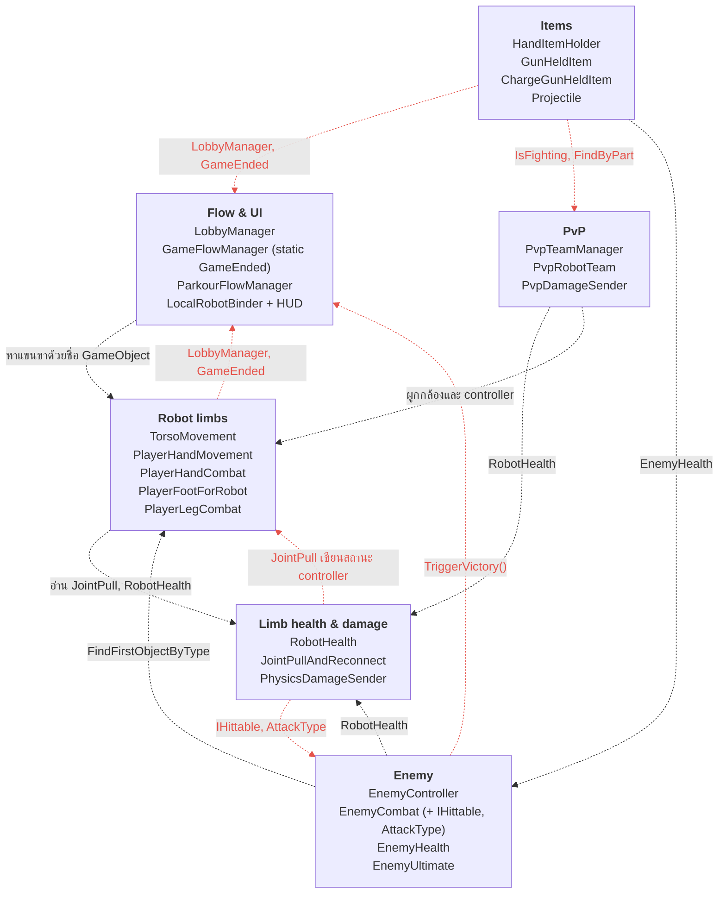
แต่ละกล่องคือกลุ่มสคริปต์ตามโฟลเดอร์ในโปรเจกต์ตอนนี้ เส้นสีแดงคือ dependency ทิศที่ไม่ควรมี คือเกมเพลย์ชี้ไปหา UI หรือคลาสของโหมด หรือวนกลับกัน (รายการเต็มอยู่ในหัวข้อ F)

### แผนภาพ 2 — ภาพรวมโมดูล: โครงสร้างที่เสนอ

แผนภาพนี้เขียนเป็นโค้ด Mermaid (มาจากโมเดลเดียวกับรูป `png/hl-proposed.png`)

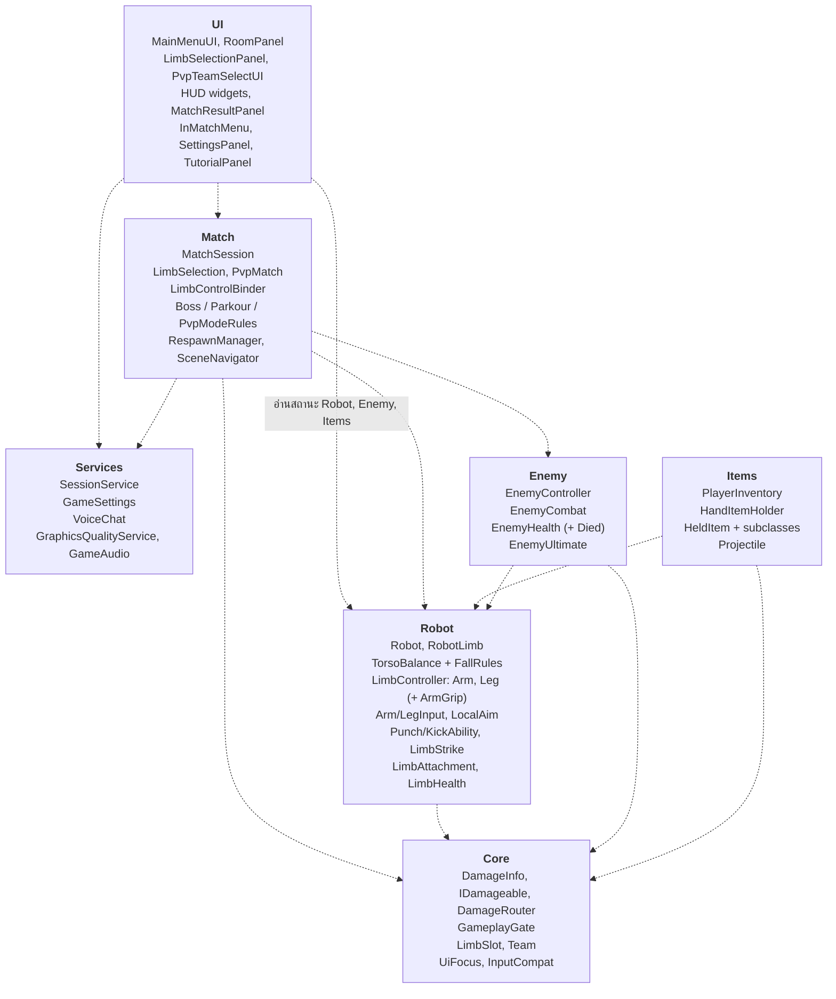
dependency ไหลทางเดียวจากบนลงล่าง UI อ่านได้ทุกอย่างแต่ไม่มีใครพึ่ง UI และ Core ไม่พึ่งใครเลย

### แผนภาพ 3 — Robot aggregate และวงจรชีวิตของแขนขา

แผนภาพนี้เขียนเป็นโค้ด Mermaid (มาจากโมเดลเดียวกับรูป `png/robot-core.png`)

```mermaid
classDiagram
  %% สถานะ: ข้อเสนอ (ยังไม่มีในโค้ด)
  direction LR
  class Robot {
    <<ใหม่>>
    -Team team
    -TorsoBalance torso
    -RobotLimb[4] limbs
    +event LimbStateChanged
    +GetLimb(LimbSlot slot) RobotLimb
    +Limbs() IEnumerable~RobotLimb~
    +DetachedCount() int
    +SetSimulationEnabled(bool on) void
    +ServerResetForRespawn(Pose spawn) void
    +FromCollider(Collider hit)$ Robot
    -OnLimbStateChanged(RobotLimb limb) void
  }
  class LimbSlot {
    <<enumeration · เดิม LimbStatusUI.LimbSlot>>
    LeftArm
    RightArm
    LeftLeg
    RightLeg
  }
  class RobotLimb {
    <<ใหม่>>
    -LimbSlot slot
    -Robot owner
    -LimbAttachment attachment
    -LimbHealth health
    -LimbController controller
    +bool IsAttached
    +event StateChanged
    +ServerApplyDamage(DamageInfo info) bool
    +ServerForceDetach() void
    -OnHealthDepleted() void
    -OnAttachmentChanged(bool attached) void
  }
  class LimbAttachment {
    <<NetworkBehaviour · เดิม JointPullAndReconnect>>
    -NetworkVariable~bool~ isAttached
    -Rigidbody socket
    -SavedJointSettings savedJoint
    -float = 3 reconnectCooldown
    -float = 2 reconnectDistance
    +bool IsAttached
    +event AttachmentChanged
    +ServerDetach() void
    +RequestPullBackRpc(bool held) void
    -ServerReconnect() void
  }
  class SavedJointSettings {
    <<struct · เดิม SavedConfigurableJointSettings>>
    +Vector3 anchor, connectedAnchor
    +Vector3 axis, secondaryAxis
    +motions, limits, drives
  }
  class LimbHealth {
    <<NetworkBehaviour · เดิม RobotHealth>>
    -NetworkVariable~float~ hp
    -NetworkVariable~float~ maxHp
    +event Depleted
    +ServerTakeDamage(float amount) void
    +ServerDeplete() void
    +ServerRefill() void
    -Regenerate() void
  }
  class IDamageable {
    <<interface · เดิม IHittable>>
    +Kind() DamageTargetKind
    +Team() Team
    +ServerApplyDamage(DamageInfo info) bool
  }
  class RobotBodyDamageRelay {
    <<เดิม PvpRobotTeam>>
    -Robot robot
    +ServerApplyDamage(DamageInfo info) bool
    -NearestAttachedLimb(Vector3 p) RobotLimb
  }
  class TorsoBalance {
    <<NetworkBehaviour · เดิม TorsoMovement>>
    -NetworkVariable~TorsoState~ state
    +ServerKnockDown(FallReason reason) void
    +ServerResetForRespawn() void
  }
  class LimbController {
    <<abstract NetworkBehaviour · ใหม่>>
    #RobotLimb limb
    #Rigidbody body
    +ServerResetForRespawn()* void
  }
  Robot *-- "1" TorsoBalance
  Robot *-- "4" RobotLimb
  RobotLimb --> LimbSlot
  RobotLimb *-- LimbController
  RobotLimb *-- LimbAttachment
  RobotLimb *-- LimbHealth
  LimbAttachment *-- SavedJointSettings
  IDamageable <|.. RobotLimb
  IDamageable <|.. RobotBodyDamageRelay
  RobotBodyDamageRelay --> Robot : หาชิ้นที่ใกล้สุด
  note for RobotLimb "กติการะดับชิ้น เหมือนโค้ดตอนนี้ (server):\nชิ้นที่หลุดไม่รับดาเมจ และไม่มีเอฟเฟคโดนตี\nHp = 0 หรือโดนท่าไม้ตายบอส → หลุด + เพดานเลือดลด\nต่อกลับ → เลือดเต็มตามเพดานปัจจุบัน\nทุกเครื่อง: ยิง StateChanged(this)"
  note for RobotBodyDamageRelay "เหมือน PvP ตอนนี้:\nลำตัวไม่มีเลือดของตัวเอง\nดาเมจที่ลำตัวลงชิ้นที่ใกล้จุดปะทะที่สุด\nและยังต่ออยู่ (ไม่หารให้ทุกชิ้น)"
  note for LimbAttachment "หลุดและดึงกลับแบบเดิม:\nหลุด = ทำลาย joint อย่างเดียว ตัวชิ้นและฟิสิกส์ยังอยู่\nขาที่หลุดยังคลานตามจุดเล็ง แขนที่หลุดนิ่ง\nกด R ค้างได้หลังหลุด 3 วิ ต่อเมื่อห่าง socket ≤ 2 ม."
  note for LimbHealth "ค่าจาก prefab ที่ฉากเกมใช้จริง:\nเลือดเริ่ม 500 หลุดแต่ละครั้งเพดานลด 125 (ต่ำสุด 50)\nไม่โดนตี 7.5 วิ แล้ว regen 2 ต่อวิ ไม่เกินเพดาน\nโดนตีแล้วชิ้นนั้นกระเด็น (แรง = ดาเมจ × 2)"
```
หุ่นเป็นเจ้าของลำตัวและแขนขา 4 ชิ้น `RobotLimb` เป็นตัวแทนของชิ้นนั้นและเป็นที่อยู่ของกติการะดับชิ้น (รับดาเมจเฉพาะตอนต่ออยู่ เลือดหมดแล้วหลุด ต่อกลับแล้วเติมเลือด) `LimbHealth` กับ `LimbAttachment` จึงไม่ต้องรู้จักกัน สถานะ "ต่ออยู่ไหม" มีเจ้าของคนเดียวคือ `LimbAttachment` ส่วนดาเมจที่ลำตัวลงชิ้นที่ใกล้สุดผ่าน `RobotBodyDamageRelay` ผู้ที่ implement `IDamageable` ฝั่งหุ่นคือ `RobotLimb` ไม่ใช่ `LimbHealth` เพราะชิ้นที่หลุดต้องปัดดาเมจทิ้งเหมือนที่ `RobotHealth.CanTakeDamage` ทำตอนนี้ (`RobotHealth.cs:173-182`) ถ้าให้ `LimbHealth` รับดาเมจตรง ชิ้นที่หลุดจะโดนตีจนเพดานเลือดลดซ้ำ ซึ่งเป็นบั๊กที่โค้ดตอนนี้แก้ไปแล้ว

### แผนภาพ 4 — การทรงตัวของลำตัว

แผนภาพนี้เขียนเป็นโค้ด Mermaid (มาจากโมเดลเดียวกับรูป `png/balance.png`)

```mermaid
classDiagram
  %% สถานะ: ข้อเสนอ (ยังไม่มีในโค้ด)
  direction LR
  class TorsoBalance {
    <<NetworkBehaviour · เดิม TorsoMovement>>
    -NetworkVariable~TorsoState~ state
    -float stress «server only»
    -FallReason lastFall «server only»
    -Robot robot
    -FallRules rules
    -FallLimits limits
    +TorsoState State
    +ServerKnockDown(FallReason reason) void
    +ServerAddStress(float amount) void
    +ServerApplyJump(LimbSlot from) void
    +ServerApplyRecoveryPush(Vector3 point) void
    +ServerResetForRespawn() void
    -ReadBalanceInput() BalanceInput
    -ApplyStandingSupport(BalanceInput input) void
  }
  class TorsoState {
    <<enumeration · เดิม TorsoMovement.TorsoState>>
    Standing
    Ragdoll
  }
  class FallRules {
    <<plain C# · ใหม่>>
    -FallLimits limits
    -float steppingTimer
    -float offBalanceTimer
    -float airborneTimer
    -float tiltTimer
    +Evaluate(BalanceInput input, float dt) FallReason
    +Reset() void
  }
  class FallLimits {
    <<struct · ใหม่>>
    +float = 50 maxStress
    +float = 45 maxTiltAngle
    +float = 0.25 tiltGrace
    +float = 0.15 bothSteppingGrace
    +float = 0.15 offBalanceGrace
    +float = 0.5 airborneGrace
    +bool = true countDetachedLegs
  }
  class BalanceInput {
    <<struct · ใหม่>>
    +int feet, groundedFeet, balancedFeet
    +int walkSteppingFeet
    +bool hasSupportFoot, kickActive
    +bool handSupport, jumpProtected
    +float stress, tiltAngle
  }
  class FallReason {
    <<enumeration · ใหม่>>
    None
    StressOverload
    BothFeetStepping
    BothFeetOffBalance
    AirborneTooLong
    TiltedInAir
    LegDetached
    HitByBlackHole
  }
  class FootContact {
    <<struct · ใหม่>>
    +bool attached
    +bool grounded, balanced
    +bool walkStepping, kicking
    +bool canSupport
    +Vector3 position
  }
  class Robot {
    <<ใหม่>>
    +Limbs() IEnumerable~RobotLimb~
  }
  class LegController {
    <<NetworkBehaviour · เดิม PlayerFootForRobot>>
    +FootContact Contact
  }
  class ArmController {
    <<NetworkBehaviour · เดิม PlayerHandMovement>>
    +float ClimbPull
  }
  class ArmGrip {
    <<NetworkBehaviour · เดิม PlayerHandMovement>>
    +bool IsSupporting
  }
  TorsoBalance --> TorsoState
  note for TorsoState "ผู้เล่นไม่เห็นความต่าง:\nตัด Falling ออก เพราะในโค้ดตอนนี้มันอยู่แค่ 1 FixedUpdate\nและทุกจุดที่อ่านถือว่าเท่ากับ Ragdoll\nลุกได้ทางเดียวเหมือนเดิม: กด Q ระหว่าง Ragdoll"
  note for TorsoBalance "stress และ lastFall อยู่บน server เท่านั้น\nclient ไม่ได้ตัดสินการล้ม จึงอ่านแค่ state\nแขนขาเรียกลำตัวได้ 3 ทาง: ServerAddStress,\nServerApplyJump, ServerApplyRecoveryPush"
  note for TorsoBalance "กระโดดและลุกเหมือนเดิม:\nSpace ขาแรก = hop แรง 250 ขาที่สองกดภายใน 0.3 วิ = +450\nความเร็วขาขึ้นไม่เกิน 10 ม./วิ ไม่ว่ากี่ขากด\nQ: แรงลุกคิดครั้งเดียวต่อ tick ไม่ว่ากี่คนกดพร้อมกัน"
  TorsoBalance *-- FallRules
  note for FallRules "กฎล้มเหมือนเกมตอนนี้ (ตัวเลขจาก prefab อยู่ใน FallLimits):\nสองขาก้าวพร้อมกันเกิน 0.15 วิ = ล้ม (กฎหลักของเกม)\nมือที่จับของนิ่ง: กันได้ทุกกฎ รวม stress ≥ 50 (ลดลง 50 ต่อวิ)\nช่วงกระโดด 1.2 วิ และพยุงหลังลงพื้น 0.4 วิ: กันทุกกฎยกเว้น stress\nขาที่ยันพื้นหรือกำลังเตะ: กันเฉพาะกฎทรงตัว\nกฎทรงตัว: เอียงเกิน 45° ตอนไม่มีเท้าแตะพื้น 0.25 วิ,\nสองเท้าลอยและเสียสมดุล 0.15 วิ, ลอยทั้งตัว 0.5 วิ"
  TorsoBalance --> Robot : แขนขาทั้ง 4 ชิ้น
  TorsoBalance ..> LegController : อ่าน Contact
  LegController --> FootContact
  TorsoBalance ..> ArmController : อ่าน ClimbPull
  TorsoBalance ..> ArmGrip : อ่าน IsSupporting
  TorsoBalance ..> BalanceInput
  FallRules ..> BalanceInput : อ่าน
  FallRules --> FallLimits
  FallRules ..> FallReason : คืนค่า
  note for FallLimits "ต้องตัดสินก่อนเปลี่ยน: ขาที่หลุด\nตอนนี้ขาที่หลุดยังถูกนับในกฎล้ม และในแรงดึงลำตัวเข้าหากลางเท้า\nมีผลกับความรู้สึกตอนเหลือขาข้างเดียว\ncountDetachedLegs = true คือแบบเดิม (ค่าเริ่มต้น)\nfalse นับเฉพาะขาที่ต่ออยู่ ต้องลองเล่นเทียบก่อน"
  note for ArmController "ต้องลองเล่นเทียบ: แรงดึงตอนปีน\nตอนนี้แขนสองข้างเขียนค่าเดียวกันทุก tick\nลำตัวใช้ค่าของแขนที่รันทีหลัง (ขึ้นกับลำดับสคริปต์)\nที่เสนอ: ใช้ ClimbPull ที่มากกว่าของสองแขน"
```
`TorsoBalance` ไม่เก็บรายชื่อแขนขาเอง ทุก physics tick มันอ่านแขนขาทั้ง 4 ชิ้นผ่าน `Robot` มาเป็น `BalanceInput` แล้วให้ `FallRules` (คลาส C# ธรรมดา) ตัดสินว่าล้มไหมและเพราะอะไร กติกาการล้มจึงเทสได้โดยไม่ต้องเปิด Unity และตอบได้เสมอว่าหุ่นล้มเพราะกฎข้อไหน ตัวเลขใน `FallLimits` เป็นค่าจาก prefab ที่ใช้จริง (stress 50, เอียง 45° นาน 0.25 วินาที, ลอย 0.5 วินาที, สองขาก้าวพร้อมกัน 0.15 วินาที) โน้ตสีส้มสองอันคือบั๊กที่น่าจะไม่ได้ตั้งใจแต่มีผลกับความรู้สึก: ขาที่หลุดยังถูกนับ (ข้อ B แถว 25) และแรงดึงตอนปีนเป็นของแขนที่รันทีหลัง (แถว 26) ข้อเสนอเก็บข้อแรกไว้เหมือนเดิม (`countDetachedLegs = true`) ส่วนข้อหลังเก็บแบบเดิมไม่ได้เพราะผลขึ้นกับลำดับสคริปต์ จึงเสนอให้ใช้ค่ามากสุดและลองปีนเทียบ

### แผนภาพ 5 — การควบคุมแขนขา

แผนภาพนี้เขียนเป็นโค้ด Mermaid (มาจากโมเดลเดียวกับรูป `png/limb-control.png`)

```mermaid
classDiagram
  %% สถานะ: ข้อเสนอ (ยังไม่มีในโค้ด)
  direction LR
  class ArmInput {
    <<NetworkBehaviour · เดิม PlayerHandMovement>>
    -ArmController controller
    -ArmGrip grip
    -LocalAim aim
    -ReadOwnerInput() void
  }
  class LocalAim {
    <<เดิม PlayerHandMovement>>
    -Vector3 aimOffset
    -Vector2 virtualCursor
    +Accumulate(Vector2 delta) void
    +AimNormalized() Vector2
  }
  class LegInput {
    <<NetworkBehaviour · เดิม PlayerFootForRobot>>
    -LegController controller
    -LocalAim aim
    -ReadOwnerInput() void
  }
  class LimbController {
    <<abstract NetworkBehaviour · ใหม่>>
    #RobotLimb limb
    #Rigidbody body
    #Transform pivot
    +ServerResetForRespawn()* void
    #DriveToward(Vector3 target, float speed, float damper) void
    #ProtectJointChain() void
  }
  class ArmGrip {
    <<NetworkBehaviour · เดิม PlayerHandMovement>>
    -FixedJoint joint
    -Rigidbody held
    +bool IsSupporting
    +RequestGrabRpc() void
    +RequestReleaseRpc() void
    +ServerRelease() void
    -IgnoreTorsoCollision(bool on) void
  }
  class ArmController {
    <<NetworkBehaviour · เดิม PlayerHandMovement>>
    -Vector3 target
    -ArmMotionOverride motionOverride
    -ArmGrip grip
    +float ClimbPull
    +SetHandTargetRpc(Vector3 target) void
    +RequestRecoveryPushRpc() void
    +SetMotionOverride(ArmMotionOverride o) void
    +ServerResetForRespawn() void
    -DriveHand() void
    -PullTorsoTowardGrip() void
  }
  class LegController {
    <<NetworkBehaviour · เดิม PlayerFootForRobot>>
    -LegMode mode
    -Vector3 target
    -Vector3 balanceShift
    -bool stepping
    -bool recoveryHeld
    +FootContact Contact
    +SetFootTargetRpc(Vector3 target) void
    +SetBalanceShiftRpc(Vector3 point) void
    +SetSteppingRpc(bool on) void
    +SetRecoveryHeldRpc(bool on) void
    +JumpRpc() void
    +ServerResetForRespawn() void
    -ResolveMode() LegMode
    -DriveForMode(LegMode mode) void
  }
  class LegMode {
    <<enumeration · ใหม่>>
    Planted
    Stepping
    Kicking
    Limp
    PushingUp
    Detached
  }
  class ArmMotionOverride {
    <<struct · ใหม่>>
    +Vector3 target
    +float velocityCap
    +float damper
    +float brakeScale
    +float extraReach
  }
  class PunchAbility {
    <<NetworkBehaviour · เดิม PlayerHandCombat>>
    -NetworkVariable~CombatState~ state
    -float peakSpeed
    +RequestPunchStartRpc() void
    +RequestPunchReleaseRpc() void
    +CanDealDamage() bool
    +PeakSpeed() float
  }
  class KickAbility {
    <<NetworkBehaviour · เดิม PlayerLegCombat>>
    -NetworkVariable~LegActionState~ action
    -float peakSpeed
    +bool ControlsFoot
    +RequestChargeRpc(Vector3 aim) void
    +RequestReleaseRpc(Vector3 aim) void
    +CanDealDamage() bool
    +PeakSpeed() float
  }
  class IStrikeSource {
    <<interface · ใหม่>>
    +CanDealDamage() bool
    +PeakSpeed() float
    +Source() DamageSource
    +OnStrikeLanded() void
    +OnStrikeBlocked() void
  }
  class LimbStrike {
    <<เดิม PhysicsDamageSender + PvpDamageSender>>
    -IStrikeSource source
    -StrikeTuning tuning
    -OnCollisionEnter(Collision c) void
    -BuildDamageInfo(Collision c) DamageInfo
  }
  ArmInput --> LocalAim
  LegInput --> LocalAim
  note for LegInput "ผู้เล่นปกติไม่เห็นความต่าง:\nRPC ทุกตัวเป็น owner-only ตัวรับแค่ตรวจค่าแล้วเก็บคำสั่ง\nส่งเมื่อเป้าขยับเกินเกณฑ์ ฟิสิกส์รันบน server ใน FixedUpdate\nไม่มี client prediction เหมือนตอนนี้"
  ArmInput --> ArmGrip : RPC
  ArmInput --> ArmController : RPC
  LegInput --> LegController : RPC
  LimbController <|-- ArmController
  LimbController <|-- LegController
  ArmController --> ArmGrip
  ArmController --> ArmMotionOverride
  LegController --> LegMode
  note for LegController "ขาที่หลุดคิดแบบเดิม:\nResolveMode() ครั้งเดียวต่อ tick จาก attachment, ท่าเตะ,\nลำตัวล้มไหม และคำสั่งล่าสุด\nขาที่หลุด: canSupport = false\nแต่ grounded และ balanced ยังคิดตามฟิสิกส์"
  note for LegMode "ต้องตัดสินก่อนเปลี่ยน: แฟล็กก้าวค้าง\nตอนนี้ถ้าขาหลุดตอนผู้เล่นกดคลิกซ้ายค้างอยู่\nstepping ของขานั้นค้าง และยังนับในกฎสองขาก้าวพร้อมกัน\nที่เสนอเก็บแบบเดิมไว้ก่อน ล้างตอนหลุดเมื่อทีมยืนยันว่าเป็นบั๊ก"
  PunchAbility --> ArmController : ตั้ง override
  PunchAbility ..> ArmMotionOverride : สร้าง
  KickAbility --> LegController : ขับเท้าตอนเตะ
  IStrikeSource <|.. PunchAbility
  IStrikeSource <|.. KickAbility
  LimbStrike --> IStrikeSource
```
ฝั่งเจ้าของอ่าน input แล้วส่ง RPC แบบ owner-only ฝั่ง server ตรวจค่าแล้วขับฟิสิกส์ `ArmController` กับ `LegController` ใช้ฐานเดียวกัน (`LimbController`) ขามีโหมดเดียวต่อ tick การจับแยกเป็น `ArmGrip` ส่วนท่าต่อยกับเตะเป็น ability ที่ประกอบเข้ากับตัวควบคุม และ implement `IStrikeSource` ให้ `LimbStrike` อ่าน ปุ่มทุกปุ่มและจังหวะส่งคำสั่งเหมือนเดิม (โน้ตสีเขียว) ขาที่หลุดยังคิด grounded และ balanced ตามฟิสิกส์เหมือนตอนนี้ ส่วนแฟล็ก stepping ที่ค้างเมื่อขาหลุดตอนกดคลิกซ้าย (แถว 25) เก็บไว้ก่อนจนกว่าทีมยืนยันว่าเป็นบั๊ก

### แผนภาพ 6 — เส้นทางดาเมจ

แผนภาพนี้เขียนเป็นโค้ด Mermaid (มาจากโมเดลเดียวกับรูป `png/damage.png`)

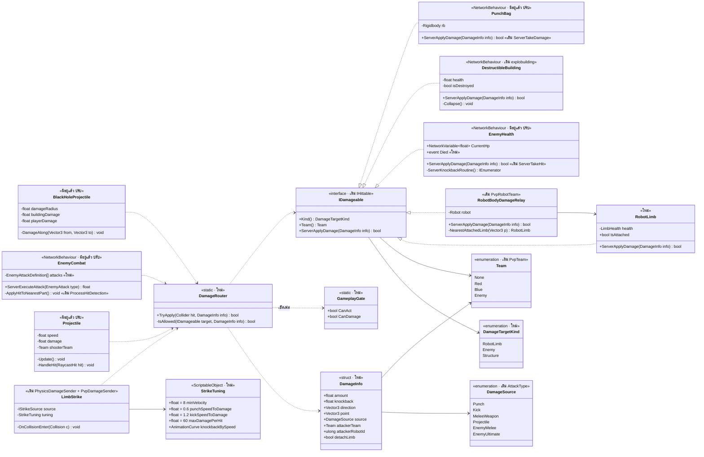
ผู้โจมตีทุกตัวสร้าง `DamageInfo` แล้วเรียก `DamageRouter` ที่เดียว ผู้รับทุกชนิด implement `IDamageable` กติกาทีมและเฟสของแมตช์จึงอยู่ที่เดียว สูตรดาเมจเดิมย้ายค่าเข้า `StrikeTuning` (ความเร็วพีคขั้นต่ำ 8 ม./วินาที ตัวคูณหมัด 0.6 เตะ 1.2 เพดาน 60 ต่อครั้ง) โน้ตสีส้มคือสิ่งที่ต้องวัดใน Play Mode ก่อนย้าย เพราะแขนขาใน PvP ตอนนี้มีตัวส่งดาเมจสองตัว (ข้อ B แถว 2) จึงยังไม่รู้แน่ว่าหมัดหนึ่งลดเลือดเท่าไหร่

### แผนภาพ 7 — แมตช์ ลอบบี้ และ session

แผนภาพนี้เขียนเป็นโค้ด Mermaid (มาจากโมเดลเดียวกับรูป `png/match.png`)

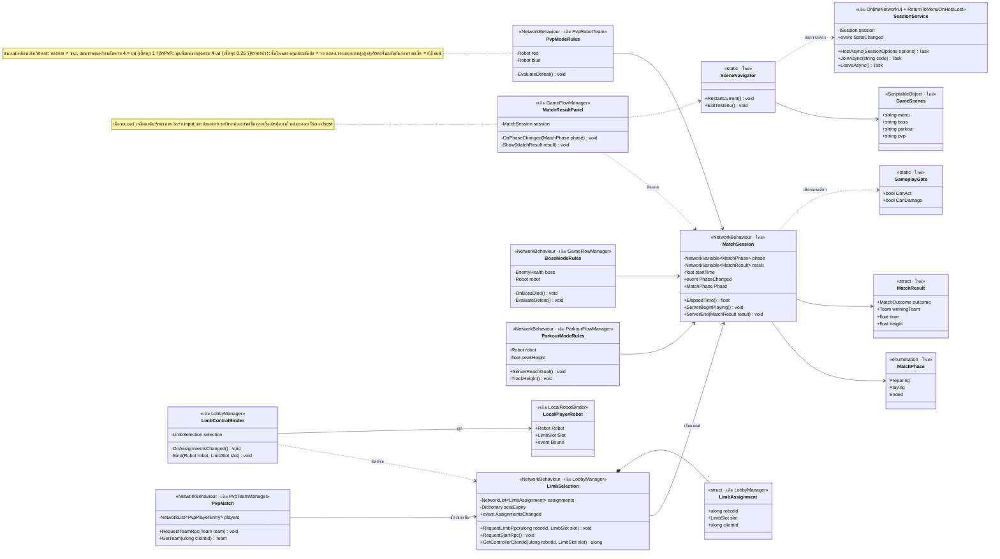
`MatchSession` เป็นเจ้าของเฟสของแมตช์คนเดียว กติกาของแต่ละโหมดเป็นคอมโพเนนต์แยก และ co-op กับ PvP ใช้ระบบแจกแขนขาชุดเดียวกัน เงื่อนไขชนะแพ้และจังหวะการเช็คเหมือนเดิม (บอสเช็คทุก 1 วินาที PvP ทุก 0.25 วินาที)

### แผนภาพ 8 — ไอเทม (แทบไม่เปลี่ยน)

แผนภาพนี้เขียนเป็นโค้ด Mermaid (มาจากโมเดลเดียวกับรูป `png/items.png`)

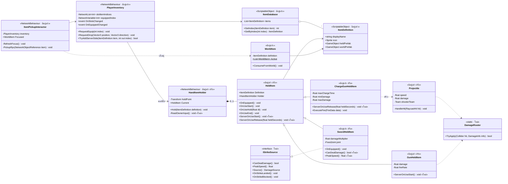
โครงเดิมใช้ได้ดีอยู่แล้ว สิ่งที่เปลี่ยนคือ `HeldItem` มี hook ฝั่ง server (`HandItemHolder` จะได้เลิก cast เป็นปืนชาร์จ) และอาวุธทำดาเมจผ่าน `DamageRouter`

---

## J. แผนภาพการสื่อสาร

sequence diagram อ่านจากบนลงล่างตามเวลา เส้นทึบหัวทึบคือการเรียกเมธอดหรือ RPC เส้นทึบหัวเปิดคืออีเวนต์หรือค่าที่ sync และเส้นประคือค่าที่ส่งกลับ ป้ายใต้ชื่อผู้เข้าร่วมบอกว่าโค้ดส่วนนั้นรันที่ไหน (server, owner client, ทุกเครื่อง หรือ static ซึ่งคือคลาสล้วนที่ไม่มีอินสแตนซ์)

### แผนภาพ 9 — หมัดโดนบอส บอสตาย แมตช์จบ

แผนภาพนี้เขียนเป็นโค้ด Mermaid (มาจากโมเดลเดียวกับรูป `png/seq-punch.png`)

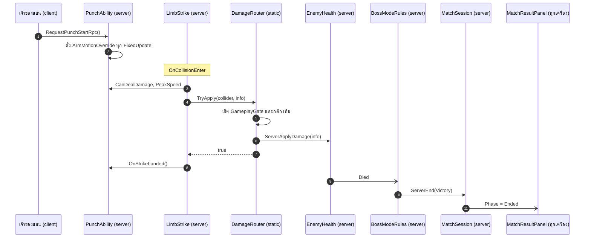
ดาเมจเดินผ่าน `DamageRouter` จุดเดียว บอสแค่ประกาศอีเวนต์ `Died` โดยไม่รู้ว่าอยู่ในโหมดไหน กติกาของโหมดเป็นคนจบแมตช์

### แผนภาพ 10 — เลือกแขนขา เริ่มแมตช์ ผูกผู้เล่นในเครื่อง

แผนภาพนี้เขียนเป็นโค้ด Mermaid (มาจากโมเดลเดียวกับรูป `png/seq-lobby.png`)

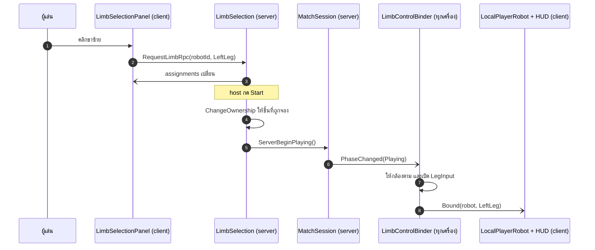
co-op และ PvP ใช้เส้นทางเดียวกัน `LimbSelection` เก็บว่าใครคุมชิ้นไหน `MatchSession` ประกาศเฟส แล้ว binder ในแต่ละเครื่องผูกกล้องกับ input เอง

### แผนภาพ 11 — เลือดหมด ขาหลุด หุ่นล้ม แล้วดึงกลับมาต่อ

แผนภาพนี้เขียนเป็นโค้ด Mermaid (มาจากโมเดลเดียวกับรูป `png/seq-limb-break.png`)

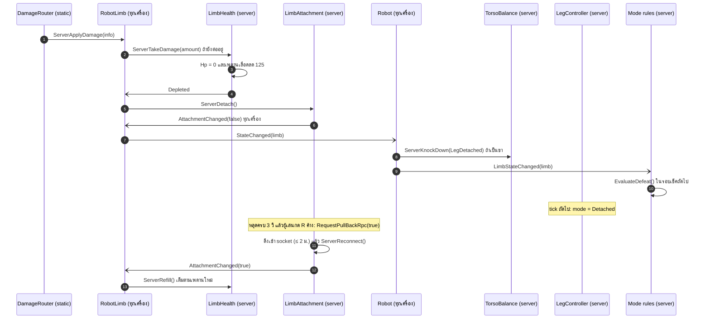
`RobotLimb` เป็นผู้รับดาเมจของชิ้นและเป็นคนใช้กติกาของชิ้น `LimbHealth` กับ `LimbAttachment` ไม่รู้จักกัน `Robot` สั่งลำตัวล้มพร้อมเหตุผล ลำตัวไม่ต้องถอนทะเบียนขา เพราะ tick ถัดไปมันอ่านแขนขาจาก `Robot` เอง ส่วนการแพ้เป็นหน้าที่ของกติกาโหมด ตารางนี้สรุปว่าแต่ละส่วนของชิ้นเป็นอย่างไรเมื่อหลุดและเมื่อต่อกลับตามโครงที่เสนอ พฤติกรรมและตัวเลขเหมือนเกมตอนนี้ทุกแถว รวมถึงแถวลำตัวที่เก็บพฤติกรรมเดิมของข้อ B แถว 25 ไว้เป็นค่าเริ่มต้น

| ส่วนของชิ้น | เมื่อหลุด | เมื่อต่อกลับ |
|---|---|---|
| joint (`ConfigurableJoint`) | ถูกทำลาย | สร้างใหม่ที่ socket เดิมด้วย `SavedJointSettings` |
| GameObject และ NetworkObject | อยู่ต่อ ไม่ despawn | ไม่เปลี่ยน |
| ฟิสิกส์ | ยังจำลองบน server ชิ้นนั้นกลายเป็นวัตถุอิสระ | กลับไปขับตามโหมดปกติ |
| input ของเจ้าของ | ขาที่หลุดยังคลานตามจุดเล็ง (`LegMode.Detached`) แขนที่หลุดนิ่ง | ไม่เปลี่ยน |
| ลำตัว | ถ้าเป็นขา สั่งล้มด้วย `LegDetached` ขาที่หลุดยันพื้นแทนขาไม่ได้ แต่ยังถูกนับในกฎล้มและในแรงดึงเข้ากลางแบบเดิม (`countDetachedLegs = true`) | ไม่เปลี่ยน |
| เลือด | `RobotLimb` ปัดดาเมจทิ้งและไม่มีเอฟเฟคโดนตี ถ้าหลุดเพราะเลือดหมดหรือโดนท่าที่สั่งให้หลุด เพดานเลือดลด 125 (ต่ำสุด 50) | เติมเต็มตามเพดานใหม่ |
| การดึงกลับ | กด R ค้างได้หลังคูลดาวน์ 3 วินาที ต่อเมื่อห่าง socket ไม่เกิน 2 เมตร | ไม่เกี่ยว |
| กติกาของโหมด | ตรวจการแพ้ เช่น PvP แพ้เมื่อหลุดครบ 4 ชิ้น | ไม่เกี่ยว |

### แผนภาพ 12 — ก้าวเท้าหนึ่งครั้ง จาก input ถึงจอทุกคน

แผนภาพนี้เขียนเป็นโค้ด Mermaid (มาจากโมเดลเดียวกับรูป `png/seq-step.png`)

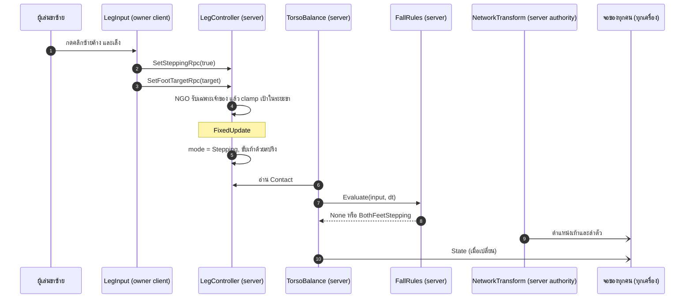
เจ้าของขาส่งแค่คำสั่ง server ตรวจคำสั่ง จำลองฟิสิกส์ และตัดสินการล้มคนเดียว ทุกเครื่องได้ผลผ่าน NetworkTransform (AuthorityMode = Server) และ NetworkVariable ไม่มีการทำนายผลฝั่ง client (ตาราง authority อยู่ในหัวข้อ G)

### แผนภาพ 13 — ตกแมพแล้วเกิดใหม่ที่เช็คพอยต์

แผนภาพนี้เขียนเป็นโค้ด Mermaid (มาจากโมเดลเดียวกับรูป `png/seq-respawn.png`)

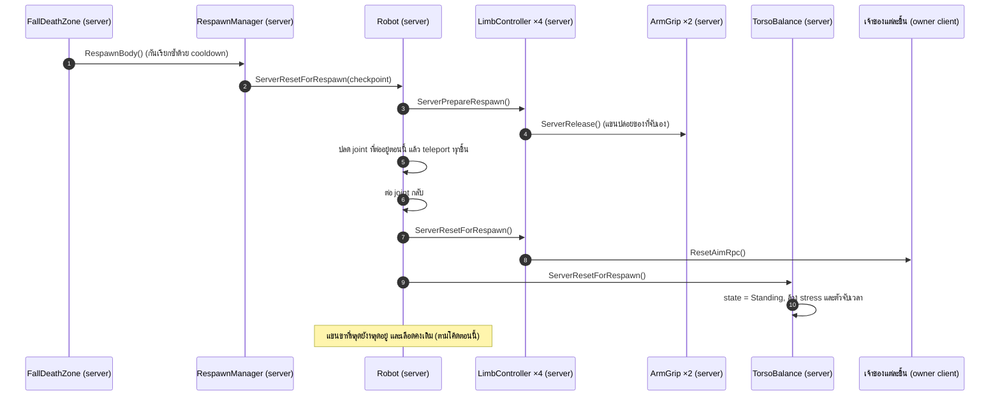
`RespawnManager` ตัดสินว่าเมื่อไหร่และที่ไหน `Robot` ตัดสินว่ารีเซ็ตตัวเองอย่างไรและตามลำดับไหน ชิ้นส่วนแต่ละชิ้นล้าง state ส่วนตัวของตัวเอง `Robot` อ่าน joint ที่ต่ออยู่ตอนนั้นจากแขนขา ไม่ใช้ลิสต์ที่แคชไว้ตอนเริ่มฉาก (ข้อ B แถว 27) การต่อแขนขาที่หลุดคืนและการเติมเลือดไม่ได้ทำตอน respawn ตามโค้ดตอนนี้ ถ้าจะเปลี่ยนเป็นเรื่องที่ทีมต้องเลือก

---

## K. การไหลของข้อมูล

### แผนภาพ 14 — ค่าตั้ง → state → ลอจิก → การแสดงผล

แผนภาพนี้เขียนเป็นโค้ด Mermaid (มาจากโมเดลเดียวกับรูป `png/dataflow.png`)

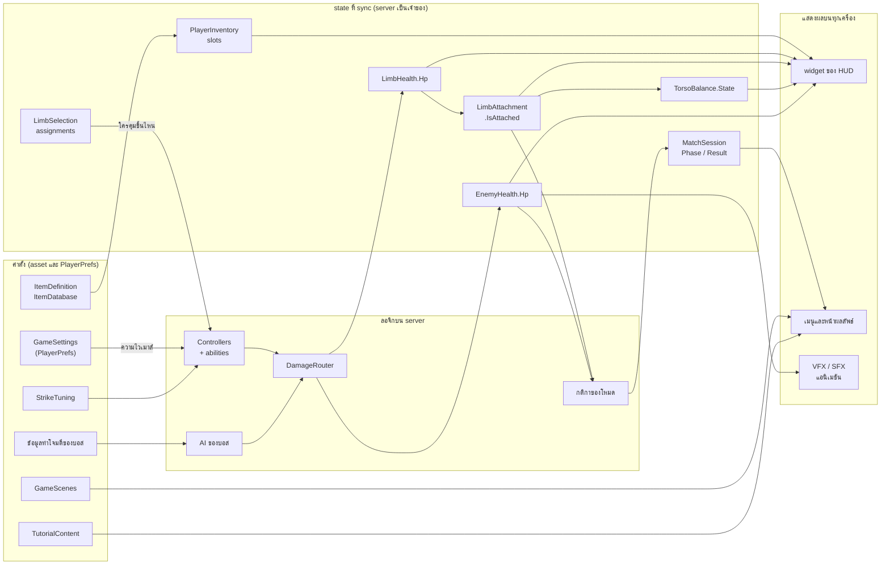
ค่าตั้งอยู่ใน asset ลอจิกรันบน server state ที่ sync มีเจ้าของคนเดียว และการแสดงผลแค่อ่าน state ไม่แก้เอง

### จุดที่ข้อมูล state และลอจิกปนกันอยู่ตอนนี้

| ประเภท | ตัวอย่างตอนนี้ | คำแนะนำ |
|---|---|---|
| ค่าตั้งที่ซ้ำกัน | `minVelocityThreshold`, `speedToDamage`, `kickSpeedToDamage`, `maxDamagePerHit` อยู่ทั้งใน `PhysicsDamageSender` และ `PvpDamageSender` และ `SwordHeldItem` เขียนทับฟิลด์เหล่านั้นตอนรัน | asset `StrikeTuning` ตัวเดียว ดาบส่งตัวคูณมาแทน |
| ค่าตั้งบนคอมโพเนนต์ที่ใช้ได้อยู่แล้ว | ระยะและน้ำหนักการสุ่มท่าของบอส ค่าคงที่ของสปริงแขนขา | เก็บเป็นฟิลด์ serialize ต่อไป ย้ายค่าจูนแขนขาไปเป็น asset เฉพาะเมื่อมีหุ่นหลายแบบที่ต้องใช้ตัวเลขชุดเดียวกัน |
| เนื้อหาในโค้ด | ข้อความสอนเล่น ชื่อฉากใน 4 ที่ | asset `TutorialContent` และ `GameScenes` |
| เลขมหัศจรรย์ในลอจิก | การ regen ของ `RobotHealth` ที่ `2f` ต่อวินาทีและดีเลย์ `7.5f` วินาที | ทำเป็นฟิลด์ serialize |
| state ที่เก็บสองที่ | การต่ออยู่ของแขนขา (joint และตัวควบคุม), "เกมเริ่มแล้ว" (ลอบบี้, PvP, ตัวจัดการโหมด), รายชื่อเท้าและมือในลำตัวที่ไม่ตามสถานะการหลุด | เจ้าของอย่างละหนึ่ง และอ่านจากเจ้าของแทนการเก็บสำเนา |
| ค่าที่หลายคนเขียนทับ | `armPullIntensity` ที่มือทุกข้างเขียนทุก tick, `currentState` ของลำตัวที่ 3 คลาสเขียน | ผู้เขียนคนเดียว หรือให้ผู้ใช้ค่าอ่านจากทุกแหล่งแล้วรวมเอง (`ClimbPull` ค่ามากสุด) |
| state แบบ static | การเล็งที่แชร์, `GameEnded`, static ของการ reconnect | state ของอินสแตนซ์บนเจ้าของ |
| การบันทึกค่ากระจายอยู่ใน UI | PlayerPrefs ใน 8 ไฟล์ | `GameSettings` |

---

## L. ก่อนและหลัง

| ปัญหาตอนนี้ | ต้นเหตุ | การรีแฟกเตอร์ | ผลลัพธ์ |
|---|---|---|---|
| ลอจิกดาเมจอยู่ 7 ที่ และ PvP มีตัวส่งดาเมจสองตัวแย่งกัน | ไม่มีสัญญาเรื่องดาเมจ | `DamageInfo` + `IDamageable` + `DamageRouter` + `LimbStrike` | กติกาดาเมจ ทีม และเฟสอยู่ที่เดียว บั๊กตัวส่งซ้อนของ PvP หายไปทั้งกลุ่ม |
| `LobbyManager` เป็น God class และเกมเพลย์ต้องอ่านมัน | ลอบบี้ถือทั้ง state เครือข่าย UI และการเตรียมหุ่น | `LimbSelection`, `LimbSelectionPanel`, `LimbControlBinder`, `Robot.SetSimulationEnabled` | input ของแขนขาไม่ต้องพึ่งอ็อบเจกต์ UI อีก |
| หาชิ้นส่วนหุ่นด้วยชื่อใน 9+ ที่ | ไม่มี aggregate `Robot` | `Robot`, `RobotLimb`, `LimbSlot` | อ้างอิงชัดเจน เปลี่ยนชื่อ GameObject แล้ว PvP ไม่พัง |
| แฟล็ก "เริ่ม/จบแมตช์" 4 ตัว | ไม่มีเจ้าของเฟสของแมตช์ | `MatchSession` + `GameplayGate` | มีคำตอบเดียวว่าผู้เล่นทำอะไรหรือทำดาเมจได้หรือยัง |
| สถานะการต่ออยู่ถูกเก็บสองที่ | joint เขียนสถานะของตัวควบคุม | ตัวควบคุมอ่าน `LimbAttachment` | HUD การเช็คแพ้ และฟิสิกส์ไม่หลุด sync กัน |
| หุ่นล้มโดยไม่รู้ว่าเพราะกฎข้อไหน และลำตัวยังนับขาที่หลุด | กฎการล้มปนกับแรงพยุง และใช้รายชื่อเท้าที่ลงทะเบียนตอน spawn | `FallRules` + `FallReason` + อ่านแขนขาจาก `Robot` ทุก tick | เทสกฎการล้มได้ใน EditMode และ log บอกเหตุผลทุกครั้งที่ล้ม การนับขาที่หลุดยังเหมือนเดิม (`countDetachedLegs = true`) จนกว่าทีมจะลองเล่นแล้วตัดสิน |
| respawn พึ่ง joint ที่แคชไว้ตอนเริ่มฉาก | `RespawnManager` รู้จักทุกคลาสของหุ่นและแคช joint ตอน `Awake` | `Robot.ServerResetForRespawn` อ่าน joint ปัจจุบันจากแขนขา และเรียก `LimbController` ทีละชิ้น | แขนขาที่เคยหลุดแล้วต่อกลับ respawn ได้ถูกต้อง และ `RespawnManager` ไม่ต้องรู้จักคลาสของหุ่น |
| การแจกแขนขาของ co-op และ PvP ถูกเขียนสองรอบ | สร้างแยกกันตามโหมด | `LimbSelection` + `LimbControlBinder` ที่ใช้ร่วมกัน | แก้การผูกกล้องและการควบคุมครั้งเดียวได้ทั้งสองโหมด |
| ตัวจัดการโหมดที่ก๊อปกัน และชื่อฉากเมนู 4 แบบ | กติกา UI และการเปลี่ยนฉากอยู่ในคลาสเดียว | `*ModeRules`, `MatchResultPanel`, `SceneNavigator`, `GameScenes` | เพิ่มโหมดใหม่ = เพิ่มคอมโพเนนต์กติกาหนึ่งตัว |
| สิบคลาสแย่งกันตั้งเคอร์เซอร์ | ไม่มีเจ้าของ | `UiFocus` เป็นเจ้าของนโยบายเคอร์เซอร์ | เคอร์เซอร์ในเมนู วงล้อ และหน้าผลลัพธ์คาดเดาได้ |
| แขนใช้ inheritance แบบแก้ฟิลด์ ขาใช้ composition | สองแพทเทิร์นสำหรับแนวคิดเดียว | `PunchAbility` + `ArmMotionOverride` | แขนกับขาอ่านแบบเดียวกัน |
| helper ของ DOTween ที่ก๊อปกัน | ไม่มีคอมโพเนนต์ UI ที่ใช้ร่วมกัน | `UiPanelAnimator`, `ButtonFeedback`, `MenuParallax` | โค้ดลดลงราว 400 บรรทัด และ CLAUDE.md เลิกแนะนำให้ก๊อป |
| คีย์ PlayerPrefs ใน 8 ไฟล์ | UI เป็นเจ้าของการบันทึก | `GameSettings` | รายการคีย์อยู่ที่เดียว |
| ข้อความสอนเล่นผิด | เนื้อหาอยู่ในโค้ด ปุ่มกระจายใน 12 คลาส | `TutorialContent` + แหล่งกำหนดปุ่มที่เดียว | ข้อความสร้างจากปุ่มจริง |
| ปุ่มดีบักทำให้แขนขาหลุดไปถึงผู้เล่นจริง | ไม่มีตัวกั้นให้ใช้ได้เฉพาะตอนพัฒนา | `#if UNITY_EDITOR \|\| DEVELOPMENT_BUILD` และ RPC แบบ owner-only | build ที่ปล่อยจริงไม่มีช่องโกง |
| โฟลเดอร์ตามชื่อคน และชื่อโฟลเดอร์ที่ไม่เหมาะสม | โตมาแบบไม่ได้วางแผน | โฟลเดอร์ตามฟีเจอร์ และ namespace root เดียว | หาของง่าย path ใน log สะอาด |
| คลาสและฟิลด์ที่ไม่ได้ใช้ | ไม่เคยเก็บกวาด | ลบ | อ่านน้อยลงและเข้าใจผิดน้อยลง |

### แผนภาพ 15 — พฤติกรรมที่ผู้เล่นเห็น: ลำตัว แขนขา และแมตช์

แผนภาพนี้เขียนเป็นโค้ด Mermaid (มาจากโมเดลเดียวกับรูป `png/gameplay.png`)

```mermaid
flowchart TB
  %% สถานะ: พฤติกรรมที่ผู้เล่นเห็น (ต้องเหมือนเดิมก่อนและหลังรีแฟกเตอร์)
  subgraph g_torso["ลำตัว (ทั้งหุ่น)"]
    direction LR
    t0((" "))
    tStand("<b>Standing</b><br/>ลอยพยุงตัว ดึงลำตัวเข้าหากลางเท้า<br/>เดิน กระโดด จับ ต่อย เตะ")
    tRag("<b>Ragdoll</b><br/>ล้มตามฟิสิกส์ ลุกเองไม่ได้<br/>ทุกคนกด Q ช่วยกันดันตัวขึ้นได้")
    nFall>"Standing → Ragdoll เมื่อ:<br/>สองขาก้าวพร้อมกันเกิน 0.15 วิ (กฎหลักของเกม)<br/>stress ≥ 50 (ชน โดนตี) เว้นแต่มีมือจับของนิ่ง<br/>เอียงเกิน 45° ตอนไม่มีเท้าแตะพื้น 0.25 วิ<br/>สองเท้าลอยและเสียสมดุล 0.15 วิ หรือลอยทั้งตัว 0.5 วิ<br/>(กฎทรงตัวพักไว้ถ้ามีขายัน กำลังเตะ หรือจับของนิ่ง)<br/>ขาหลุด หรือโดนหลุมดำของบอส"]
    nJump>"กระโดด (อยู่ใน Standing):<br/>Space ขาแรก = hop, ขาที่สองกดภายใน 0.3 วิ = co-op jump<br/>ความเร็วขึ้นไม่เกิน 10 ม./วิ พักกฎล้มจากเท้า 1.2 วิ"]
  end
  subgraph g_limb["แขนขาแต่ละชิ้น"]
    direction LR
    l0((" "))
    lAtt("<b>ต่ออยู่</b><br/>รับดาเมจ และ regen 2 ต่อวิ<br/>หลังไม่โดนตี 7.5 วิ")
    lDet("<b>หลุด</b><br/>ไม่รับดาเมจ ขาคลานตามจุดเล็ง แขนนิ่ง<br/>ดึงกลับได้หลังหลุด 3 วิ")
    lPull("<b>กำลังดึงกลับ</b><br/>สปริงดึงเข้า socket เร็วสุด 25 ม./วิ")
    nLimb>"ทุกครั้งที่หลุด เพดานเลือดของชิ้นลด 125 (ต่ำสุด 50)<br/>ขาหลุด → ลำตัวเป็น Ragdoll ทันที"]
  end
  subgraph g_match["แมตช์"]
    direction LR
    m0((" "))
    mPrep("<b>เตรียม</b><br/>จองแขนขา (co-op) หรือเลือกทีม (PvP)")
    mPlay("<b>กำลังเล่น</b><br/>พาร์คัวร์: ตกแมพ = เกิดที่เช็คพอยต์<br/>ชิ้นที่หลุดยังหลุด เลือดเท่าเดิม")
    mEnd("<b>จบแมตช์</b><br/>หน้าผลลัพธ์ขึ้นทุกเครื่อง แขนขาหยุดรับ input<br/>host กดเล่นใหม่หรือออก")
    nMatch>"เช็คแพ้เป็นรอบ: บอสทุก 1 วิ PvP ทุก 0.25 วิ<br/>ต่อชิ้นกลับทันก่อนรอบเช็ค = ยังไม่แพ้<br/>พาร์คัวร์ไม่มีแพ้ จบที่เส้นชัยพร้อมเวลาและความสูง"]
  end
  t0 --> tStand
  tStand -->|"ล้ม (เงื่อนไขในโน้ต)"| tRag
  tRag -->|"กด Q จนลำตัวเจอพื้น หรือ respawn"| tStand
  tRag -.- nFall
  tStand -.- nJump
  l0 --> lAtt
  lAtt -->|"เลือดหมด หรือท่าไม้ตายบอส"| lDet
  lDet -->|"เจ้าของชิ้นกด R ค้าง"| lPull
  lPull -->|"ปล่อย R"| lDet
  lPull -->|"ถึง socket ≤ 2 ม. แล้วเลือดเต็มตามเพดาน"| lAtt
  lDet -.- nLimb
  m0 --> mPrep
  mPrep -->|"host กด Start"| mPlay
  mPlay -->|"ชนะ: บอสตาย / ถึงเส้นชัย / อีกทีมหลุดครบ 4"| mEnd
  mPlay -->|"แพ้: แขนขาหลุดพร้อมกันครบ 4"| mEnd
  mEnd -.- nMatch
```
รีแฟกเตอร์ทั้งหมดในรีวิวนี้เปลี่ยนแค่โครงสร้างข้างใน ไม่เปลี่ยนสิ่งที่ผู้เล่นเห็น แผนภาพนี้เป็น state machine ของสิ่งที่ผู้เล่นรู้สึกได้ วาดจากสคริปต์และค่าใน prefab ที่ฉากเกมใช้จริง ไม่ขึ้นกับโครงสร้างคลาส จึงใช้เป็นสัญญาได้ว่าหลังรีแฟกเตอร์ทุกสถานะ ทุกเส้น และทุกตัวเลขต้องเหมือนเดิม และใช้เป็น checklist ของขั้น 0 ในหัวข้อ M ได้ทันที

### สิ่งที่ผู้เล่นรู้สึกได้ ตอนนี้และในข้อเสนอ

| สิ่งที่ผู้เล่นรู้สึก | ตอนนี้อยู่ที่ | ในข้อเสนออยู่ที่ | ผล |
|---|---|---|---|
| ปุ่มและความไวของการบังคับ | input ใน `Update()` ของ `PlayerHandMovement` และ `PlayerFootForRobot` ส่ง RPC เมื่อเป้าขยับเกินเกณฑ์ แขนขาในเครื่องเดียวกันใช้จุดเล็งร่วม | `ArmInput`, `LegInput`, `LocalAim` ส่ง RPC แบบเดิม เพิ่มแค่ owner-only | เหมือนเดิม |
| การทรงตัวและการล้ม | กฎใน `TorsoMovement` ค่าจาก prefab: stress 50, เอียงเกิน 45° นาน 0.25 วินาที, ลอย 0.5 วินาที, สองขาก้าวพร้อมกัน 0.15 วินาที | `FallRules` + `FallLimits` ค่าเดียวกัน | เหมือนเดิม |
| ขาที่หลุดในกฎล้ม | ยังถูกนับในกฎล้มและในแรงดึงลำตัวเข้ากลาง (ข้อ B แถว 25) | `countDetachedLegs = true` | ต้องตัดสิน ค่าเริ่มต้นเหมือนเดิม |
| แฟล็กก้าวค้างเมื่อขาหลุดตอนกดคลิกซ้าย | ค้าง และนับในกฎสองขาก้าวพร้อมกัน (แถว 25) | เก็บไว้แบบเดิม | ต้องตัดสิน ค่าเริ่มต้นเหมือนเดิม |
| กระโดดและ co-op jump | `TorsoMovement.NotifyFootJump` hop แรง 250 ขาที่สองกดภายใน 0.3 วินาทีได้ +450 ความเร็วขึ้นไม่เกิน 10 ม./วินาที | `TorsoBalance.ServerApplyJump` | เหมือนเดิม |
| ลุกจาก ragdoll ด้วย Q | แรงลุกคิดครั้งเดียวต่อ tick ไม่ว่ากี่คนกด | `TorsoBalance.ServerApplyRecoveryPush` | เหมือนเดิม |
| จับด้วย F ค้าง | มือที่จับของนิ่งกันการล้มได้ทุกกฎ | `ArmGrip.IsSupporting` | เหมือนเดิม |
| แรงดึงลำตัวตอนปีน | `armPullIntensity` เป็นค่าของแขนที่รันทีหลัง (แถว 26) | `ArmController.ClimbPull` ค่าที่มากกว่าของสองแขน | ต่าง ต้องลองปีนเทียบ |
| ต่อยและเตะ | `PlayerHandCombat`, `PlayerLegCombat` + `PhysicsDamageSender` ความเร็วพีค ≥ 8 ตัวคูณ 0.6 และ 1.2 เพดาน 60 หนึ่งหมัดหนึ่งครั้ง | `PunchAbility`, `KickAbility`, `LimbStrike` + `StrikeTuning` ค่าเดียวกัน | เหมือนเดิม |
| ดาเมจต่อหมัดใน PvP | ตัวส่งดาเมจสองตัวบนชิ้นเดียว (ข้อ B แถว 2) | `LimbStrike` ตัวเดียว | ต้องยืนยันใน Play Mode ก่อนตั้งค่า |
| ดาเมจนอกช่วงเล่น | `PhysicsDamageSender` ไม่เช็คเฟส ส่วน `PvpDamageSender` เช็ค `IsFighting` | `GameplayGate.CanDamage` | ต่าง เฉพาะกรณีขอบ เช่นตีกันตอนเลือกทีม |
| เลือดของชิ้น | `RobotHealth` 500 หลุดแล้วเพดานลด 125 (ต่ำสุด 50) regen 2 ต่อวินาทีหลังไม่โดนตี 7.5 วินาที | `LimbHealth` | เหมือนเดิม |
| ชิ้นที่หลุดไม่รับดาเมจ | `RobotHealth.CanTakeDamage` | `RobotLimb.ServerApplyDamage` | เหมือนเดิม |
| หลุดและดึงกลับ | `JointPullAndReconnect` กด R ค้างหลังหลุด 3 วินาที ต่อเมื่อห่าง socket ไม่เกิน 2 เมตร แล้วเลือดเต็มตามเพดาน | `LimbAttachment` + `RobotLimb` | เหมือนเดิม |
| ขาหลุดแล้วล้ม | `JointPullAndReconnect.HandleDisconnection` ตั้งลำตัวเป็น Falling | `Robot` เรียก `TorsoBalance.ServerKnockDown(LegDetached)` | เหมือนเดิม |
| ตีลำตัวใน PvP | `PvpRobotTeam.ServerApplyBodyDamage` ลงชิ้นที่ใกล้สุดที่ยังต่ออยู่ | `RobotBodyDamageRelay` | เหมือนเดิม |
| ฟิสิกส์และเครือข่าย | server จำลองคนเดียว `NetworkTransform` แบบ Server ไม่มี client prediction | ไม่เปลี่ยน | เหมือนเดิม |
| ชนะและแพ้ | `GameFlowManager` (แขนขาหลุดพร้อมกันครบ 4 เช็คทุก 1 วินาที), `PvpRobotTeam` (หลุดครบ 4 เช็คทุก 0.25 วินาที), `ParkourFlowManager` (แตะเส้นชัย) | `BossModeRules`, `PvpModeRules`, `ParkourModeRules` + `MatchSession` | เหมือนเดิม |
| respawn ในพาร์คัวร์ | `RespawnManager` ชิ้นที่หลุดยังหลุด เลือดเท่าเดิม | `Robot.ServerResetForRespawn` | เหมือนเดิม |

---

## M. แผนการรีแฟกเตอร์

ทุกขั้นทำให้เกมยังเล่นได้อยู่ ทำทีละขั้นต่อหนึ่ง branch และทดสอบเล่นก่อน merge

| ขั้น | อะไรเปลี่ยน | ทำไม | ต้องทำอะไรก่อน | Risk | ทดสอบอะไรหลังทำ |
|---|---|---|---|---|---|
| **0. เก็บพฤติกรรมปัจจุบัน** | ใช้แผนภาพ 15 และตารางในหัวข้อ L เป็นฐาน เขียน checklist ทดสอบเล่นของแต่ละโหมด (เดิน กระโดดสองคน ต่อย เตะ จับและปีน แขนขาหลุดและกด R ดึง ตกแมพแล้ว respawn เก็บของและยิง หน้าชนะและแพ้ การต่อกลับ) เพิ่ม EditMode test ให้ฟังก์ชันบริสุทธิ์ที่จะแตะ โดยดู `Assets/Editor/ItemAuthorityTests.cs` เป็นตัวอย่าง และยืนยันปัญหาข้อ 2 ด้วยการใส่ log ในตัวส่งดาเมจทั้งสองตัว แล้วต่อยหุ่นอีกตัวระหว่างเลือกทีม | รู้พฤติกรรมเดิมก่อนเปลี่ยน | ไม่มี | None | ตัว checklist เอง |
| **1. เก็บกวาด** | เปลี่ยนชื่อโฟลเดอร์ที่ไม่เหมาะสม (ทำใน Editor) ลบโค้ดที่ไม่ได้ใช้ในแถว 23 และลบการเรียก `RobotTeam` ใน `PhysicsDamageSender` (มันคืน true เสมอ) ครอบ `DebugLimbBreaker` และ `DebugRequestBreakRpc` ด้วย `#if UNITY_EDITOR \|\| DEVELOPMENT_BUILD` และตั้งแฟล็กดีบักเป็น false รวมชื่อฉากไว้ในคลาส `GameScenes` ที่เดียว อัปเดต CLAUDE.md | ลดสิ่งรบกวน ปิดช่องโกง แก้ชื่อฉากเมนูที่ไม่ตรงกัน | ขั้น 0 | Low | คอมไพล์ผ่าน ทุกซีนใน build โหลดได้ ไม่มี missing script บน prefab |
| **2. aggregate ของ Robot** | เพิ่ม `Robot` และ `RobotLimb` ที่อ้างอิงแบบ serialize (ปุ่ม "Auto-fill" ใน editor ใช้กติกาชื่อเดิมได้ครั้งเดียวตอนแก้ไข) แทนการค้นใน `LocalRobotBinder`, `LobbyManager`, `PvpTeamManager`, `PvpRobotTeam`, `RobotBodyCheck`, `GameFlowManager`, `EnemyController`, `RespawnManager` เพิ่ม `LimbSlot` และบันทึกเรื่องซ้าย/ขวาที่กลับด้านในลอบบี้ไว้ที่เดียว ย้าย "ขาหลุด → ลำตัวล้ม" ไปไว้ใน `Robot` และเพิ่ม `TorsoBalance.ServerKnockDown(reason)` ลบ `HandState`/`FootState` | ทุกขั้นต่อจากนี้ต้องมีทางเข้าถึงแขนขาที่เชื่อถือได้ | ขั้น 1 | Medium | co-op: ทั้ง 4 ช่องคุมแขนขาถูกชิ้น PvP: ทั้งสองทีมทุกช่อง HUD โชว์ชิ้นของเรา แพ้เมื่อหลุดครบ 4 ชิ้น หลุมดำทำให้ล้ม |
| **2b. การทรงตัวและวงจรชีวิตของแขนขา** | แยก `FallRules`, `BalanceInput`, `FallReason` ออกจาก `TorsoMovement` โดยย้ายตัวเลขและลำดับของกฎทั้ง 5 ข้อมาเป๊ะๆ และเขียน EditMode test ให้ทุกกฎ ลำตัวอ่านแขนขาจาก `Robot` แทน `Register*`/`Unregister*` โดยยังนับขาที่หลุดแบบเดิม (`countDetachedLegs = true`) คลาสอื่นสั่งล้มผ่าน `ServerKnockDown(reason)` เท่านั้น แทน `armPullIntensity` ด้วย `ClimbPull` ที่ลำตัวอ่านเอง ย้ายกติกา "เลือดหมด → หลุด → ต่อกลับ → เติมเลือด" ไปที่ `RobotLimb` และให้ `Robot.ServerResetForRespawn` อ่าน joint ปัจจุบันแทนแคชของ `RespawnManager` ใส่ `RpcInvokePermission.Owner` ให้ RPC ของแขนขาที่ส่งไป server ทุกตัว และลบ `TorsoMovement.ApplyRecoveryForceRpc` ที่ไม่มีโค้ดไหนเรียก | แก้แถว 25-28 และทำให้กติกาหลักของเกมเทสได้ | ขั้น 2 | Medium-High (ฟีลการทรงตัว) | EditMode: ทุกกฎล้มที่เงื่อนไขเดิมและไม่ล้มเมื่อมีขายันหรือมือจับ Play Mode: สองคนก้าวพร้อมกันแล้วล้มพร้อม log `BothFeetStepping` ขาหลุดตอนกดคลิกค้างแล้วลุกด้วยขาที่เหลือ ได้ผลเหมือนก่อนรีแฟกเตอร์ ปีนด้วยมือเดียวขณะอีกมือว่าง ต่อแขนกลับแล้วตกแมพให้ respawn client ที่ไม่ใช่เจ้าของส่ง RPC ไปที่ขาไม่ได้ |
| **3. เส้นทางดาเมจ** | เพิ่ม `DamageInfo`, `DamageSource`, `Team`, `IDamageable`, `DamageRouter`, `GameplayGate` (ค่าเริ่มต้นเปิด) ให้ `RobotHealth`, `EnemyHealth` (adapter ครอบ `ServerTakeHit`), `explobuilding`, `PunchBag`, `RobotBodyDamageRelay` implement `IDamageable` เพิ่ม `IStrikeSource` ให้มือ ขา และดาบ รวมตัวส่งดาเมจสองตัวเป็น `LimbStrike` พร้อม asset `StrikeTuning` ที่ก๊อปตัวเลขปัจจุบันมาเป๊ะๆ เอา `PvpDamageSender` ออกจาก `PVP.unity` และ `Sword.prefab` ให้กระสุน ปืน การโจมตีของบอส และหลุมดำ เรียก `DamageRouter` แล้วลบ `IHittable` | แก้ปัญหาข้อ 2 และทำให้กติกาดาเมจแก้ได้ที่เดียว | ขั้น 2 | Medium-High (ฟีลการต่อสู้) | ดาเมจต่อครั้งเท่าเดิม (เทียบ log ของหมัดเดียวกัน) ไม่มี friendly fire ไม่มีดาเมจตอนเลือกทีม หลุมดำพังตึกได้ ตัวคูณของดาบ |
| **4. เฟสของแมตช์** | เพิ่ม `MatchSession` ในทุกฉากเกมเพลย์ โดยเป็นผู้เขียน `GameplayGate` เพียงคนเดียว การเริ่มของลอบบี้และ PvP เรียก `ServerBeginPlaying()` ส่วนแพ้/ชนะเรียก `ServerEnd(result)` แทนการอ่าน `GameEnded`, `GameStarted`, `IsFighting` ในแขนขา ไอเทม และ HUD รวมประตู HUD สองตัวเป็นตัวเดียว และให้ `EnemyHealth` ส่งอีเวนต์ `Died` | มีเจ้าของคำตอบ "แมตช์กำลังเล่นอยู่ไหม" คนเดียว | ขั้น 3 | Medium | จับเวลาเริ่มตอนกด Start HUD ซ่อนจนกด Start อาวุธใช้ไม่ได้ก่อน Start หน้าผลลัพธ์ทุกโหมด เคอร์เซอร์ถูกปล่อยตอนจบ ปุ่มเริ่มใหม่และออก |
| **5. แยก `LobbyManager` และใช้ร่วมกับ PvP** | แยก `LimbSelection` ออกมา (คงเลย์เอาต์ NetworkList เดิม) ตามด้วย `LimbSelectionPanel` และ `LimbControlBinder` การแช่แข็งฟิสิกส์ย้ายไป `Robot.SetSimulationEnabled` ส่วน `PvpTeamManager` เก็บเรื่องทีมไว้และใช้ `LimbSelection` สำหรับช่อง เอา `CanReadCombatInputForThisLimb` ออก เพราะ binder เปิดเฉพาะ input ของแขนขาที่ได้รับ | ปลด God class และตัดความซ้ำซ้อนระหว่าง co-op กับ PvP | ขั้น 4 | High (เครือข่าย) | 2-4 client ด้วย Multiplayer Play Mode (ติดตั้งแพ็กเกจแล้ว) ต่อกลับภายในเวลากันที่นั่งแล้วได้ชิ้นเดิม เข้าห้องช้า host ออก |
| **6. กติกาของโหมดและหน้าผลลัพธ์** | `GameFlowManager` → `BossModeRules` + `MatchResultPanel`; `ParkourFlowManager` → `ParkourModeRules` (วัดความสูง); `PvpResultUI` อ่าน `MatchResult` และใช้ `SceneNavigator` ตัวเดียว | เพิ่มโหมดใหม่ได้ด้วยคอมโพเนนต์เดียว | ขั้น 4 | Low-Medium | ข้อความ เวลา และความสูงบนหน้าผลลัพธ์ของแต่ละโหมด การเริ่มใหม่ของทุก client |
| **7. Input และเคอร์เซอร์** | ย้ายโค้ดฝั่งเจ้าของจากมือและเท้าไปไว้ใน `ArmInput`/`LegInput` โดยไม่แก้เนื้อโค้ด RPC ยังอยู่ที่ตัวควบคุม ใช้ `LocalAim` หนึ่งอินสแตนซ์แทนการเล็งแบบ static ให้ `UiFocus` เป็นโค้ดเดียวที่ตั้ง `Cursor.lockState` รวมการกำหนดปุ่มไว้ที่เดียวและสร้างข้อความสอนเล่นจากตรงนั้น (ถ้าพร้อม) แปลง `PlayerHandCombat` เป็น `PunchAbility` + `ArmMotionOverride` ย้ายโค้ดที่ซ้ำระหว่างแขนกับขาไปที่ `LimbController` แยก `ArmGrip` ออกจากแขน และเปลี่ยนแฟล็กของเท้าเป็น `LegMode` | ขอบเขตระหว่างเจ้าของกับ server ชัดเจน และเลิกแย่งเคอร์เซอร์ | ขั้น 2 | Medium (ฟีลการเล่น) | ฟีลการเล็งเหมือนเดิม (ใช้ harness `_ArmFeelTest`) สถานะเคอร์เซอร์ตอน ESC เมนู วงล้อ และหน้าผลลัพธ์ มือสองข้างยังแชร์จุดเล็ง |
| **8. ค่าตั้ง helper ของ UI และ session** | ใช้ `GameSettings` กับ PlayerPrefs ทั้งหมด ใช้ `UiPanelAnimator`, `ButtonFeedback`, `MenuParallax` แทน helper ที่ก๊อปกัน (อัปเดต CLAUDE.md) ย้ายการเรียก UGS จาก `OnlineNetworkUI` ไป `SessionService` รวม `ReturnToMenuOnHostLost` เข้าไป และแทนฟิลด์ static ด้วย state ของอินสแตนซ์กับอีเวนต์ | ลดความซ้ำ session อยู่รอดข้ามการโหลดฉากได้สะอาด | ขั้น 1 | Low-Medium | ค่าตั้งยังอยู่หลังเปิดเกมใหม่ เมนูเคลื่อนไหวเหมือนเดิม host, join, leave, reconnect |
| **9. โฟลเดอร์ namespace และ asmdef** | ย้ายสคริปต์ไปโฟลเดอร์ตามฟีเจอร์ใน Editor เพิ่ม namespace ตอนย้าย และ (ถ้าต้องการ) เพิ่ม asmdef หนึ่งตัวต่อโมดูล | ทำให้ทิศของ dependency ที่ผิดกลายเป็น compile error | ขั้น 2-8 | Low (ถ้าทำใน Editor) | คอมไพล์ผ่าน ไม่มี missing script ทุกซีนโหลดได้ |

ขั้น 7 และ 8 ทำคู่ขนานกับขั้น 5 และ 6 ได้ ถ้าเวลาน้อย ขั้น 1-4 (รวม 2b) ให้คุณค่าส่วนใหญ่แล้ว เพราะตัดความซ้ำที่ยืนยันแล้ว บั๊กดาเมจ PvP และบั๊กขาที่หลุดที่น่าจะเกิด และการที่เกมเพลย์พึ่ง UI

---

## N. การใช้ Design Pattern

| Pattern | ตำแหน่ง | เหตุผล | ข้อแลก |
|---|---|---|---|
| Aggregate root (composition) | `Robot` + `RobotLimb` | แทนการหาด้วยชื่อและ hierarchy 9+ ที่ | มีคอมโพเนนต์ต้องผูกเพิ่มหนึ่งตัว ปุ่ม auto-fill ใน editor ช่วยได้ |
| ทางเข้าเดียว (facade) | `DamageRouter` | จุดทำดาเมจ 7 ที่ใช้นโยบายเดียวกัน | เป็นคลาส static ต้องเก็บให้เล็กและไม่รู้เรื่องโหมด |
| อินเทอร์เฟซสำหรับผู้รับที่ไม่เกี่ยวกัน | `IDamageable` | ผู้รับห้าชนิด ตัดการ downcast | ผู้รับทุกตัวต้องปรับให้เข้ากับซิกเนเจอร์เดียว |
| Strategy | `IStrikeSource` (หมัด เตะ ดาบ) | ตัด `if/else` ใน 3 ไฟล์ | อินเทอร์เฟซเล็กๆ หนึ่งตัว |
| Observer | `EnemyHealth.Died`, `LimbAttachment.AttachmentChanged`, `MatchSession.PhaseChanged` และ callback ของ `NetworkVariable` ที่มีอยู่ | ผู้ส่งไม่ต้องรู้จักผู้รับ | ผู้ฟังทุกตัวต้องเลิกฟังใน `OnDestroy` หรือ `OnNetworkDespawn` |
| ที่เก็บ state แบบผู้เขียนคนเดียว | `GameplayGate` เขียนโดย `MatchSession` เท่านั้น | แทนแฟล็กที่กระจาย 4 ตัว โดยเกมเพลย์ไม่ต้องพึ่งโมดูล Match | ทุกคนอ่านได้ ต้องเก็บ setter ไว้ภายในโค้ด Match และคอยรีวิวผู้เขียน |
| ค่าตั้งแบบ data-driven | `StrikeTuning`, `GameScenes`, `TutorialContent` และ (ถ้าต้องการ) ค่าจูนแขนขาและ `EnemyAttackDefinition[]` | ตัดค่าจูนที่ซ้ำและข้อความที่ล้าสมัย | มี asset ต้องดูแลเพิ่ม |
| Parameter object | `ArmMotionOverride`, `BalanceInput`, `FootContact` | แทนการแก้ฟิลด์ชั่วคราวในแขน และส่งสถานะของแขนขาให้ลำตัวเป็นค่า | ไม่มีข้อแลกที่น่ากังวล |
| ลอจิกล้วนแยกจาก Unity (functional core) | `FallRules` | กติกาหลักของเกมเทสได้ใน EditMode และคืนเหตุผลของการล้ม | ต้องสร้าง struct ข้อมูลเข้าทุก tick ซึ่งถูกมาก |
| คลาสฐาน (template method) | `LimbController` | โค้ดที่ซ้ำระหว่างแขนกับขา และการรีเซ็ตแบบเดียวกัน | ลำดับชั้นลึกหนึ่งระดับ ห้ามลึกกว่านี้ |
| Adapter | `InputCompat` (มีอยู่แล้ว) | ซ่อน input ระบบเก่ากับใหม่ | ใช้ไปจนกว่าจะย้ายไปใช้ actions |
| Registry | `Robot.All`, `WorldItem.Active` (มีอยู่แล้ว) | หาของได้โดยไม่ต้องค้นฉาก | ต้องล้างตอน domain reload (`WorldItem` ทำแล้ว) |
| State pattern | `TorsoState`, `EnemyState`, `CombatState`, `LegActionState` | **ไม่ต้องใช้ Pattern** enum กับ `switch` เล็กพอ และต้อง serialize ใน `NetworkVariable` ได้ | — |
| Command | การกระทำของผู้เล่น | **ไม่ต้องใช้ Pattern** RPC เป็นคำสั่งอยู่แล้ว | — |
| Factory | การสร้างไอเทมและ VFX | **ไม่ต้องใช้ Pattern** `Instantiate` กับ `ItemDefinition` พอแล้ว | — |
| DI container / service locator | การผูกอ็อบเจกต์ | **ไม่ต้องใช้ Pattern** อ้างอิงผ่าน Inspector และ singleton ไม่กี่ตัวที่มีเหตุผล เหมาะกับขนาดนี้ | — |
| Event bus | ข้อความข้ามโมดูล | **ไม่ต้องใช้ Pattern** อีเวนต์ไม่ถึงสิบตัว และแต่ละตัวมีเจ้าของชัด | — |
| Repository | ค่าตั้ง | **ไม่ต้องใช้ Pattern** `GameSettings` ครอบ PlayerPrefs พอแล้ว | — |
| อินเทอร์เฟซระหว่างลำตัวกับแขนขา (`ISupportProvider`) | การอ่านค่าทรงตัว | **ไม่ต้องใช้ Pattern** กฎการล้มแยกมือจับกับขายันคนละแบบ (มือจับกันได้ทุกกฎรวม stress ขายันไม่กัน stress) และกฎหลักเป็นของขาโดยเฉพาะ (สองขาก้าวพร้อมกัน) อินเทอร์เฟซรวมจะลบความต่างนี้ทิ้ง และแต่ละอินเทอร์เฟซจะมีผู้ implement ตัวเดียว ใช้ struct `FootContact` กับ property อ่านอย่างเดียวแทน | — |
| Registry ที่ต้องลงทะเบียนและถอนเอง | ชิ้นส่วนของหุ่น | **ไม่ต้องใช้ Pattern** อ่านจาก `Robot` ณ tick นั้น รายชื่อที่ต้องถอนเองคือที่มาของแถว 25 | — |

---

## O. กฎสถาปัตยกรรมสำหรับการพัฒนาต่อ

1. โค้ดใน Robot, Enemy และ Items ห้ามอ้างคลาส UI ลอบบี้ หรือโหมด ถ้าอยากรู้ว่าแมตช์กำลังเล่นอยู่ไหม ให้อ่าน `GameplayGate`
2. ดาเมจมีทางเดียว: สร้าง `DamageInfo` แล้วเรียก `DamageRouter.TryApply` ผู้โจมตีห้ามหาคอมโพเนนต์เลือดเอง
3. ชิ้นส่วนหุ่นมีทางเดียว: `Robot`, `RobotLimb`, `LimbSlot` ห้ามเทียบชื่อ GameObject หรือค้นฉากตอนรัน
4. state ที่ server เป็นเจ้าของต้อง private: ใช้ `NetworkVariable` แบบ private, property อ่านอย่างเดียว และเมธอด `Server*` คลาสอื่นเรียกเมธอด ห้ามเขียน `.Value`
5. state ที่ใช้ร่วมกันแต่ละชิ้นมีเจ้าของคนเดียว: เคอร์เซอร์ (`UiFocus`), เฟสของแมตช์ (`MatchSession`), ค่าตั้ง (`GameSettings`), การแจกแขนขา (`LimbSelection`), การต่ออยู่ของแขนขา (`LimbAttachment`)
6. input ของเจ้าของกับการจำลองบน server อยู่คนละคอมโพเนนต์ (`*Input` กับ `*Controller`) มีแค่ RPC เป็นสะพาน และ RPC ที่มาจาก input ของเจ้าของต้องประกาศ `InvokePermission.Owner`
7. เลือก composition ก่อน: ให้ `*Ability` ขับตัวควบคุมผ่าน struct พารามิเตอร์ ห้าม subclass ตัวควบคุมเพื่อเปลี่ยนค่าจูนชั่วคราว
8. เพิ่มอินเทอร์เฟซเฉพาะเมื่อมีคลาสที่ไม่เกี่ยวกันตั้งแต่สองตัวขึ้นไปที่ผู้เรียกต้องปฏิบัติแบบเดียวกัน ห้ามมีอินเทอร์เฟซที่มี implementation เดียว
9. ใช้อีเวนต์ C# สำหรับ "มีบางอย่างเกิดขึ้น" ข้ามโมดูล ตั้งชื่อเป็นรูปอดีตไม่ขึ้นต้นด้วย `On` และเลิกฟังใน `OnDestroy` หรือ `OnNetworkDespawn`
10. ค่าจูนที่ใช้ร่วมกันและข้อความที่ผู้เล่นเห็นให้อยู่ใน ScriptableObject ส่วนค่าเฉพาะอินสแตนซ์ให้ serialize บนคอมโพเนนต์
11. ห้ามเพิ่มคลาส `*Manager` ใหม่ ตั้งชื่อตามหน้าที่โดยใช้คำศัพท์ในข้อ D
12. singleton ใหม่ต้องมีเหตุผลหนึ่งบรรทัด: เป็น service ที่อยู่ตลอดอายุแอป (session เสียงพูด กราฟิก) หรือเป็นผู้ประสานงานหนึ่งตัวต่อฉาก (`MatchSession`, `RespawnManager`) คอมโพเนนต์เกมเพลย์ห้ามเป็น singleton
13. เครื่องมือดีบักคอมไพล์เฉพาะใน Editor และ development build และห้ามเปิด server RPC ที่ใครก็เรียกได้
14. สคริปต์อยู่ในโฟลเดอร์ตามฟีเจอร์ภายใต้ root เดียวและ namespace root เดียว โฟลเดอร์ส่วนตัวใช้กับซีนทดลองเท่านั้น
15. ชิ้นส่วนของหุ่นไม่ลงทะเบียนกันเอง ใครอยากรู้ว่าแขนขาชิ้นไหนต่ออยู่ให้ถาม `Robot` ณ tick นั้น
16. state ที่มีเหตุผลเบื้องหลังเปลี่ยนผ่านเมธอดที่รับเหตุผล เช่น `ServerKnockDown(FallReason)` เพื่อให้ log ตอบได้ว่าเกิดเพราะอะไร
17. ก่อนเพิ่มชั้นใหม่ ให้บอกได้ว่ามันตัดความซ้ำหรือบั๊กอะไรที่มีอยู่จริง เก็บสถาปัตยกรรมให้เล็กเท่ากับตัวเกม

---

## คำถามที่ยังเปิดอยู่ (สรุปจากโค้ดที่มีไม่ได้)

- ปัญหาข้อ 2 จะทำดาเมจซ้ำหรือข้ามกติกา PvP จริงหรือไม่ ขึ้นกับลำดับที่ `OnCollisionEnter` ถูกเรียกระหว่างสองคอมโพเนนต์บน GameObject เดียวกัน ต้องยืนยันใน Play Mode (ขั้น 0)
- ชื่อฉากเมนูและแมพที่ใช้จริงขึ้นกับค่าที่ serialize ในซีน ซึ่งอาจทับค่า default ในโค้ด
- ป้ายของ `PvpTeamSelectUI` ชดเชยการกลับซ้าย/ขวาของลอบบี้หรือไม่
- `GunHeldItem` (บน `Pistol.prefab`) อยู่ในฐานข้อมูลไอเทมที่ build ใช้จริงหรือไม่
- แถว 25-27 มาจากการอ่านโค้ด ยังไม่ได้ลองใน Play Mode วิธีลอง: ทำให้ขาหลุดตอนกดคลิกซ้ายค้าง (ปุ่มดีบัก) กด Q ลุกด้วยขาที่เหลือแล้วก้าว / ปีนด้วยมือเดียวขณะอีกมือว่างแล้วดูค่า `armPullIntensity` / ต่อแขนกลับแล้วตกแมพให้ respawn
- หุ่นขาเดียวควรยืนและเดินได้แค่ไหน พฤติกรรมตอนนี้ขึ้นกับการนับขาที่หลุด (แถว 25) พอแก้แล้วหุ่นขาเดียวที่ยกขาจะไม่มีเท้าแตะพื้น และล้มตามกฎ "ลอยนานเกิน" ใน 0.5 วินาที (`fallGracePeriod` ใน `RobotContainer.prefab`) ทีมต้องเลือกว่าต้องการแบบไหน ข้อเสนอเก็บแบบเดิมไว้เป็นค่าเริ่มต้น (`FallLimits.countDetachedLegs = true`) เปลี่ยนได้ที่เดียวหลังลองเล่นเทียบ
- respawn ควรต่อแขนขาที่หลุดคืนและเติมเลือดหรือไม่ ตอนนี้ไม่ทำ
